# Other — librefang-runtime-tests

# librefang-runtime-tests — MCP OAuth Integration Tests

Integration tests that verify the MCP (Model Context Protocol) OAuth discovery, token lifecycle, provider wiring, and auth-state serialization in `librefang-runtime`.

## Purpose

This module guards against several classes of bugs that are difficult to catch with unit tests alone:

- **Silent miswiring** — an `oauth_provider: None` passed through a call chain can silently disable the entire OAuth flow without any error.
- **Serialization regressions** — auth state enums that serialize identically can cause incorrect dashboard UI (e.g., showing "Authorizing…" before the user clicks Authorize).
- **Token isolation** — clearing tokens for one server must not affect tokens for another.

## Architecture

```mermaid
graph TD
    A[discover_oauth_metadata] -->|fallback| B[McpOAuthConfig]
    C[McpConnection::connect] -->|401 triggers| D[McpOAuthProvider]
    D -->|trait methods| E[load_token / store_tokens / clear_tokens]
    F[McpAuthState] -->|serializes to JSON| G["needs_auth / pending_auth / authorized"]
```



## Test Groups

### 1. OAuth Metadata Discovery

| Test | What it verifies |
|---|---|
| `test_discover_fallback_to_config` | When the remote well-known endpoint is unreachable, `discover_oauth_metadata` falls back to values supplied in `McpOAuthConfig` (auth_url, token_url, client_id). |
| `test_discover_fails_without_any_source` | When neither remote discovery nor a local config is available, the function returns an error containing `"OAuth metadata"`. |

These call into `discover_oauth_metadata` exported by `librefang_runtime::mcp_oauth`, which is defined in `librefang-runtime-mcp/src/mcp_oauth.rs`.

### 2. OAuth Provider Wiring (Regression)

**`test_http_connect_calls_oauth_provider_load_token`**

This is a regression test for a bug where `connect_mcp_servers` in the kernel passed `oauth_provider: None`, silently disabling OAuth. It:

1. Creates a `TrackingOAuthProvider` (see mock providers below) that records whether `load_token` was invoked.
2. Configures an `McpServerConfig` with `McpTransport::Http` pointing at `127.0.0.1:1` (guaranteed connection refused).
3. Asserts the connection fails (expected).
4. Asserts `load_token` **was called**, proving the provider object is wired into `McpConnection::connect`.

Dependencies from `librefang-runtime-mcp`:
- `McpConnection` — the connection struct under test.
- `McpServerConfig` — configuration including `oauth_provider` field.
- `McpTransport::Http` — the HTTP transport variant.
- `empty_taint_rule_sets_handle` — provides a no-op taint rule set handle required by the config.

### 3. Token Lifecycle via `InMemoryOAuthProvider`

Four tests exercise the `McpOAuthProvider` trait contract using `InMemoryOAuthProvider`, an in-memory mock backed by `tokio::sync::Mutex<HashMap<String, OAuthTokens>>`.

| Test | Flow |
|---|---|
| `test_provider_store_then_load` | `store_tokens` → `load_token` returns the same access token. Verifies initial state returns `None`. |
| `test_provider_clear_removes_token` | `store_tokens` → `clear_tokens` → `load_token` returns `None`. |
| `test_provider_clear_is_isolated` | Stores tokens for two servers (A and B), clears A, confirms B is unaffected. |
| `test_provider_reauthorize_after_clear` | Full lifecycle: store v1 → clear → store v2 → load returns v2. Ensures re-authorization after revocation works. |

The `OAuthTokens` struct (from `librefang-types/src/oauth.rs`) has fields: `access_token`, `refresh_token` (optional), `token_type`, `expires_in`, `scope`.

### 4. Auth State Serialization

Two synchronous tests verify that `McpAuthState` (from `librefang_runtime::mcp_oauth`) serializes correctly via `serde_json`:

| Test | What it verifies |
|---|---|
| `test_auth_state_lifecycle` | The state machine round-trips: `NeedsAuth` → `PendingAuth` → `Authorized` → `NeedsAuth` (after revoke). Each state serializes with the expected `"state"` discriminator. |
| `test_needs_auth_serializes_differently_from_pending_auth` | Regression test: `NeedsAuth` and `PendingAuth` must produce distinct `"state"` values (`"needs_auth"` vs `"pending_auth"`), ensuring the dashboard shows the correct UI at boot. |

## Mock Providers

### `TrackingOAuthProvider`

Minimal stub that sets an `AtomicBool` when `load_token` is called. Returns `None` for every method. Used solely to detect whether the provider is wired into the connection path.

### `InMemoryOAuthProvider`

Full in-memory implementation of `McpOAuthProvider` using a `HashMap` guarded by `tokio::sync::Mutex`. Suitable for testing any token store/load/clear scenario without a vault dependency.

Both implement the `McpOAuthProvider` trait (requires `async_trait`):

```rust
#[async_trait]
impl McpOAuthProvider for InMemoryOAuthProvider {
    async fn load_token(&self, server_url: &str) -> Option<String>;
    async fn store_tokens(&self, server_url: &str, tokens: OAuthTokens) -> Result<(), String>;
    async fn clear_tokens(&self, server_url: &str) -> Result<(), String>;
}
```

## External Dependencies

| Crate / Module | What's used |
|---|---|
| `librefang_runtime::mcp_oauth` | `discover_oauth_metadata`, `McpAuthState`, `OAuthTokens`, `McpOAuthProvider` |
| `librefang_runtime::mcp` | `McpConnection`, `McpServerConfig`, `McpTransport`, `empty_taint_rule_sets_handle` |
| `librefang_types::config` | `McpOAuthConfig` |
| `tokio` | `#[tokio::test]` async test runtime |
| `async_trait` | Trait implementation for mock providers |
| `serde_json` | Auth state serialization assertions |