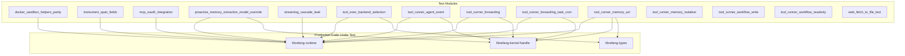

# Other — librefang-runtime-tests

# librefang-runtime-tests

Integration test suite for the `librefang-runtime` crate. These tests exercise cross-module contracts that unit tests within individual submodules cannot reach — security boundaries, dispatch wiring, parity invariants, and end-to-end tool execution paths.

## Architecture

```mermaid
graph TD
    subgraph "Test Modules"
        PARITY[docker_sandbox_helpers_parity]
        INSTR[instrument_span_fields]
        OAUTH[mcp_oauth_integration]
        MEM_OVERRIDE[proactive_memory_extraction_model_override]
        CASCADE[streaming_cascade_leak]
        BACKEND[tool_exec_backend_selection]
        AGENT_EVT[tool_runner_agent_event]
        FWD[tool_runner_forwarding]
        CRON[tool_runner_forwarding_task_cron]
        ACL[tool_runner_memory_acl]
        MEM_ISO[tool_runner_memory_isolation]
        WF_W[tool_runner_workflow_write]
        WF_R[tool_runner_workflow_readonly]
        WEB[web_fetch_to_file_test]
    end

    subgraph "Production Code Under Test"
        RUNTIME[librefang-runtime]
        TYPES[librefang-types]
        KH[librefang-kernel-handle]
    end

    PARITY --> RUNTIME
    INSTR --> RUNTIME
    OAUTH --> RUNTIME
    MEM_OVERRIDE --> RUNTIME
    MEM_OVERRIDE --> KH
    CASCADE --> RUNTIME
    BACKEND --> RUNTIME
    BACKEND --> TYPES
    AGENT_EVT --> RUNTIME
    AGENT_EVT --> KH
    FWD --> RUNTIME
    FWD --> KH
    CRON --> RUNTIME
    CRON --> KH
    ACL --> RUNTIME
    ACL --> KH
    ACL --> TYPES
```

## Test Modules

### docker_sandbox_helpers_parity.rs

**Gated on `#[cfg(feature = "docker-sandbox")]`.**

Asserts byte-for-byte behavioral parity between two copies of security-critical helper functions:

- **`contains_shell_metacharacters`** — the canonical version in `librefang_runtime::subprocess_sandbox` and the duplicate-by-design copy in `librefang_runtime::docker_sandbox::helpers`. The Docker sandbox crate inlines its own copy to avoid a circular dependency on the full runtime. If a CVE fix extends the canonical denylist without updating the duplicate, the Docker `exec` path silently accepts payloads the local subprocess sandbox would reject.
- **`safe_truncate_str`** — canonical in `librefang_runtime::str_utils`, duplicate in `docker_sandbox::helpers`. Tests cover ASCII, 2-byte (é), 3-byte (中), and 4-byte (𝄞) characters at and across truncation boundaries.

`PARITY_INPUTS` enumerates every metacharacter class (command substitution, chaining, pipes, redirection, brace expansion, background, process substitution, null bytes) plus quoting edge cases and clean commands. Both the detection result (`Option` presence) and the reason string are asserted equal.

### instrument_span_fields.rs

Verifies that `agent.id` and `session.id` set as `#[instrument]` fields on `run_agent_loop` propagate to log events emitted inside the loop. Three tests:

| Test | What it locks in |
|------|-----------------|
| `warn_inside_agent_span_includes_agent_and_session_ids` | Fields appear in captured output when emitted inside an `info_span!` |
| `info_span_is_dropped_under_warn_target_filter` | INFO-level spans are discarded by the production `librefang_runtime=warn` filter |
| `warn_span_survives_warn_target_filter_and_carries_fields` | WARN-level spans survive the same filter — justifies `#[instrument(level = "warn")]` on `run_agent_loop` |

Uses a custom `CaptureWriter` that buffers all tracing output into a `Mutex<Vec<u8>>` for string assertions.

### mcp_oauth_integration.rs

Tests the MCP OAuth discovery and token lifecycle:

- **Discovery fallback**: `discover_oauth_metadata` falls back to config-provided endpoints when the server's well-known URL is unreachable
- **Provider wiring regression**: `test_http_connect_calls_oauth_provider_load_token` catches the bug where `oauth_provider: None` was passed in `connect_mcp_servers`, silently disabling OAuth. Uses `TrackingOAuthProvider` with `AtomicBool` flags.
- **Token lifecycle via `InMemoryOAuthProvider`**: store → load → clear → reauthorize, plus isolation (clearing server A doesn't affect server B)
- **Auth state machine**: `McpAuthState` transitions `NeedsAuth → PendingAuth → Authorized → NeedsAuth` serialize to distinct `state` values, preventing the dashboard from showing "Authorizing..." before the user clicks Authorize

### proactive_memory_extraction_model_override.rs

Tests per-agent `extraction_model` override (#5475). Strategy:

1. A `SharedRecordingDriver` captures the `model` field from every `CompletionRequest`
2. An `OverrideKernel` stub implements `CatalogQuery::proactive_memory_extraction_model_for` with a string-keyed override map
3. `build_extractor_with_kernel` wires the extractor with `"global-extractor"` as the boot-time model, then installs the kernel via `install_kernel_handle`

Tests assert:

| Test | Assertion |
|------|-----------|
| `agent_override_wins_over_boot_time_model` | Per-agent override replaces boot-time model |
| `no_override_falls_back_to_boot_time_model` | Missing override falls back to `"global-extractor"` |
| `provider_qualified_override_strips_prefix_at_request_time` | `"anthropic/claude-haiku-4-5"` → `"claude-haiku-4-5"` |
| `colon_form_override_strips_prefix_at_request_time` | `"openai:gpt-4o-mini"` → `"gpt-4o-mini"` |

### streaming_cascade_leak.rs

Tests the incremental cascade-leak detection guard in `stream_with_retry`. Because `forward_task` is a private closure inside a `tokio::spawn`, these tests **replicate the exact accumulation + channel-forwarding pattern** using public types (`is_cascade_leak`, `StreamEvent`).

`run_forward_task` is a simplified facsimile that omits the 128 KB rolling-window cap and UTF-8 boundary walk from production — noted explicitly in comments.

Key behaviors verified:

- Post-leak `TextDelta` tokens never reach downstream
- Non-text events (`ContentComplete`, etc.) are still forwarded after leak fires
- `cascade_leak_aborted = true` even when `stop_reason = ToolUse` — the caller must treat the entire turn as silent
- Structural markers split across deltas are still detected
- Clean streams (no structural markers) never abort

### tool_exec_backend_selection.rs

End-to-end dispatch resolution tests mirroring the production path: `config.toml → KernelConfig.tool_exec → AgentManifest.tool_exec_backend → resolve_backend_kind → build_backend`.

Covers:

- Default resolves to `Local`
- TOML parsing for `kind = "local"` and `kind = "docker"`
- Agent manifest override wins over global config
- `build_backend` dispatches to correct implementation (`Local`, `Docker`)
- `Ssh` and `Daytona` error without feature/subtable
- Full end-to-end: parse config → resolve → build → `run_command("echo ...")` → assert stdout (Unix-only)

### tool_runner_agent_event.rs

Tests `agent_send`, `agent_list`, and `event_publish` tool dispatch through `execute_tool_raw`. Uses a `CapturingKernel` that records calls on `AgentControl` and `EventBus` traits.

Key invariants:

- **`agent_send`**: forwards target agent_id and message body; refuses self-send (deadlock prevention) before reaching the kernel
- **`agent_list`**: renders kernel-provided agents with both id and name; empty list returns a friendly "no agents" string (not an error)
- **`event_publish`**: forwards event_type and payload; validation short-circuits before `EventBus::publish_event` when `event_type` is missing

### tool_runner_forwarding.rs

Tests that `memory_store`, `memory_recall`, and `memory_list` forward `sender_id` as `peer_id` to the kernel. Uses a `CapturingKernel` that records the `peer_id` argument on each `MemoryAccess` call.

Asserts:

- `sender_id: Some("user-42")` → `peer_id: Some("user-42")`
- `sender_id: None` → `peer_id: None`
- Sequential calls with different sender_ids are isolated (no cross-contamination)

### tool_runner_forwarding_task_cron.rs

Tests task and cron tool dispatch, including ownership enforcement:

- **`task_post`**: forwards `caller_agent_id` as `created_by`
- **`task_status`**: projects exactly six canonical fields (`status`, `result`, `title`, `assigned_to`, `created_at`, `completed_at`) from the full substrate row; returns "not found" message for missing tasks
- **`cron_create`**: injects `sender_id` as `peer_id` (overriding any explicit value), forwards `caller_agent_id` as `agent_id`
- **`cron_list`**: returns serialized jobs for the calling agent
- **`cron_cancel`**: succeeds when caller owns the job (present in `cron_list` response); renders `NotFound` for unowned jobs without reaching the kernel
- **`schedule_delete`**: same ownership guard as `cron_cancel` — regression test for the bypass where `schedule_delete` called `cron_cancel` directly with no ownership check

### tool_runner_memory_acl.rs

Regression tests for #5139: the shared-KV and wiki tools must enforce `UserMemoryAccess` ACL at the tool dispatch boundary. The ACL itself is the real `librefang_types::user_policy::UserMemoryAccess` — only the substrate and ACL resolution are stubbed.

Tests assert **side effects** (not just error strings): denied writes must never reach the substrate (`store_calls` stays empty), denied reads must never reach the substrate.

ACL roles tested:

| Role | `readable_namespaces` | `writable_namespaces` |
|------|----------------------|----------------------|
| `viewer_acl()` | `proactive`, `wiki` | (none) |
| `user_acl()` | `proactive`, `kv:*`, `wiki` | `kv:*`, `wiki` |
| `None` (RBAC disabled) | — | — |

Coverage spans `memory_store`, `memory_recall`, `memory_list`, `wiki_write`, `wiki_get`, and `wiki_search` — each tested for deny, allow, and no-ACL paths.

## Shared Patterns

### KernelHandle Mocking

Most tool dispatch tests build a `CapturingKernel` (or variant) that implements the full `KernelHandle` trait composition. Unused role traits get empty/stub implementations. This pattern is repeated across files because each test file needs different recording behavior (some capture `peer_id`, others capture event payloads, etc.), and the trait object (`Arc<dyn KernelHandle>`) requires all traits.

### ToolExecContext Construction

Every tool dispatch test constructs a `ToolExecContext` via a local `make_ctx` helper. The context carries:
- `kernel`: the mock `Arc<dyn KernelHandle>`
- `caller_agent_id`: the agent invoking the tool
- `sender_id`: the external user/peer (for ACL and peer_id forwarding)
- `channel`: the communication channel (for ACL resolution)

### Regression Lock Pattern

Several tests explicitly document the bug they prevent:
- `docker_sandbox_helpers_parity` — CVE fix silently skipped in Docker path
- `test_http_connect_calls_oauth_provider_load_token` — `oauth_provider: None` silently disabling OAuth
- `test_agent_send_self_is_refused_to_avoid_deadlock` — self-send deadlock
- `tool_use_stop_reason_still_sets_cascade_leak_aborted` — ToolUse stop_reason bypassing silent drop
- `test_schedule_delete_unowned_job_renders_as_not_found` — ownership bypass via `schedule_delete`
- `restricted_user_*` tests — cross-user data leakage through agent tools