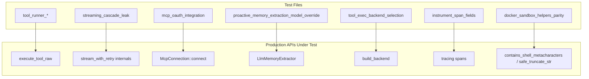

# Other — librefang-runtime-tests

# librefang-runtime-tests

Integration test suite for the `librefang-runtime` crate. These tests exercise cross-cutting contracts that span multiple crates (runtime, kernel-handle, types, memory, mcp) and cannot be validated with unit tests alone.

## Architecture

The tests are organized by the runtime subsystem they validate. Each file typically follows a **mock-kernel pattern**: a minimal `struct` implements the full `KernelHandle` trait composition (stubbing unused roles), records calls on the relevant role traits, and asserts both the tool-layer dispatch result and whether the underlying substrate was reached.


```mermaid
graph TD
    subgraph "Test Files"
        A[tool_runner_*]
        B[streaming_cascade_leak]
        C[mcp_oauth_integration]
        D[proactive_memory_extraction_model_override]
        E[tool_exec_backend_selection]
        F[instrument_span_fields]
        G[docker_sandbox_helpers_parity]
    end

    subgraph "Production APIs Under Test"
        T[execute_tool_raw]
        S[stream_with_retry internals]
        M[McpConnection::connect]
        P[LlmMemoryExtractor]
        BE[build_backend]
        TR[tracing spans]
        H[contains_shell_metacharacters / safe_truncate_str]
    end

    A --> T
    B --> S
    C --> M
    D --> P
    E --> BE
    F --> TR
    G --> H
```

## Test Files

### `docker_sandbox_helpers_parity.rs`

**Feature-gated:** `#[cfg(feature = "docker-sandbox")]`

Asserts byte-for-byte parity between the canonical helper implementations in `librefang-runtime` and their duplicate-by-design copies in `librefang-runtime-sandbox-docker`. The docker sandbox crate carries inlined copies to avoid a circular dependency; these tests prevent a silent drift if a CVE fix extends the canonical denylist without updating the duplicate.

| Test | What it asserts |
|------|----------------|
| `contains_shell_metacharacters_parity` | Both implementations return identical `Option` results (and reason strings) over an enumerated input set covering every metacharacter class, quoting edge cases, and clean commands. |
| `safe_truncate_str_parity` | UTF-8-safe truncation matches across ASCII, 2-byte (é), 3-byte (中), and 4-byte (𝄞) characters at boundary lengths. |

The `PARITY_INPUTS` constant is the authoritative list of inputs — add new entries there whenever the canonical denylist changes.

### `instrument_span_fields.rs`

Validates that `agent.id` and `session.id` set as `#[instrument]` fields on `run_agent_loop` propagate to events emitted inside the span. Uses a `CaptureWriter` that intercepts formatted log output.

| Test | What it asserts |
|------|----------------|
| `warn_inside_agent_span_includes_agent_and_session_ids` | Both fields appear in captured log output when a `warn!` fires inside an `info_span!`. |
| `info_span_is_dropped_under_warn_target_filter` | Confirms the production `librefang_runtime=warn` filter drops INFO-level spans — the reason `run_agent_loop` uses `level = "warn"`. |
| `warn_span_survives_warn_target_filter_and_carries_fields` | A WARN-level span survives the WARN target filter and surfaces both fields. |

### `mcp_oauth_integration.rs`

Tests OAuth discovery, token lifecycle, and auth-state serialization for MCP server connections.

**Key mock types:**
- `TrackingOAuthProvider` — records whether `load_token` / `store_oauth_metadata` were called; catches the bug where `oauth_provider: None` silently disables OAuth.
- `InMemoryOAuthProvider` — stores tokens in a `HashMap` for lifecycle tests.

| Test | What it asserts |
|------|----------------|
| `test_discover_fallback_to_config` | Falls back to `McpOAuthConfig` when metadata discovery fails. |
| `test_discover_fails_without_any_source` | Errors when no config and no discovery endpoint available. |
| `test_http_connect_calls_oauth_provider_load_token` | `McpConnection::connect` invokes the provider on a 401. |
| `test_provider_store_then_load` | Store → load round-trip. |
| `test_provider_clear_removes_token` | Clear deletes the stored token. |
| `test_provider_clear_is_isolated` | Clearing one server's token doesn't affect another. |
| `test_provider_reauthorize_after_clear` | Store → clear → store works (re-authorization after revocation). |
| `test_auth_state_lifecycle` | `NeedsAuth → PendingAuth → Authorized → NeedsAuth` serialization. |
| `test_needs_auth_serializes_differently_from_pending_auth` | Prevents the dashboard showing "Authorizing..." before user clicks Authorize. |

### `proactive_memory_extraction_model_override.rs`

Tests the per-agent `[proactive_memory] extraction_model` override (#5475).

**Mock infrastructure:**
- `OverrideKernel` — implements `KernelHandle` with only `CatalogQuery::proactive_memory_extraction_model_for` returning configurable overrides; all other traits are stubs.
- `SharedRecordingDriver` — implements `LlmDriver`, captures the `model` field from every `CompletionRequest`.

| Test | What it asserts |
|------|----------------|
| `agent_override_wins_over_boot_time_model` | Per-agent override replaces the extractor's boot-time model. |
| `no_override_falls_back_to_boot_time_model` | Missing override falls back to the global extractor model. |
| `provider_qualified_override_strips_prefix_at_request_time` | `"anthropic/claude-haiku-4-5"` → `"claude-haiku-4-5"` before the wire request. |
| `colon_form_override_strips_prefix_at_request_time` | `"openai:gpt-4o-mini"` → `"gpt-4o-mini"` before the wire request. |

Note: `build_extractor_with_kernel` leaks the kernel via `std::mem::forget` so the `Weak` reference inside the extractor remains valid for the test duration.

### `streaming_cascade_leak.rs`

Tests the incremental cascade-leak detection guard that runs inside `stream_with_retry`'s `forward_task`. Because `forward_task` is a private closure, the tests replicate the exact same accumulation + channel-forwarding pattern using public `is_cascade_leak` and `StreamEvent` types.

**Key function:** `run_forward_task` — a simplified facsimile of the production `forward_task` closure. It omits the 128 KB rolling-window cap and UTF-8 boundary walk present in production code.

| Test | What it asserts |
|------|----------------|
| `text_delta_tokens_are_suppressed_after_leak_detection` | Post-leak `TextDelta` events never reach downstream. |
| `non_text_events_forwarded_after_leak` | `ContentComplete` and similar events still forward after the leak fires. |
| `tool_use_stop_reason_still_sets_cascade_leak_aborted` | Even with `StopReason::ToolUse`, the `cascade_leak_aborted` flag is set — the caller must not execute tools. |
| `silent_reason_prompt_regurgitated_serializes` | `SilentReason::PromptRegurgitated` serializes correctly for structured logs. |
| `leak_fires_when_markers_split_across_deltas` | Markers split across streaming deltas are still detected. |
| `clean_stream_does_not_abort` | Clean streams pass through without setting the abort flag. |

### `tool_exec_backend_selection.rs`

Tests the tool-exec backend dispatch path: `config.toml → KernelConfig.tool_exec → AgentManifest.tool_exec_backend → resolve_backend_kind → build_backend`.

| Test | What it asserts |
|------|----------------|
| `default_kernel_config_resolves_to_local` | Default resolves to `BackendType::Local`. |
| `config_toml_kind_local_loads` / `config_toml_kind_docker_loads` | TOML parsing round-trips correctly. |
| `agent_manifest_override_wins_over_global` | Per-agent override takes precedence over global config. |
| `agent_manifest_no_field_falls_back_to_global` | Missing override falls back. |
| `build_backend_local_dispatches_to_local_impl` / `build_backend_docker_dispatches_to_docker_impl` | `build_backend` returns the correct trait object. |
| `build_backend_ssh_without_subtable_or_feature_errors` / `build_backend_daytona_without_subtable_or_feature_errors` | Missing config for SSH/Daytona surfaces an error. |
| `end_to_end_local_dispatch_runs_command` (Unix only) | Full e2e: parse config → resolve → build → `run_command("echo ...")` → assert stdout. |

### `tool_runner_agent_event.rs`

Tests `agent_send`, `agent_list`, and `event_publish` tool dispatch through `execute_tool_raw`.

**Mock:** `CapturingKernel` — records `send_to_agent` calls (target + body), `publish_event` calls (type + payload), and returns a configurable `agents` list.

| Test | What it asserts |
|------|----------------|
| `agent_send_forwards_target_agent_id_and_message` | Payload and caller forwarded correctly. |
| `agent_send_self_is_refused_to_avoid_deadlock` | Self-send short-circuits before reaching `AgentControl`. |
| `agent_list_renders_kernel_provided_agents` | Output includes both ids and names. |
| `agent_list_when_no_agents_running_returns_friendly_string` | Empty list produces a user-friendly message, not an error. |
| `event_publish_forwards_event_type_and_payload` | Both fields forwarded to `EventBus`. |
| `event_publish_missing_event_type_errors_without_invoking_kernel` | Validation short-circuits before kernel call. |

### `tool_runner_forwarding.rs`

Tests that `memory_store`, `memory_recall`, and `memory_list` correctly forward `sender_id` as `peer_id` to the kernel's `MemoryAccess` trait.

**Mock:** `CapturingKernel` — records the `peer_id: Option<String>` argument for each memory call.

| Test | What it asserts |
|------|----------------|
| `test_memory_store_forwards_sender_id_as_peer_id` | Sender ID present → `Some("user-42")`. |
| `test_memory_store_forwards_none_when_no_sender` | No sender → `None`. |
| `test_memory_recall_forwards_sender_id_as_peer_id` / `..._none_when_no_sender` | Same pattern for recall. |
| `test_memory_list_forwards_sender_id_as_peer_id` / `..._none_when_no_sender` | Same pattern for list. |
| `test_sender_id_not_leaked_between_calls` | Sequential calls with different senders are isolated — each records its own sender. |

### `tool_runner_forwarding_task_cron.rs`

Tests `task_post`, `task_status`, `cron_create`, `cron_list`, `cron_cancel`, and `schedule_delete` tool dispatch.

**Mock:** `CapturingKernel` — records `created_by`, `task_get` args, `cron_create` (agent_id + job_json), `cron_list` args, and `cron_cancel` args. Configurable responses for `task_get` and `cron_list`.

| Test | What it asserts |
|------|----------------|
| `test_task_post_forwards_caller_as_created_by` / `..._none_created_by` | `caller_agent_id` maps to `created_by`. |
| `test_cron_create_injects_sender_peer_id` | `sender_id` injected into job JSON as `peer_id`. |
| `test_cron_create_overrides_explicit_peer_id_with_sender` | Tool-layer sender takes precedence over user-supplied `peer_id`. |
| `test_cron_create_forwards_caller_as_agent_id` | Agent ID forwarded to `CronControl::cron_create`. |
| `test_task_status_projects_six_canonical_fields` | Output contains exactly: `status`, `result`, `title`, `assigned_to`, `created_at`, `completed_at`. |
| `test_task_status_not_found_returns_message` | Missing task → user-friendly "not found" (not an error). |
| `test_cron_list_returns_serialized_jobs` | Returns pretty-printed JSON array. |
| `test_cron_cancel_succeeds_when_caller_owns_the_job` | Owned job → cancel forwarded. |
| `test_cron_cancel_unowned_job_renders_as_not_found` | Unowned job → `ToolError::NotFound` display, kernel never reached. |
| `test_cron_cancel_missing_job_id_renders_as_missing_parameter` | Missing param → typed `MissingParameter` display. |
| `test_schedule_delete_succeeds_when_caller_owns_the_job` | Same ownership guard as `cron_cancel`. |
| `test_schedule_delete_unowned_job_renders_as_not_found` | Regression: previously no ownership check, allowing cross-agent deletion. |

### `tool_runner_memory_acl.rs`

**Regression tests for #5139.** Validates that `memory_*` and `wiki_*` tools enforce the per-user `UserMemoryAccess` ACL at the tool dispatch boundary.

**Mock:** `AclKernel` — records all substrate calls (store, recall, list, wiki_write, wiki_read) and returns a configurable ACL from `memory_acl_for_sender`. The ACL evaluation itself uses the real `MemoryNamespaceGuard` — only the resolution (sender → policy) is stubbed.

**ACL fixtures:**
- `viewer_acl()` — read `proactive` + `wiki`, no writes.
- `user_acl()` — read/write `kv:*` + `wiki`.

| Test | What it asserts |
|------|----------------|
| `restricted_user_memory_store_is_denied_and_does_not_land` | Viewer → denied; substrate write never called. |
| `allowed_user_memory_store_succeeds_and_lands` | User with `kv:*` → allowed; write lands with correct peer_id. |
| `no_acl_means_no_restriction_store_still_lands` | `None` ACL (RBAC disabled) preserves pre-RBAC behavior. |
| `restricted_user_memory_recall_is_denied_and_does_not_read` | No `kv` read access → denied; no cross-user leak. |
| `restricted_user_memory_list_is_denied_and_does_not_enumerate` | No `kv` read → denied; substrate never enumerated. |
| `allowed_user_memory_recall_runs` | User with `kv:*` read → allowed. |
| `restricted_user_wiki_write_is_denied_and_does_not_land` | Viewer with wiki read but no write → denied. |
| `wiki_write_provenance_separates_channel_and_sender` | `channel` and `sender` routed to distinct provenance fields. |

## Common Patterns

### Mock Kernel Construction

Most tool-dispatch tests build a kernel mock that:

1. Implements the full `KernelHandle` trait composition (15+ role traits).
2. Returns `Err("not implemented")` for unused methods — the dispatcher under test never calls them.
3. Records arguments (peer_id, agent_id, payloads) in `Arc<Mutex<Vec<...>>>` probes that the test asserts against.

The `make_ctx` helper constructs a `ToolExecContext` with the mock kernel wired in and specific fields (`sender_id`, `caller_agent_id`, `channel`) set for the test scenario.

### Side-Effect Assertion Pattern

Security-critical tests (memory ACL, cron ownership) assert **two properties**:

1. The tool result is an error with a specific user-facing message.
2. The substrate was **never reached** — the probe vec is empty.

This pattern catches regressions where a new code path might bypass the check but still return a harmless-looking error.

### Facsimile Testing

When production code is an untestable closure (e.g., `forward_task` inside `tokio::spawn` in `stream_with_retry`), tests replicate the exact same logic in a test-visible function and document the omissions (e.g., the 128 KB rolling-window cap). If the production logic changes, the facsimile must be updated to match.

## Running

```bash
# All runtime tests
cargo test -p librefang-runtime

# Docker-sandbox parity tests (requires feature)
cargo test -p librefang-runtime --features docker-sandbox -- docker_sandbox_helpers_parity

# Specific subsystem
cargo test -p librefang-runtime -- tool_runner
cargo test -p librefang-runtime -- streaming_cascade_leak
```

The `end_to_end_local_dispatch_runs_command` test is Unix-only (`#[cfg(unix)]`).