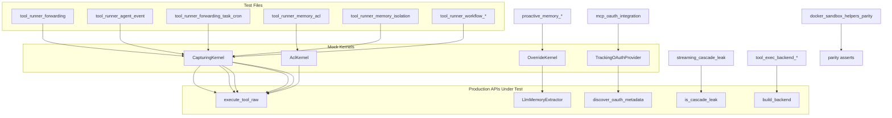

# Other — librefang-runtime-tests

# librefang-runtime-tests

Integration test suite for the `librefang-runtime` crate. These tests exercise cross-cutting contracts that require real type wiring, trait dispatch, or multi-crate interaction — things unit tests in individual modules cannot cover in isolation.

## Architecture

Every test file follows the same structural pattern: a **mock kernel** that implements the full `KernelHandle` composition trait, constructed with probe channels (`Arc<Mutex<Vec<_>>>`) to record which substrate calls actually landed. Tests call the public API under test, then assert both the return value and the side-effect probes.


```mermaid
graph TD
    subgraph "Test Files"
        A[tool_runner_forwarding]
        B[tool_runner_agent_event]
        C[tool_runner_forwarding_task_cron]
        D[tool_runner_memory_acl]
        E[tool_runner_memory_isolation]
        F[tool_runner_workflow_*]
    end

    subgraph "Mock Kernels"
        MK[CapturingKernel]
        AK[AclKernel]
        OK[OverrideKernel]
        TK[TrackingOAuthProvider]
    end

    subgraph "Production APIs Under Test"
        ETR[execute_tool_raw]
        BB[build_backend]
        DOM[discover_oauth_metadata]
        ICL[is_cascade_leak]
        PML[LlmMemoryExtractor]
    end

    A --> MK --> ETR
    B --> MK --> ETR
    C --> MK --> ETR
    D --> AK --> ETR
    E --> MK --> ETR
    F --> MK --> ETR
    G[proactive_memory_*] --> OK --> PML
    H[streaming_cascade_leak] --> ICL
    I[mcp_oauth_integration] --> TK --> DOM
    J[tool_exec_backend_*] --> BB
    K[docker_sandbox_helpers_parity] --> L[parity asserts]
```

## Test Files

### Tool Dispatch (`tool_runner_*`)

These test the `execute_tool_raw` dispatch boundary — the function that maps a tool name string and a JSON input to the correct kernel method call.

| File | Tool families covered | Key invariant |
|------|----------------------|---------------|
| `tool_runner_forwarding.rs` | `memory_store`, `memory_recall`, `memory_list` | `sender_id` from `ToolExecContext` forwards as `peer_id` to kernel; no cross-call leakage |
| `tool_runner_agent_event.rs` | `agent_send`, `agent_list`, `event_publish` | Agent ID/message forwarded; self-send rejected; validation short-circuits before kernel call |
| `tool_runner_forwarding_task_cron.rs` | `task_post`, `task_status`, `cron_create`, `cron_list`, `cron_cancel`, `schedule_delete` | Caller forwarded as `created_by`/`agent_id`; ownership guard on cancel/delete; typed error rendering |
| `tool_runner_memory_acl.rs` | `memory_*`, `wiki_*` | `UserMemoryAccess` ACL enforced at dispatch boundary; denied calls never reach substrate; soft `Denied` status (#5984) |
| `tool_runner_memory_isolation.rs` | `memory_*` | Per-agent namespace scoping |
| `tool_runner_workflow_readonly.rs` | `workflow_list`, `workflow_status` | Output field projection and deterministic ordering |
| `tool_runner_workflow_write.rs` | `workflow_start`, `workflow_cancel` | Schema validation; definition lookup; state transitions |

#### Mock Kernel Pattern

All tool dispatch tests share this mock structure:

```
CapturingKernel (or AclKernel)
  implements: KernelHandle (full trait composition)
  records:    method calls into Arc<Mutex<Vec<_>>> probes
  stubs:      unused traits with "not implemented" errors
```

The `ToolExecContext` is constructed with `make_ctx()` helpers that wire the mock kernel, `caller_agent_id`, `sender_id`, and `channel` as needed by each test scenario.

#### Key Design Decisions in Tests

- **Side-effect assertion, not just return values**: ACL denial tests assert that `probes.store` remains empty — proving the substrate was never reached, not just that an error was returned.
- **Validation short-circuit**: Tests like `event_publish_missing_event_type_errors_without_invoking_kernel` assert the kernel mock was never called, confirming input validation happens before dispatch.
- **Ownership guards**: `cron_cancel` and `schedule_delete` tests verify the tool-layer ownership check by seeding `cron_list_response` and asserting the kernel's `cron_cancel` is only invoked when the caller owns the job.

### Security-Critical Parity (`docker_sandbox_helpers_parity.rs`)

Gated on `#[cfg(feature = "docker-sandbox")]`. Asserts byte-for-byte equivalence between:

- **Canonical** implementations in `librefang-runtime` (`subprocess_sandbox::contains_shell_metacharacters`, `str_utils::safe_truncate_str`)
- **Duplicate** implementations in `librefang-runtime-sandbox-docker` (carried to avoid circular dependencies)

`PARITY_INPUTS` enumerates every metacharacter class (command substitution, chaining, pipes, redirection, brace expansion, background, process substitution, null bytes) plus quoting edge cases and clean commands. Both the `is_some()` result and the reason string are compared — drift in the reason usually signals a new metacharacter class added on one side only.

### Tracing Span Fields (`instrument_span_fields.rs`)

Three tests that pin the `#[instrument(level = "warn")]` workaround for `run_agent_loop`:

1. **Fields propagate**: `agent.id` and `session.id` set as span fields appear in captured log output when a `warn!` event fires inside the span.
2. **INFO span is dropped**: Under `EnvFilter::new("warn")`, an INFO-level span is filtered out — confirming why the workaround exists.
3. **WARN span survives**: A WARN-level span under the same filter carries both fields through to the output.

Uses a `CaptureWriter` that records all formatted output into a shared `Arc<Mutex<Vec<u8>>>` for string-contains assertions.

### MCP OAuth (`mcp_oauth_integration.rs`)

Tests two layers:

**Discovery**:
- `discover_oauth_metadata` falls back to `McpOAuthConfig` when the well-known endpoint is unreachable.
- Returns an error when neither discovery nor config is available.

**Provider wiring** (`TrackingOAuthProvider`):
- `McpConnection::connect` with an HTTP transport calls `load_token` on the provided OAuth provider — regression test for the bug where `oauth_provider: None` silently disabled the entire flow.

**Token lifecycle** (`InMemoryOAuthProvider`):
- Store → load round-trip.
- `clear_tokens` removes only the target server's token (isolation).
- Re-authorization after clear works (store → clear → store).

**Auth state machine** (`McpAuthState`):
- Serialization round-trips: `NeedsAuth` → `PendingAuth` → `Authorized` → `NeedsAuth` (after revoke).
- `NeedsAuth` and `PendingAuth` serialize to distinct `"state"` values — regression for the dashboard showing "Authorizing..." at boot.

### Proactive Memory Extraction Override (`proactive_memory_extraction_model_override.rs`)

Tests the per-agent `extraction_model` override (#5475):

- **Override wins**: An agent with a configured override routes the LLM call through the override model, not the boot-time `global-extractor` model.
- **Fallback**: An agent with no override uses the boot-time model.
- **Prefix stripping**: Provider-qualified forms (`anthropic/claude-haiku-4-5`, `openai:gpt-4o-mini`) have the prefix stripped before the wire request.

Uses `OverrideKernel` implementing `CatalogQuery::proactive_memory_extraction_model_for` and a `SharedRecordingDriver` that captures the `model` field from every `CompletionRequest`.

### Streaming Cascade Leak Guard (`streaming_cascade_leak.rs`)

Replicates the private `forward_task` closure from `stream_with_retry` as a test-only facsimile. Tests assert:

- **Text suppression**: After `is_cascade_leak` fires, neither the triggering delta nor any subsequent `TextDelta` events are forwarded.
- **Non-text passthrough**: `ContentComplete`, `ToolUseStart`, etc. continue forwarding after the leak fires.
- **ToolUse doesn't bypass**: Even when `stop_reason` is `ToolUse`, `cascade_leak_aborted` is `true` — the caller must treat the turn as a silent drop.
- **Split markers**: Structural markers split across multiple deltas still trigger detection.
- **Clean streams**: Streams with no structural markers never set `cascade_leak_aborted`.

> **Note**: The facsimile omits the 128 KB rolling-window cap and UTF-8 boundary walk from production. If those change, the facsimile must be updated.

### Tool Exec Backend Selection (`tool_exec_backend_selection.rs`)

Tests the resolution chain: `config.toml` → `KernelConfig.tool_exec` + `agent.toml` → `AgentManifest.tool_exec_backend` → `resolve_backend_kind` → `build_backend`.

- Default resolves to `Local`.
- TOML parsing of `kind = "local"` / `kind = "docker"`.
- Per-agent manifest override wins over global config; no override falls back.
- `build_backend` dispatches to the correct `BackendKind` implementation.
- `Ssh` and `Daytona` error without configuration.
- End-to-end local dispatch runs a real command and asserts stdout.

## Adding New Tests

When adding a test for a new tool or dispatch path:

1. **Choose or create a mock kernel**: If the existing `CapturingKernel` / `AclKernel` pattern fits, extend it. If you need new trait behavior (e.g., a new role trait), add probe fields and implement the trait method.
2. **Use `make_ctx()`**: Construct `ToolExecContext` through the helper to avoid missing fields as the struct evolves.
3. **Assert side effects**: Don't just check the return value — verify that the kernel mock's probes show the correct calls landed (or didn't land for rejection paths).
4. **Check `ToolExecutionStatus`**: For ACL/security denials, assert `status == ToolExecutionStatus::Denied` (soft failure) rather than just `is_error`.
5. **Gate features**: If a test depends on an optional dependency, add `#[cfg(feature = "...")]`.