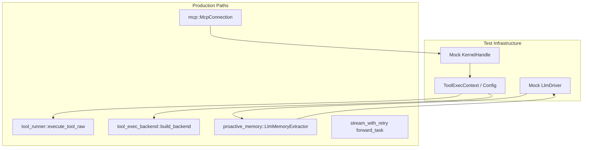

# Other — librefang-runtime-tests

# librefang-runtime-tests

Integration test suite for the `librefang-runtime` crate. Tests exercise real runtime code paths against mock/stub implementations of `KernelHandle` and `LlmDriver`, asserting correct dispatch, security enforcement, and behavioral contracts without requiring a live kernel, database, or LLM provider.

## Architecture

Every test file follows the same pattern:

1. **Mock kernel** — a struct implementing the full `KernelHandle` trait composition (via `librefang_kernel_handle::prelude::*`), stubbing unused role traits and recording calls on the trait(s) under test.
2. **Context construction** — a `ToolExecContext` (or equivalent) wired to the mock kernel, optionally carrying `sender_id`, `caller_agent_id`, `channel`, etc.
3. **Invoke production code** — call `execute_tool_raw`, `McpConnection::connect`, `extract_memories_with_agent_id`, or the function under test.
4. **Assert side effects and return values** — check recorded calls on the mock, output strings, error conditions.


```mermaid
graph TD
    subgraph "Test Infrastructure"
        MK[Mock KernelHandle]
        MD[Mock LlmDriver]
        CTX[ToolExecContext / Config]
    end
    subgraph "Production Paths"
        TR[tool_runner::execute_tool_raw]
        TE[tool_exec_backend::build_backend]
        PM[proactive_memory::LlmMemoryExtractor]
        MCP[mcp::McpConnection]
        SL[stream_with_retry forward_task]
    end
    MK --> CTX
    MD --> PM
    CTX --> TR
    CTX --> TE
    PM --> MD
    MCP --> MK
```

## Test Files

### `docker_sandbox_helpers_parity.rs`

**Feature-gated:** `#![cfg(feature = "docker-sandbox")]`

Ensures the inlined `helpers` module in `librefang-runtime-sandbox-docker` stays byte-for-byte equivalent to the canonical implementations in `librefang-runtime`. The Docker sandbox crate duplicates these functions to avoid a circular dependency — a CVE fix in the canonical denylist must not silently leave the Docker path unprotected.

| Test function | What it asserts |
|---|---|
| `contains_shell_metacharacters_parity` | Both implementations return identical `Option<&str>` results (and reason strings) across 39 input cases covering every metacharacter class, quoting edge cases, and clean commands. |
| `safe_truncate_str_parity` | Truncation results match for ASCII, 2-byte (é), 3-byte (中), and 4-byte (𝄞) strings across multiple length boundaries. |

**Key constant:** `PARITY_INPUTS` — enumerated inputs covering command substitution, chaining, pipes, redirection, brace expansion, background/ampersand, process substitution, newline/null, quoted metachars, mixed quoted+unquoted, clean commands, and empty input.

### `instrument_span_fields.rs`

Validates that `agent.id` and `session.id` set as `#[instrument]` fields on `run_agent_loop` propagate to emitted events. Does not call `run_agent_loop` directly; instead constructs equivalent spans by hand.

Uses a `CaptureWriter` (thread-safe `Vec<u8>` behind `Arc<Mutex<>>`) as a `tracing_subscriber` writer, then asserts on the captured output string.

| Test function | What it asserts |
|---|---|
| `warn_inside_agent_span_includes_agent_and_session_ids` | Both fields appear in the formatted output when a `warn!` event fires inside an `info_span!`. |
| `info_span_is_dropped_under_warn_target_filter` | An INFO-level span is filtered out by `EnvFilter::new("warn")`, confirming why `run_agent_loop` must use `level = "warn"`. |
| `warn_span_survives_warn_target_filter_and_carries_fields` | A WARN-level span (matching the production `#[instrument(level = "warn", ...)]`) survives the same filter and propagates both fields. |

### `mcp_oauth_integration.rs`

Tests for MCP OAuth discovery, token lifecycle, and auth state machine serialization.

**Mock providers:**
- `TrackingOAuthProvider` — records whether `load_token` and `store_oauth_metadata` were called (AtomicBool flags).
- `InMemoryOAuthProvider` — stores `OAuthTokens` in a `HashMap<String, OAuthTokens>` behind `tokio::sync::Mutex`.

| Test function | What it asserts |
|---|---|
| `test_discover_fallback_to_config` | When well-known discovery fails, falls back to `McpOAuthConfig` values. |
| `test_discover_fails_without_any_source` | Errors when no discovery endpoint and no config provided. |
| `test_http_connect_calls_oauth_provider_load_token` | Regression: `McpConnection::connect` invokes the OAuth provider on 401, catching the `oauth_provider: None` bug. |
| `test_provider_store_then_load` | Store → load round-trip returns the stored access token. |
| `test_provider_clear_removes_token` | `clear_tokens` removes the token for the target server. |
| `test_provider_clear_is_isolated` | Clearing one server's token does not affect another server's token. |
| `test_provider_reauthorize_after_clear` | Store → clear → store works (re-authorization after revocation). |
| `test_auth_state_lifecycle` | `McpAuthState` transitions: `NeedsAuth` → `PendingAuth` → `Authorized` → `NeedsAuth` (after revoke). |
| `test_needs_auth_serializes_differently_from_pending_auth` | `NeedsAuth` and `PendingAuth` produce distinct `"state"` values in JSON. |

### `proactive_memory_extraction_model_override.rs`

Tests per-agent `extraction_model` override (#5475). Verifies `LlmMemoryExtractor::extract_memories_with_agent_id` consults `KernelHandle::proactive_memory_extraction_model_for` and routes the LLM call through the resolved model.

**Mock infrastructure:**
- `OverrideKernel` — implements full `KernelHandle`, returning override model names from a `HashMap<String, String>`. Uses `std::mem::forget` to keep the kernel alive for the `Weak` reference inside the extractor.
- `SharedRecordingDriver` — implements `LlmDriver`, captures every `CompletionRequest.model` into a shared `Mutex<Vec<String>>`.

| Test function | What it asserts |
|---|---|
| `agent_override_wins_over_boot_time_model` | Per-agent override replaces the boot-time `"global-extractor"` model. |
| `no_override_falls_back_to_boot_time_model` | Missing override falls back to `"global-extractor"`. |
| `provider_qualified_override_strips_prefix_at_request_time` | `"anthropic/claude-haiku-4-5"` → `"claude-haiku-4-5"` on the wire request. |
| `colon_form_override_strips_prefix_at_request_time` | `"openai:gpt-4o-mini"` → `"gpt-4o-mini"`. |

### `streaming_cascade_leak.rs`

Regression tests for the incremental cascade-leak detection guard in `stream_with_retry`. The production `forward_task` closure is private, so these tests replicate its exact accumulation + channel-forwarding pattern using public types (`is_cascade_leak`, `StreamEvent`).

**Note:** The test facsimile omits the 128 KB rolling-window cap and UTF-8 boundary walk present in production. See the `run_forward_task` doc comment for limitations.

| Test function | What it asserts |
|---|---|
| `text_delta_tokens_are_suppressed_after_leak_detection` | Only pre-leak `TextDelta` events are forwarded; the triggering and all subsequent deltas are swallowed. |
| `non_text_events_forwarded_after_leak` | `ContentComplete` and other non-text events continue forwarding after the leak fires. |
| `tool_use_stop_reason_still_sets_cascade_leak_aborted` | `cascade_leak_aborted = true` even when `stop_reason = ToolUse` — the caller must not execute tools. |
| `silent_reason_prompt_regurgitated_serializes` | `SilentReason::PromptRegurgitated` serializes as `"prompt_regurgitated"`. |
| `leak_fires_when_markers_split_across_deltas` | Structural markers split across multiple `TextDelta` events still trigger detection. |
| `clean_stream_does_not_abort` | Streams with no structural markers forward all events unchanged. |

### `tool_exec_backend_selection.rs`

End-to-end tests for tool-exec backend dispatch (#3332). Exercises the resolution chain: `config.toml` → `KernelConfig.tool_exec` + `AgentManifest.tool_exec_backend` → `resolve_backend_kind` → `build_backend`.

| Test function | What it asserts |
|---|---|
| `default_kernel_config_resolves_to_local` | Default `KernelConfig` → `BackendKind::Local`. |
| `config_toml_kind_local_loads` / `config_toml_kind_docker_loads` | TOML parsing for `[tool_exec] kind = "local"` / `"docker"`. |
| `agent_manifest_override_wins_over_global` | Per-agent `Ssh` override beats global `Docker`. |
| `agent_manifest_no_field_falls_back_to_global` | `None` manifest field falls back to global config. |
| `build_backend_local_dispatches_to_local_impl` | `build_backend(Local, ...)` returns a backend with `kind() == Local`. |
| `build_backend_docker_dispatches_to_docker_impl` | `build_backend(Docker, ...)` succeeds even without a Docker daemon. |
| `build_backend_ssh_without_subtable_or_feature_errors` / `_daytona_...` | Missing config subtables produce errors. |
| `end_to_end_local_dispatch_runs_command` | Full resolution → build → `run_command("echo ...")` → assert exit code and stdout. Unix-only. |

### `tool_runner_agent_event.rs`

Tests `agent_send`, `agent_list`, and `event_publish` tool dispatch through `execute_tool_raw` (#3696). Uses `CapturingKernel` with `AgentControl` and `EventBus` recording calls.

| Test function | What it asserts |
|---|---|
| `agent_send_forwards_target_agent_id_and_message` | `agent_id` and `message` reach `AgentControl::send_to_agent`. |
| `agent_send_self_is_refused_to_avoid_deadlock` | Self-send errors before reaching the kernel (deadlock prevention). |
| `agent_list_renders_kernel_provided_agents` | Output contains both agent IDs and names from `list_agents`. |
| `agent_list_when_no_agents_running_returns_friendly_string` | Empty list produces a "no agents" message, not an error. |
| `event_publish_forwards_event_type_and_payload` | `event_type` and `payload` reach `EventBus::publish_event`. |
| `event_publish_missing_event_type_errors_without_invoking_kernel` | Validation short-circuits before kernel call. |

### `tool_runner_forwarding.rs`

Tests that `memory_store`, `memory_recall`, and `memory_list` forward `ToolExecContext.sender_id` as the `peer_id` argument to `MemoryAccess` trait methods.

| Test function | What it asserts |
|---|---|
| `test_memory_store_forwards_sender_id_as_peer_id` | `sender_id = Some("user-42")` → `peer_id = Some("user-42")`. |
| `test_memory_store_forwards_none_when_no_sender` | `sender_id = None` → `peer_id = None`. |
| `test_memory_recall_forwards_sender_id_as_peer_id` / `_none_...` | Same pattern for recall. |
| `test_memory_list_forwards_sender_id_as_peer_id` / `_none_...` | Same pattern for list. |
| `test_sender_id_not_leaked_between_calls` | Sequential calls with different sender IDs are correctly isolated. |

### `tool_runner_forwarding_task_cron.rs`

Tests `task_post`, `cron_create`, `cron_list`, `cron_cancel`, `schedule_delete`, and `task_status` dispatch. `CapturingKernel` records calls and supports configurable return values for `task_get` and `cron_list`.

| Test function | What it asserts |
|---|---|
| `test_task_post_forwards_caller_as_created_by` | `caller_agent_id` reaches `TaskQueue::task_post` as `created_by`. |
| `test_cron_create_injects_sender_peer_id` | `sender_id` injected as `peer_id` in the cron job JSON. |
| `test_cron_create_overrides_explicit_peer_id_with_sender` | Tool-layer `sender_id` overrides any `peer_id` in the input. |
| `test_cron_create_forwards_caller_as_agent_id` | `caller_agent_id` becomes the first argument to `cron_create`. |
| `test_task_status_projects_six_canonical_fields` | Output contains exactly `status`, `result`, `title`, `assigned_to`, `created_at`, `completed_at`. |
| `test_task_status_not_found_returns_message` | Missing task returns a "not found" message, not an error. |
| `test_cron_list_returns_serialized_jobs` | Kernel-provided jobs serialize as JSON array. |
| `test_cron_cancel_succeeds_when_caller_owns_the_job` | Ownership check passes when job ID is in the agent's cron list. |
| `test_cron_cancel_unowned_job_renders_as_not_found` | Unowned job errors without reaching `KernelHandle::cron_cancel`. |
| `test_cron_cancel_missing_job_id_renders_as_missing_parameter` | Missing parameter produces a descriptive error string. |
| `test_schedule_delete_succeeds_when_caller_owns_the_job` | Same ownership guard as `cron_cancel`. |
| `test_schedule_delete_unowned_job_renders_as_not_found` | Regression for the pre-#3576 bypass where `schedule_delete` skipped ownership checks. |
| `test_schedule_delete_missing_id_renders_as_missing_parameter` | Missing `id` field produces descriptive error. |

### `tool_runner_memory_acl.rs`

Regression tests for #5139: `memory_*` and `wiki_*` tools enforce `UserMemoryAccess` ACL at the dispatch boundary. Uses `AclKernel` with a configurable ACL and probes for substrate calls.

**ACL factory functions:**
- `viewer_acl()` — read `proactive` + `wiki`; no writes.
- `user_acl()` — read/write `kv:*` + `wiki`.

| Test function | What it asserts |
|---|---|
| `restricted_user_memory_store_is_denied_and_does_not_land` | Viewer ACL → error + zero substrate writes. |
| `allowed_user_memory_store_succeeds_and_lands` | User ACL → success + one substrate write with correct `peer_id`. |
| `no_acl_means_no_restriction_store_still_lands` | `None` ACL preserves pre-RBAC behavior. |
| `restricted_user_memory_recall_is_denied_and_does_not_read` | Append-only ACL without `kv` read → error + zero substrate reads. |
| `restricted_user_memory_list_is_denied_and_does_not_enumerate` | No `kv` read access → error + zero list calls. |
| `allowed_user_memory_recall_runs` | User ACL → success + one read. |
| `restricted_user_wiki_write_is_denied_and_does_not_land` | Viewer (wiki read-only) → error + zero wiki writes. |
| Wiki read tests (truncated) | Wiki search/get respect the readable namespaces ACL. |

## Mock Kernel Pattern

All tool-dispatch test files share the same mock kernel structure:

```rust
struct CapturingKernel {
    // Arc<Mutex<Vec<...>>> probes for each trait method under test
}

// Implement the full KernelHandle composition:
impl AgentControl for CapturingKernel { /* record or stub */ }
impl MemoryAccess for CapturingKernel { /* record or stub */ }
impl TaskQueue for CapturingKernel { /* record or stub */ }
impl EventBus for CapturingKernel { /* record or stub */ }
impl CronControl for CapturingKernel { /* record or stub */ }
// ... remaining role traits get empty/default impls
impl CatalogQuery for CapturingKernel { /* optional: return overrides */ }
```

Each test file creates a `(CapturingKernel, CapturedCalls)` pair, wraps the kernel in `Arc<dyn KernelHandle>`, constructs a `ToolExecContext`, and asserts on the captured call log after invoking `execute_tool_raw`.

## Running the Tests

```bash
# All runtime integration tests
cargo test -p librefang-runtime --test '*'

# Docker sandbox parity (requires docker-sandbox feature)
cargo test -p librefang-runtime --features docker-sandbox --test docker_sandbox_helpers_parity

# Single test file
cargo test -p librefang-runtime --test tool_runner_memory_acl

# Specific test function
cargo test -p librefang-runtime --test streaming_cascade_leak -- text_delta_tokens_are_suppressed
```

## When to Add Tests Here

Add a new integration test file to this directory when:

- The code under test lives in `librefang-runtime` (not behind an API boundary).
- You need a `KernelHandle` mock to verify dispatch, forwarding, or ACL behavior.
- You're locking in a regression fix (reference the issue number in the file doc-comment and test names).
- The test exercises a **contract** between `librefang-runtime` and `librefang-types` / `librefang-kernel-handle`.

Do **not** add tests here for:

- API-layer HTTP handling (those go in `librefang-api/tests/`).
- Pure unit tests of internal functions (those go in `#[cfg(test)] mod tests` within the source file).
- Tests requiring a live LLM provider or database.