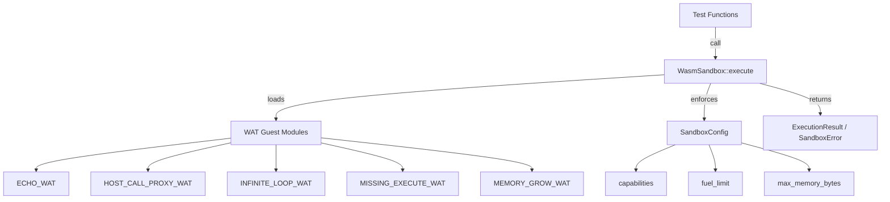

# Other — librefang-runtime-wasm-tests

# librefang-runtime-wasm-tests

Integration test suite for `librefang-runtime-wasm`'s public `WasmSandbox` API. Validates the full sandbox lifecycle — module loading, instantiation, invocation, capability enforcement, fuel metering, memory limits, and ABI validation — using self-contained WAT (WebAssembly Text Format) guest fixtures.

## Purpose

These tests exercise the sandbox boundary invariants that cannot be meaningfully unit-tested inside the runtime crate itself. Every test calls the public async `WasmSandbox::execute()` entry point, which means the `spawn_blocking` + watchdog plumbing is also covered.

The suite has **zero external fixture dependencies** — all guest modules are inlined as `const` WAT strings. Wasmtime's `Module::new` accepts both binary `.wasm` and text `.wat`, so the tests compile and validate modules directly from the inline source.

## Test Architecture



## Guest Fixtures

Each WAT constant defines a minimal guest module targeting a specific boundary condition. All conform to the sandbox ABI (exports: `memory`, `alloc`, `execute`) except where intentionally violating it.

### `ECHO_WAT`

Returns input bytes verbatim by packing `(ptr, len)` into an `i64` return value. Smoke-tests the JSON serialization round-trip and the core `alloc` + `memory` + `execute` ABI contract.

ABI contract: `execute(ptr: i32, len: i32) -> i64` where the upper 32 bits are the pointer and lower 32 bits are the length of the result.

### `HOST_CALL_PROXY_WAT`

Imports `librefang::host_call` and forwards input bytes directly to it. Used for all capability-check tests — the guest delegates to the host, and the host's capability gate determines the response.

### `INFINITE_LOOP_WAT`

Contains a tight `(loop $inf (br $inf))` — an unconditional branch that never exits. Used to verify that the fuel meter traps execution before host CPU is consumed indefinitely.

### `MISSING_EXECUTE_WAT`

Exports only `memory` and `alloc`, intentionally omitting `execute`. Triggers the ABI validation gate in `WasmSandbox::execute_sync` when it attempts to retrieve guest exports.

### `MEMORY_GROW_WAT`

Calls `memory.grow(200)` (≈12.5 MiB) on each invocation. When the host's `MemoryLimiter` denies the request, `memory.grow` returns `-1`, which the guest surfaces as the packed result length. The host's bounds check then catches the oversized value (since `-1` cast through `u32` exceeds any reasonable result cap).

## Test Cases

### Happy Path

| Test | What it proves |
|------|---------------|
| `sandbox_loads_and_invokes_echo_module` | Full load → instantiate → invoke path. JSON input is serialized, passed to the guest, echoed back, and deserialized unchanged. Asserts `fuel_consumed > 0`. |
| `sandbox_accepts_module_loaded_from_disk` | The `execute` API works identically with bytes read from disk via `std::fs::read`. Defends against regressions where the API might require ownership or fail on borrowed data. |

### Capability Boundary

| Test | What it proves |
|------|---------------|
| `sandbox_denies_fs_read_without_capability` | With `capabilities: []`, an `fs_read` host_call returns a JSON error containing `"denied"`. Includes a CWD guard that asserts `Cargo.toml` exists, preventing false passes if the test runner changes the working directory. |
| `sandbox_allows_capless_host_call` | `time_now` succeeds without any explicit capability grant. Proves the boundary isn't a blanket deny-all. |
| `sandbox_capability_grant_toggles_env_read` | Positive→negative pair: `EnvRead("PATH")` granted → `env_read` succeeds; no capabilities → same call is denied. Confirms the capability check is actually dispatched rather than degenerate always-allow or always-deny behavior. |

### Resource Limits

| Test | What it proves |
|------|---------------|
| `sandbox_fuel_cap_traps_runaway_guest` | A guest with an infinite loop traps with `SandboxError::FuelExhausted` when `fuel_limit: 10_000` is set. Validates the `Trap::OutOfFuel` → `SandboxError::FuelExhausted` mapping. |
| `sandbox_memory_cap_blocks_oversized_growth` | With `max_memory_bytes: 1 MiB`, a guest attempting a 200-page growth is blocked. Accepts `SandboxError::AbiError` (failed grow surfaced as oversized result) or any other error variant — the invariant is that the host didn't OOM. An `Ok` result triggers a panic, as it would indicate the cap was bypassed. |

### ABI Validation

| Test | What it proves |
|------|---------------|
| `sandbox_rejects_module_missing_required_exports` | A module without the `execute` export is rejected with `SandboxError::AbiError(msg)` where `msg` contains `"execute"`. Not a panic, not a generic error — a typed, catchable rejection. |

## Dependencies

- **`librefang_runtime_wasm`** — provides `WasmSandbox`, `SandboxConfig`, `SandboxError`
- **`librefang_types`** — provides `Capability` enum (e.g., `Capability::EnvRead(...)`)
- **`serde_json`** — test input construction and result assertions
- **`tempfile`** — `NamedTempFile` for the disk-load test only
- **`tokio`** — `#[tokio::test]` async runtime for all tests

## Running

```sh
# From the workspace root
cargo test -p librefang-runtime-wasm --test sandbox_integration

# Or via nextest
cargo nextest run -p librefang-runtime-wasm --test sandbox_integration
```

All tests are async and run under the tokio runtime. No environment setup, external services, or fixture files are required.

## Adding New Tests

When adding a new boundary test:

1. **Define a WAT fixture** as a `const &str` in the guest fixtures section. Keep it minimal — only export what the test needs. If testing the happy ABI, include `memory`, `alloc`, and `execute`. If testing a violation, omit or break the relevant export.

2. **Use `HOST_CALL_PROXY_WAT`** for capability tests rather than writing a new module. Construct the `input` JSON with `"method"` and `"params"` to target the specific host call.

3. **Assert on `SandboxError` variants** for failure cases — `FuelExhausted`, `AbiError(...)`, etc. — rather than string-matching on `Display` output, to keep assertions resilient to error message formatting changes.

4. **Include a CWD guard** (like the `Cargo.toml` existence check) if the test depends on filesystem paths, so failures are attributed correctly rather than silently passing.