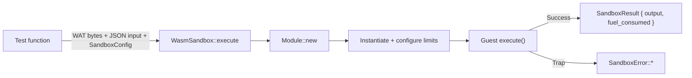

# Other — librefang-runtime-wasm-tests

# librefang-runtime-wasm-tests — Integration Test Suite

## Purpose

End-to-end integration tests for the `WasmSandbox` public API in `librefang-runtime-wasm`. The suite exercises the full lifecycle — load, instantiate, invoke — and validates every sandbox boundary enforcement mechanism: capabilities, fuel caps, ABI validation, and memory limits.

Tests use inline WAT (WebAssembly Text format) guest modules so there are **no external fixture dependencies**. Wasmtime's `Module::new` accepts both binary `.wasm` and text `.wat`, so each test embeds its guest program as a `const &str`.

All tests target the async `execute()` entry point, which means the `spawn_blocking` + watchdog plumbing in the production code path is also covered.

## Test Coverage Matrix

| Test | Boundary | Validates |
|------|----------|-----------|
| `sandbox_loads_and_invokes_echo_module` | Happy path | JSON round-trip through guest, fuel metering reports > 0 |
| `sandbox_accepts_module_loaded_from_disk` | Happy path | Bytes loaded from disk work identically to inline bytes |
| `sandbox_denies_fs_read_without_capability` | Capability | `fs_read` returns a denied error when no capabilities are granted |
| `sandbox_allows_capless_host_call` | Capability | `time_now` (no capability required) succeeds unconditionally |
| `sandbox_capability_grant_toggles_env_read` | Capability | `env_read("PATH")` succeeds with `EnvRead("PATH")` grant, denied without it |
| `sandbox_fuel_cap_traps_runaway_guest` | Fuel | Infinite loop traps with `SandboxError::FuelExhausted` at the configured limit |
| `sandbox_rejects_module_missing_required_exports` | ABI | Module missing `execute` export is rejected with `SandboxError::AbiError` |
| `sandbox_memory_cap_blocks_oversized_growth` | Memory | Guest requesting 200 pages (≈13 MiB) against a 1 MiB cap is denied |

## Guest Module Fixtures

Each fixture is a self-contained WAT module. All well-behaved modules export the same minimum ABI that the sandbox expects:

- **`memory`** — exported linear memory
- **`alloc(size) → ptr`** — bump allocator for the host to write into guest memory
- **`execute(ptr, len) → u64`** — entry point; returns `(ptr: u32, len: u32)` packed into the low and high 32 bits of an `i64`

### `ECHO_WAT`

```
memory(1 page)  ·  alloc  ·  execute → returns input ptr/len unchanged
```

The simplest conforming guest. The host writes JSON into allocated memory, calls `execute`, and the guest returns the same pointer and length — the host then reads back identical bytes. Validates JSON serialization round-trip and the core ABI.

### `HOST_CALL_PROXY_WAT`

```
memory(2 pages)  ·  alloc  ·  execute → forwards to host_call import
```

Imports `librefang::host_call` from the host. `execute` passes its input directly to `host_call` and returns whatever the host sends back. This is the vehicle for testing capability checks — the test sends JSON like `{"method": "fs_read", "params": {"path": "Cargo.toml"}}` and inspects the response for denied/allowed signals.

### `INFINITE_LOOP_WAT`

```
memory(1 page)  ·  alloc  ·  execute → (loop (br 0)) — never returns
```

A tight infinite loop (`loop $inf (br $inf)`). With a low `fuel_limit` (10,000), wasmtime traps with `Trap::OutOfFuel`, which the sandbox maps to `SandboxError::FuelExhausted`. Guards against unbounded CPU consumption by runaway guests.

### `MISSING_EXECUTE_WAT`

```
memory(1 page)  ·  alloc  — no execute export
```

Deliberately omits the required `execute` export. The sandbox's ABI validation detects this during export resolution and returns `SandboxError::AbiError` mentioning the missing symbol. Prevents unclear failures later in the pipeline.

### `MEMORY_GROW_WAT`

```
memory(1 page)  ·  alloc  ·  execute → memory.grow(200), returns grow result as len
```

Calls `memory.grow(200)` (requesting ~12.5 MiB). When the `MemoryLimiter` denies the request, `memory.grow` returns `-1`, which the guest surfaces as the packed result length. The host's bounds check then rejects the oversized (or `-1`-cast) length, surfacing as `SandboxError::AbiError`. This proves the linear-memory cap is enforced at the wasmtime level before host memory is consumed.

## Architecture and Execution Flow

Each test follows the same pattern:



1. **Create sandbox** — `WasmSandbox::new()` initializes the wasmtime `Engine`.
2. **Prepare input** — A `serde_json::Value` and a `SandboxConfig` (fuel limit, capabilities, memory cap).
3. **Call `execute()`** — The async entry point spawns work on a blocking thread, compiles the WAT, validates exports, instantiates with configured limiters, and invokes the guest's `execute`.
4. **Assert outcome** — Either the result JSON matches expectations (happy path) or the error variant matches the expected `SandboxError` variant (boundary tests).

## Dependencies

- **`librefang-runtime-wasm`** — the crate under test; provides `WasmSandbox`, `SandboxConfig`, `SandboxError`.
- **`librefang-types`** — provides `Capability` enum for capability grant configuration.
- **`tokio`** — test runtime (`#[tokio::test]`).
- **`serde_json`** — constructing and asserting on JSON payloads.
- **`tempfile`** — `NamedTempFile` for the disk-load test only.

## Running the Tests

```sh
# From the workspace root
cargo test -p librefang-runtime-wasm --test sandbox_integration

# Single test
cargo test -p librefang-runtime-wasm --test sandbox_integration sandbox_fuel_cap_traps_runaway_guest
```

### CWD Assumption

`sandbox_denies_fs_read_without_capability` asserts that `Cargo.toml` exists in the current working directory. Cargo sets CWD to the crate root by default, but alternative test runners (e.g., nextest with a custom workdir) could break this assumption. The test fails loudly with a diagnostic if `Cargo.toml` is missing rather than silently passing for the wrong reason.

## Adding New Tests

To add a test for a new sandbox boundary:

1. **Define a WAT fixture** as a module-level `const &str` if no existing fixture exercises the behavior. Follow the minimum ABI (`memory`, `alloc`, `execute`).
2. **Write the test** as an `async fn` with `#[tokio::test]`, calling `sandbox.execute()` with the appropriate `SandboxConfig`.
3. **Assert on the specific `SandboxError` variant** for negative tests, or on the `SandboxResult::output` JSON for positive tests. Avoid asserting on exact error messages — prefer matching the error variant and checking for keyword presence.