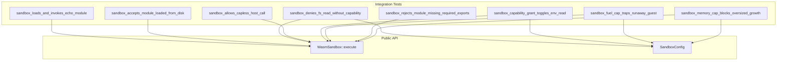

# Other — librefang-runtime-wasm-tests

# librefang-runtime-wasm-tests

Integration test suite for the `librefang-runtime-wasm` sandbox. Exercises the public `WasmSandbox` API end-to-end using WAT-defined guest modules — no external test fixtures required.

## Purpose

This crate validates the sandbox boundary guarantees that `librefang-runtime-wasm` provides. Each test targets a specific security or correctness invariant:

- **Happy path**: module load → instantiate → invoke with JSON round-trip
- **Capability deny**: no-grant implies no-access to host resources
- **Capability allow**: explicit grant enables the corresponding host call
- **Fuel cap**: runaway guests trap instead of burning CPU
- **ABI enforcement**: modules missing required exports are rejected with a typed error
- **Memory cap**: linear-memory growth beyond the configured limit is blocked

## Test Architecture



Every test goes through the public async `execute()` entry point. This ensures the full `spawn_blocking` + watchdog plumbing in `WasmSandbox` is covered — tests don't call internal sync helpers directly.

## Guest Fixtures

All guest modules are inlined as WAT (WebAssembly Text) string constants. Wasmtime's `Module::new` accepts both binary `.wasm` and text `.wat`, so no build step or external files are needed.

### Required Guest ABI

Every guest module that passes ABI validation must export:

| Export | Signature | Purpose |
|--------|-----------|---------|
| `memory` | `(memory 1+)` | Linear memory for JSON I/O |
| `alloc` | `(func (param i32) (result i32))` | Bump allocator — host writes input JSON here |
| `execute` | `(func (param i32 i32) (result i64))` | Entry point. Receives `(ptr, len)`, returns packed `(ptr:u32 << 32 | len:u32)` as `i64` |

### Fixture Modules

| Constant | Description | Used by |
|----------|-------------|---------|
| `ECHO_WAT` | Minimal echo — returns input bytes verbatim via the packed-pointer convention. | `sandbox_loads_and_invokes_echo_module`, `sandbox_accepts_module_loaded_from_disk` |
| `HOST_CALL_PROXY_WAT` | Imports `librefang::host_call` and forwards input to it. Returns whatever the host responds with. | Capability deny/allow tests (`sandbox_denies_fs_read_without_capability`, `sandbox_allows_capless_host_call`, `sandbox_capability_grant_toggles_env_read`) |
| `INFINITE_LOOP_WAT` | Contains a tight `(loop $inf (br $inf))`. Used to prove fuel exhaustion traps the guest. | `sandbox_fuel_cap_traps_runaway_guest` |
| `MISSING_EXECUTE_WAT` | Exports `memory` and `alloc` but omits `execute`. Triggers `SandboxError::AbiError`. | `sandbox_rejects_module_missing_required_exports` |
| `MEMORY_GROW_WAT` | Calls `memory.grow` with a 200-page request (~13 MiB). Surfaces `memory.grow`'s return value (-1 on denial) as the packed result length so the host can detect the failure. | `sandbox_memory_cap_blocks_oversized_growth` |

## Test Cases

### Happy Path

**`sandbox_loads_and_invokes_echo_module`** — The primary smoke test. Constructs a `WasmSandbox`, passes a JSON object to `execute()` with `ECHO_WAT`, and asserts:
- The output JSON matches the input exactly (round-trip).
- `fuel_consumed` is non-zero (metering is active).

**`sandbox_accepts_module_loaded_from_disk`** — Writes `ECHO_WAT` to a `NamedTempFile`, reads the bytes back via `std::fs::read`, and passes them to `execute()`. Defends against regressions where the API might require ownership or fail on borrowed bytes from disk I/O.

### Capability Boundary

**`sandbox_denies_fs_read_without_capability`** — Uses `HOST_CALL_PROXY_WAT` to issue an `fs_read` request for `Cargo.toml`. Configures `SandboxConfig` with an empty `capabilities` vector. Asserts the response JSON contains `"denied"` or `"Capability"`. Includes a CWD guard that asserts `Cargo.toml` exists — this prevents false passes if a future test runner changes the working directory.

**`sandbox_allows_capless_host_call`** — Issues a `time_now` request (a capability-free host call) and verifies the response contains a plausible Unix timestamp (> 1,700,000,000). Confirms the sandbox boundary isn't a blanket deny-all.

**`sandbox_capability_grant_toggles_env_read`** — Runs the same `env_read("PATH")` call twice: once with `Capability::EnvRead("PATH")` granted, once without. Asserts the granted call does **not** return a "denied" error, and the ungranted call **does**. This positive→negative pair confirms the capability dispatcher is wired correctly (not degenerate always-allow or always-deny).

### Resource Limits

**`sandbox_fuel_cap_traps_runaway_guest`** — Configures `SandboxConfig { fuel_limit: 10_000 }` and runs `INFINITE_LOOP_WAT`. Asserts the result is `Err(SandboxError::FuelExhausted)`. Pins the `Trap::OutOfFuel` → `SandboxError::FuelExhausted` mapping.

**`sandbox_memory_cap_blocks_oversized_growth`** — Configures `max_memory_bytes: 1 MiB` and runs `MEMORY_GROW_WAT`, which attempts a 200-page (~13 MiB) growth. The `MemoryLimiter` denies the growth; `memory.grow` returns `-1` to the guest. The test accepts:
- `Err(SandboxError::AbiError(_))` — the guest surfaces -1 as an oversized result length.
- `Err(other)` — any other error variant is acceptable; the invariant is "host didn't OOM".
- Panics on `Ok(...)` — successful execution would mean the memory cap was bypassed.

### ABI Validation

**`sandbox_rejects_module_missing_required_exports`** — Runs `MISSING_EXECUTE_WAT` (no `execute` export) and asserts the error is `SandboxError::AbiError(msg)` where `msg` contains `"execute"`. Confirms typed rejection, not a panic or generic error.

## Dependencies

| Crate | Role |
|-------|------|
| `librefang_runtime_wasm` | System under test. Provides `WasmSandbox`, `SandboxConfig`, `SandboxError`. |
| `librefang_types` | Provides `Capability` enum for capability grant configuration. |
| `serde_json` | Constructs test inputs and inspects outputs. |
| `tempfile` | `NamedTempFile` for the disk-load test. |
| `tokio` | `#[tokio::test]` runtime for async `execute()` calls. |

## Running

```sh
# From the workspace root
cargo test -p librefang-runtime-wasm

# Individual test
cargo test -p librefang-runtime-wasm sandbox_fuel_cap_traps_runaway_guest
```

Tests are self-contained — no Docker, no external services, no fixture files on disk. They only require a working Wasmtime runtime, which is pulled in as a dependency of `librefang-runtime-wasm`.

## Extending the Suite

When adding a new sandbox boundary test:

1. **Define the WAT inline** as a `const` string — don't add external fixture files. Keep the module minimal: only export what the test needs.
2. **Use `execute()`**, not internal APIs. These are integration tests; the public async path is the one that matters.
3. **Assert on `SandboxError` variants** when testing failure modes — don't just check `is_err()`.
4. **Include a positive→negative pair** for new capability checks (grant allows, no-grant denies) to avoid degenerate false-pass scenarios.