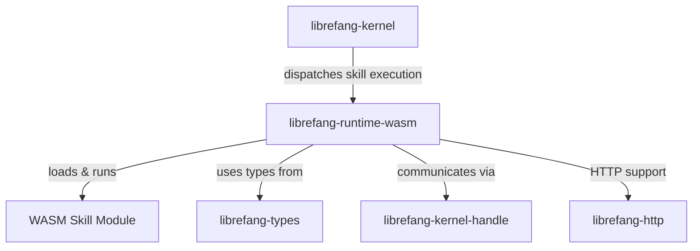

# Other — librefang-runtime-wasm

# librefang-runtime-wasm

WASM skill sandbox for the LibreFang runtime.

## Purpose

This module provides a sandboxed WebAssembly execution environment for LibreFang skills. It uses [Wasmtime](https://wasmtime.dev/) to compile and run WASM modules in an isolated, secure runtime, allowing untrusted or third-party skill code to execute without compromising the host system.

## Role in the Architecture

The WASM runtime sits between the LibreFang kernel and skill modules. The kernel delegates skill execution to this module, which isolates each skill inside a Wasmtime instance. Skills communicate back to the host through the kernel handle interface.

## Key Dependencies

| Dependency | Purpose |
|---|---|
| `wasmtime` | WebAssembly compilation and execution engine |
| `librefang-types` | Shared type definitions used across all LibreFang crates |
| `librefang-kernel-handle` | Interface for sandboxed communication between the WASM guest and the host kernel |
| `librefang-http` | HTTP client/server capabilities available to the sandbox |
| `tokio` | Async runtime for non-blocking WASM instantiation and invocation |
| `serde_json` | JSON serialization for interop between host and guest |
| `tracing` | Structured logging and diagnostics |

## Sandbox Model

Skills are loaded as `.wasm` binaries and executed within Wasmtime's sandbox. This provides:

- **Memory isolation** — each skill operates in its own linear memory space with no access to host memory.
- **Capability control** — host functions exposed to the guest are explicitly defined, limiting what a skill can do.
- **Resource limits** — Wasmtime supports configurable limits on memory, CPU, and table sizes.

Communication between the guest skill and the host flows through `librefang-kernel-handle`, which defines the typed interface the WASM module can call into.

## Async Execution

The module depends on `tokio`, indicating that WASM instantiation and function invocation are async. This prevents skill execution from blocking the kernel's event loop, allowing many skills to run concurrently.

## Error Handling

Two error strategies are in use:

- `thiserror` for typed, predictable error variants (e.g., instantiation failure, trap during execution, invalid module format).
- `anyhow` for internal operations where error variety is unbounded (e.g., Wasmtime engine configuration, I/O during module loading).

## Testing

Dev-dependencies include `tempfile` and `async-trait`, suggesting tests create temporary WASM modules on disk and validate async loading and execution paths end-to-end.

## Connection Points

- **Inbound**: The kernel (or a higher-level orchestrator) calls into this module to instantiate and execute a skill.
- **Outbound**: The module calls into `librefang-kernel-handle` to provide host functions to the WASM guest, and may use `librefang-http` to fulfill network requests originating from skill code.