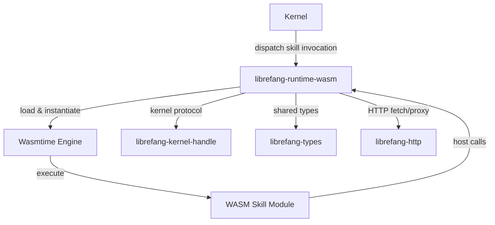

# Other — librefang-runtime-wasm

# librefang-runtime-wasm

WASM skill sandbox for the LibreFang runtime. This crate provides a WebAssembly-based execution environment that isolates and runs user-defined "skills" — plugin-like game logic — within sandboxed WASM instances.

## Purpose

Skills in LibreFang are authored as WebAssembly modules and executed in a controlled sandbox. This crate owns the lifecycle of those modules: loading WASM binaries, instantiating them via the [Wasmtime](https://wasmtime.dev/) runtime, and mediating all communication between guest code and the host system.

By compiling skills to WASM, the system gains:

- **Memory safety** — guest code cannot corrupt host memory
- **Resource limits** — CPU and memory budgets are enforced by the runtime
- **Portability** — skills can be authored in any language that targets WASM

## Dependencies

The crate sits between the kernel layer and the broader LibreFang ecosystem:

| Dependency | Role |
|---|---|
| `wasmtime` | WASM compilation, instantiation, and execution |
| `librefang-types` | Shared domain types passed across the host/guest boundary |
| `librefang-kernel-handle` | Handle protocol for communicating with the game kernel |
| `librefang-http` | HTTP utilities, likely for fetching remote WASM modules or exposing skill APIs |
| `tokio` | Async runtime backing all WASM invocation |
| `serde` / `serde_json` | Serialization of data exchanged with WASM guests |
| `reqwest` | HTTP client for external requests made on behalf of skill modules |

## Architecture

## Key Concepts

### Skill Lifecycle

1. **Loading** — A WASM binary (the compiled skill) is fetched or read from storage. `reqwest` and `librefang-http` may be involved for remote modules.
2. **Compilation** — The binary is compiled through the Wasmtime engine.
3. **Instantiation** — A module instance is created with configured imports (host functions the skill can call) and resource limits.
4. **Invocation** — The host calls an exported function on the instance (e.g., a skill entry point), passing serialized input via `serde_json`.
5. **Teardown** — The instance is dropped, releasing its linear memory and any allocated resources.

### Host-Guest Boundary

All data crossing the WASM boundary is serialized to JSON or passed as primitive types. The crate defines host functions that guest modules can import — these are the only way a skill can interact with the outside game state. Typical host functions include:

- Reading game state through the kernel handle
- Sending messages or events
- Making bounded HTTP requests via `reqwest`

### Sandboxing

Wasmtime enforces isolation at the instruction level. Each skill instance operates in its own linear memory with a configured ceiling. The host controls exactly which capabilities are exposed through the import table — a skill cannot access the filesystem, network, or kernel except through explicitly provided host functions.

## Integration Points

This crate is consumed by higher orchestration layers (likely the main server or a skill manager) that decide *when* to instantiate and invoke skills. It exposes the runtime machinery while remaining agnostic to scheduling or routing decisions.

The `librefang-kernel-handle` dependency suggests that skill invocations may need to query or mutate kernel state, with the handle providing the typed protocol for those operations.