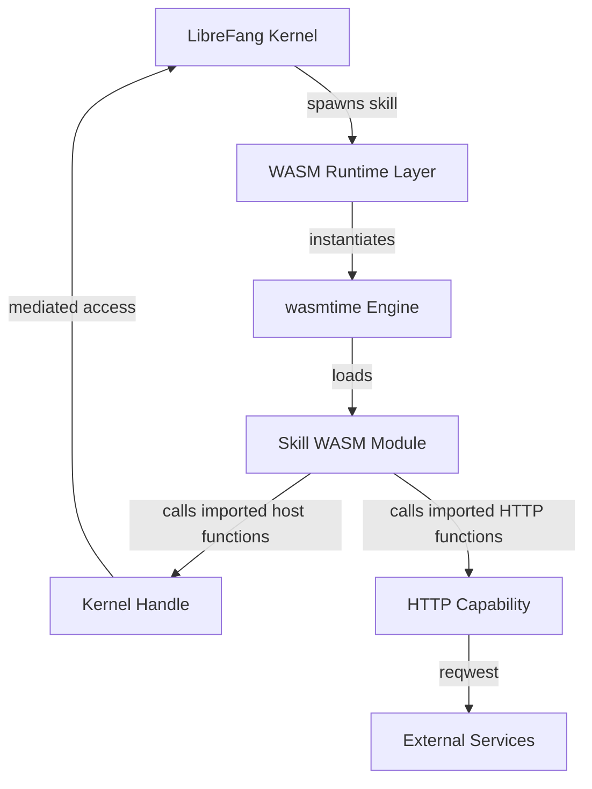

# Other — librefang-runtime-wasm

# librefang-runtime-wasm

WASM skill sandbox for the LibreFang runtime.

## Overview

`librefang-runtime-wasm` provides a WebAssembly-based sandboxed execution environment for **skills** within the LibreFang system. By compiling skill logic to WASM and executing it inside a `wasmtime` runtime, this module ensures that user-defined or third-party skill code runs in an isolated, memory-safe sandbox with controlled access to host capabilities.

## Purpose

Untrusted or user-authored skill code cannot be safely executed directly in the host process. This module addresses that by:

- **Sandboxing** skill execution inside a WASM instance, preventing unrestricted access to the host filesystem, network, or memory.
- **Providing a controlled API surface** through host functions that the WASM guest can import and call, mediated by `librefang-kernel-handle`.
- **Enabling async skill execution** via `tokio`, allowing skills to perform asynchronous operations (HTTP requests, timers, etc.) without blocking the runtime.

## Dependencies and Their Roles

| Dependency | Role in this module |
|---|---|
| `wasmtime` | Core WASM runtime — compiles and instantiates WASM modules, manages WASM memory, and exposes host-to-guest function bindings. |
| `librefang-types` | Shared type definitions (skill descriptors, messages, etc.) used across the crate boundary. |
| `librefang-kernel-handle` | Provides the host-side kernel interface that WASM guest code calls into. Acts as the bridge between sandboxed skills and the LibreFang kernel. |
| `librefang-http` | HTTP capabilities exposed to skills, enabling sandboxed code to make outbound requests via `reqwest`. |
| `tokio` | Async runtime backing skill execution and any asynchronous host functions. |
| `serde` / `serde_json` | Serialization of data passed between host and guest (e.g., skill arguments, return values, configuration). |
| `reqwest` | Underlying HTTP client used by the HTTP capability layer. |
| `tracing` | Structured logging and diagnostics for skill lifecycle events, instantiation, and errors. |
| `thiserror` / `anyhow` | Error types for sandbox-specific failures (instantiation errors, trap handling, import resolution). |

## Architecture

The kernel requests skill execution through the WASM runtime layer. The `wasmtime` engine compiles and instantiates the skill's WASM module. The module imports host-provided functions (via `librefang-kernel-handle` and `librefang-http`), which serve as the only channels through which sandboxed code can interact with the outside world.

## Key Concepts

### Skill

A unit of executable logic compiled to a `.wasm` binary. Skills are loaded, instantiated, and invoked within a sandboxed WASM instance.

### Host Functions

Functions defined on the host side and exported to the WASM guest via `wasmtime` linkers. These form the capability-based API that skills can call. Examples likely include:

- Kernel operations (state queries, event emission) via `librefang-kernel-handle`
- HTTP requests via `librefang-http`

### Sandbox Isolation

Each skill executes in its own WASM instance with its own linear memory. There is no shared state between skill instances unless explicitly mediated through the kernel handle.

## Integration with LibreFang

This module sits between the LibreFang kernel and untrusted skill code:

1. The **kernel** decides when to invoke a skill and provides the skill's WASM binary.
2. This module **instantiates** the WASM module in a `wasmtime` sandbox.
3. The skill **executes**, calling host-imported functions as needed.
4. Results or errors are **returned** to the kernel.

The module depends on `librefang-kernel-handle` to define what the guest is allowed to do, and on `librefang-http` for network access. All types flowing across the boundary are defined in `librefang-types`.

## Error Handling

Errors originating from WASM execution (traps, instantiation failures, import resolution errors) are captured using `thiserror`-based error types and reported via `tracing`. The host never panics on guest misbehavior — all faults are surfaced as `Result` values to the caller.