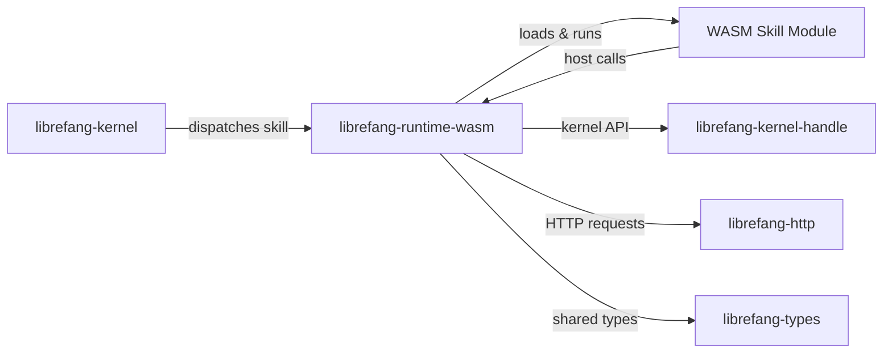

# Other — librefang-runtime-wasm

# librefang-runtime-wasm

WASM skill sandbox for the LibreFang runtime.

## Purpose

This crate provides a **sandboxed WebAssembly execution environment** for running LibreFang skills. By executing skills as compiled WASM modules inside a wasmtime sandbox, the runtime gains:

- **Isolation** — skills cannot directly access the host filesystem, network, or memory outside their linear memory
- **Determinism** — skill behavior is bounded by the capabilities explicitly granted through the host interface
- **Portability** — skills can be authored in any language that compiles to WASM (Rust, C, AssemblyScript, etc.)

## Architecture

The runtime sits between the LibreFang kernel and individual skill modules. When the kernel needs to execute a skill, it delegates to this crate, which:

1. Instantiates a wasmtime engine configured with appropriate limits
2. Loads the skill's WASM module
3. Injects host functions (via `librefang-kernel-handle`) that the skill can call to interact with the game world
4. Executes the skill's entry point
5. Returns results back to the kernel

## Dependencies

| Dependency | Role in this crate |
|---|---|
| `wasmtime` | Core WASM runtime — engine, store, module instantiation, and invocation |
| `librefang-kernel-handle` | Provides the typed handle that WASM host functions use to communicate back to the kernel |
| `librefang-http` | Enables HTTP fetch capabilities exposed to skills (if permitted by the sandbox policy) |
| `librefang-types` | Shared domain types passed between host and guest (serialized via JSON) |
| `serde` / `serde_json` | Serialization boundary between host Rust types and WASM linear memory |
| `tokio` | Async runtime — WASM instantiation and host calls are async |
| `tracing` | Structured logging for sandbox lifecycle events |
| `thiserror` / `anyhow` | Error types for sandbox setup failures and runtime errors |
| `reqwest` | HTTP client backing `librefang-http` |

## Key Concepts

### Serialization Boundary

Skills run in WASM linear memory, which is fundamentally `&[u8]`. All structured data crossing the host/guest boundary is serialized to JSON using `serde_json`. Skills receive arguments as JSON byte buffers and return results the same way. This keeps the host interface simple and language-agnostic.

### Async Execution

Skill execution is fully async via `tokio` and wasmtime's async support. Host functions imported by the skill (e.g., querying game state, making HTTP requests) are async and yield back to the tokio runtime when awaiting I/O.

### Capability-Based Security

Skills can only perform actions that the host explicitly exposes. The host function surface defined in this crate determines what a skill can do. Skills that attempt to import functions not provided by the host will fail to instantiate.

## Integration Points

This crate is consumed by the kernel at the **runtime layer**. The kernel selects this WASM runtime when it needs to run a skill that has been compiled to a `.wasm` binary. The crate is decoupled from the kernel through `librefang-kernel-handle`, which defines the interface the sandbox uses to talk back to the game engine.

## Current Status

The module is in early stages — the dependency declarations and crate metadata are in place, but no execution flows or call graphs have been wired yet. The core sandbox infrastructure (engine configuration, module loading, host function registration, and invocation) is the expected next milestone.