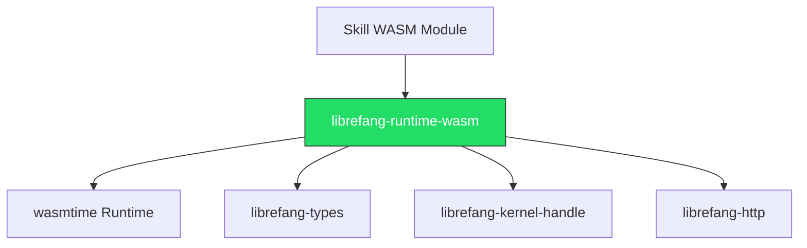

# Other — librefang-runtime-wasm

# librefang-runtime-wasm

WASM skill sandbox for the LibreFang runtime.

## Purpose

This crate provides a WebAssembly-based sandboxing layer responsible for executing **skills** — user-defined or dynamically-loaded game logic — in an isolated, safe environment. By compiling skill code to WASM and running it through the [wasmtime](https://wasmtime.dev/) runtime, the system ensures that skill execution cannot compromise the host process, access unauthorized resources, or interfere with other subsystems.

## Architecture

The crate sits between the LibreFang kernel and the skill code being executed. It uses `wasmtime` as its WASM engine and depends on several sibling crates for type definitions, kernel communication, and HTTP support.

## Key Dependencies

| Dependency | Role |
|---|---|
| `wasmtime` | Core WASM runtime — provides compilation, instantiation, and execution of WASM modules |
| `librefang-types` | Shared type definitions used across the LibreFang ecosystem |
| `librefang-kernel-handle` | Interface for communicating with the LibreFang kernel from within the sandbox |
| `librefang-http` | HTTP client/server support, available to skills that need to make outbound requests |
| `tokio` | Async runtime backing all I/O and WASM execution |
| `serde_json` | JSON serialization for data exchange between the host and WASM guests |
| `tracing` | Structured logging and diagnostics |
| `thiserror` / `anyhow` | Error type definitions and ergonomic error propagation |

## Design Principles

- **Isolation**: Skill code runs inside a WASM sandbox with no direct access to the host filesystem, network, or memory. All interaction with the outside world goes through explicitly-imported host functions exposed via the kernel handle.
- **Determinism**: WASM execution is deterministic given the same inputs, which supports reproducible game logic and testing.
- **Async-native**: Built on `tokio`, allowing the runtime to interleave skill execution with other asynchronous game server work without blocking.

## Integration Points

Skills running inside this sandbox interact with the rest of the LibreFang system through two primary channels:

1. **Kernel handle** (`librefang-kernel-handle`): Skills call into the kernel to query game state, emit events, or request services. The runtime acts as a bridge, exporting host functions that the WASM module can import and call.

2. **HTTP layer** (`librefang-http`): Skills that need to communicate with external services do so through the HTTP crate, which the runtime mediates to enforce security policies.

Data flowing between the host and WASM guest is serialized as JSON via `serde_json`, with the shared types in `librefang-types` ensuring schema compatibility on both sides.

## Error Handling

The crate uses a layered error strategy:

- `thiserror` for defining concrete, typed error enums specific to WASM sandbox operations (e.g., compilation failures, instantiation errors, trap handling).
- `anyhow` for internal propagation where the specific error variant is less important than the diagnostic context.

All errors are instrumented with `tracing` spans to aid debugging in production.