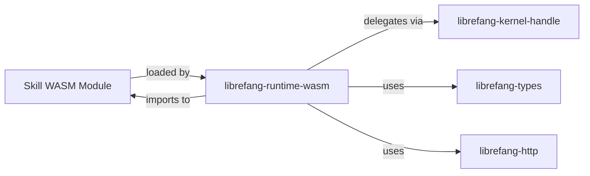

# Other — librefang-runtime-wasm

# librefang-runtime-wasm

WASM-based sandboxed execution environment for LibreFang skills.

## Overview

`librefang-runtime-wasm` provides a WebAssembly runtime that executes LibreFang skills in a sandboxed, isolated environment. Skills compiled to WASM can be loaded, instantiated, and run with controlled access to host capabilities—preventing untrusted skill code from directly accessing system resources.

The module uses [wasmtime](https://wasmtime.dev/) as its WASM engine, offering ahead-of-time compilation, fuel-based metering, and a hardened sandbox boundary.

## Purpose in the Architecture

LibreFang treats skills as potentially untrusted code. Rather than executing them directly in the host process, this module:

1. **Loads** WASM modules containing compiled skill logic.
2. **Sandboxs** execution behind capability-based host interfaces.
3. **Bridges** skill code to kernel services (via `librefang-kernel-handle`), HTTP requests (via `librefang-http`), and shared types (via `librefang-types`).

The WASM guest can only call functions explicitly exported by the host, and the host can only invoke functions exported by the guest. This bidirectional contract forms the security boundary.

## Key Dependencies

| Dependency | Role in this module |
|---|---|
| `wasmtime` | WASM compilation, instantiation, and execution engine |
| `librefang-types` | Shared data structures exchanged between host and guest |
| `librefang-kernel-handle` | Capability handle for delegating privileged operations to the kernel |
| `librefang-http` | HTTP client access exposed to sandboxed skills |
| `tokio` | Async runtime backing WASM execution and host calls |
| `serde_json` | Serialization for structured data crossing the host/guest boundary |
| `tracing` | Observability for skill lifecycle and execution events |

## Execution Model

Skills execute within a wasmtime `Store` with configurable limits (memory, table size, fuel). The host provides WASI-like imports that map to LibreFang kernel operations. When a skill needs to perform a privileged action—sending a message, making an HTTP request, reading state—it calls a host-imported function, which the runtime delegates through `librefang-kernel-handle` or `librefang-http` with appropriate permission checks.

All execution is async via `tokio`, allowing the runtime to multiplex many concurrent skill instances without blocking.

## Integration Points

- **Kernel** connects through `librefang-kernel-handle` to route skill requests (messaging, state access, etc.).
- **HTTP** skills that need network access call through `librefang-http` rather than opening sockets directly.
- **Types** are shared with the rest of the LibreFang ecosystem through `librefang-types`, ensuring consistent serialization across the host/guest boundary.

## Error Handling

The module uses `thiserror` for typed, domain-specific errors (instantiation failures, trap handling, import resolution) and `anyhow` for internal operations where error variety is less critical. All errors are instrumented with `tracing` spans for diagnostics.