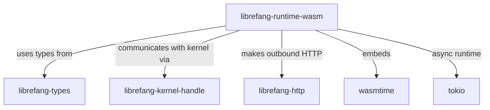

# Other — librefang-runtime-wasm

# librefang-runtime-wasm

WASM skill sandbox for the LibreFang runtime. This module provides a sandboxed WebAssembly execution environment where game skills and abilities are loaded, instantiated, and run in isolation from the core engine.

## Purpose

LibreFang skills are authored as WebAssembly modules. This runtime component is responsible for:

- Loading compiled WASM skill modules
- Sandboxing execution so skill code cannot access host resources directly
- Providing a controlled API surface (host functions) that skills can call into
- Bridging skill invocations with the kernel and HTTP subsystems

By running skills in WASM via [wasmtime](https://wasmtime.dev/), the engine gets memory-safe, deterministic execution with fine-grained control over what each skill is permitted to do.

## Dependencies & Relationships

| Dependency | Role |
|---|---|
| `librefang-types` | Shared data types exchanged between the sandbox and the rest of the engine |
| `librefang-kernel-handle` | Handle used to send commands and queries back to the LibreFang kernel |
| `librefang-http` | HTTP client capabilities exposed to skills that are allowed network access |
| `wasmtime` | The underlying WebAssembly runtime — compiles, instantiates, and runs WASM modules |
| `tokio` | Async runtime backing all WASM invocation and I/O |
| `serde` / `serde_json` | Serialization of arguments and return values across the WASM/host boundary |
| `reqwest` | Underlying HTTP client used by `librefang-http` |
| `tracing` | Structured logging of sandbox lifecycle events |
| `thiserror` / `anyhow` | Error types for sandbox setup and invocation failures |

## Architecture

### Sandbox Lifecycle

1. **Module loading** — A compiled `.wasm` binary is read and validated by wasmtime.
2. **Linker configuration** — Host functions are registered with a `wasmtime::Linker`. These are the only entry points a skill can call to interact with the outside world.
3. **Store creation** — A `wasmtime::Store` is created per-skill instance, carrying its own state and resource limits.
4. **Instantiation** — The module is instantiated against the configured linker, producing a skill instance.
5. **Invocation** — The skill's exported functions (e.g., `on_activate`, `on_tick`, `on_deactivate`) are called by the runtime as game events demand.

### Host Function Surface

Skills communicate with the engine exclusively through host functions injected into the linker. The expected categories include:

- **Kernel commands** — routed through `librefang-kernel-handle`, allowing skills to query game state or request actions.
- **HTTP requests** — proxied through `librefang-http` for skills that need external data, gated by permission checks.
- **Serialization helpers** — utilities for skills to serialize/deserialize structured data using `serde_json`.

The exact function signatures depend on the WASI or custom ABI this module defines. When extending the host surface, prefer narrow, capability-based APIs over broad access.

### Isolation Model

Each skill runs in its own wasmtime `Store`. This provides:

- **Memory isolation** — a skill cannot read or write another skill's linear memory.
- **Resource limits** — CPU and memory caps can be enforced per-store.
- **Capability restriction** — only host functions explicitly registered in the linker are callable.

## Integration Points

### For Engine Developers

To embed this runtime in the LibreFang kernel:

1. Depend on `librefang-runtime-wasm` in your crate.
2. Construct the runtime, passing a `librefang-kernel-handle` instance.
3. Load skill modules from your asset pipeline.
4. Call skill entry points in response to game events.

### For Skill Authors

Skills are compiled to WASM and export well-known functions. They import host functions provided by this runtime. Refer to the skill SDK documentation for the guest-side API.

## Current Status

The call graph shows no detected internal, incoming, or outgoing calls, which indicates this module is in an early or scaffolded state — the dependency declarations and description define the intended architecture, but the execution paths have not yet been wired up. Contributors should expect the public API to evolve as the sandbox is implemented.