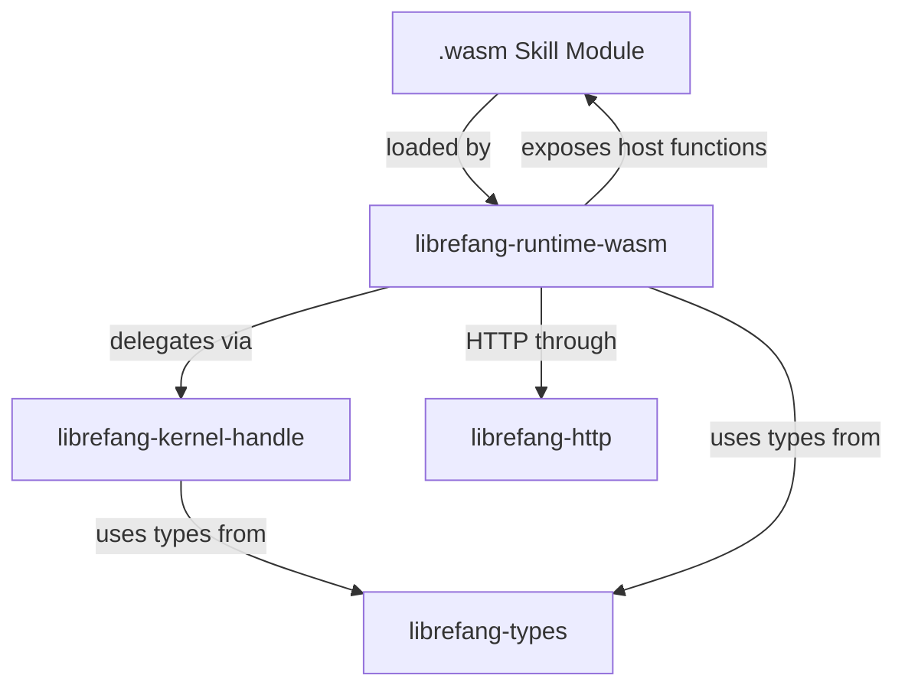

# Other — librefang-runtime-wasm

# librefang-runtime-wasm

WASM skill sandbox for the LibreFang runtime. This module provides a secure, sandboxed execution environment for game skills compiled to WebAssembly, using [wasmtime](https://wasmtime.dev/) as the runtime engine.

## Purpose

LibreFang skills are user-defined behaviors that execute within the game world. Rather than running them as native code with full system access, this module compiles and instantiates them as WASM modules, providing:

- **Memory isolation** — each skill operates within its own WASM linear memory
- **Capability control** — skills can only call host functions explicitly exposed by the runtime
- **Deterministic execution** — WASM provides a deterministic computation model suitable for game logic
- **Language agnosticism** — skills can be authored in any language that compiles to WASM (Rust, C, AssemblyScript, etc.)

## Architecture

The runtime bridges the game kernel and guest skill code. Skills are compiled to `.wasm` files and loaded by this module, which mediates all interaction between the guest and the host system.

## Key Dependencies

| Dependency | Role |
|---|---|
| `wasmtime` | Compiles and executes WASM modules. Provides the store, linker, and instance machinery. |
| `librefang-kernel-handle` | The host-side interface through which skills interact with the game kernel. Host functions exposed to WASM guests delegate to this handle. |
| `librefang-http` | Enables skills to make outbound HTTP requests (e.g., calling external services or APIs). |
| `librefang-types` | Shared type definitions for game state, skill payloads, and inter-module communication. |
| `tokio` | All WASM instantiation and host function calls run on the Tokio async runtime. |
| `serde` / `serde_json` | Serializes and deserializes data passed between host and guest across the WASM boundary. |

## Host-Guest Communication Pattern

Data crosses the WASM boundary through a combination of host functions and shared memory:

1. **Host functions** — The runtime registers callable functions with the wasmtime `Linker`. Guest code invokes these to request kernel operations or HTTP calls. Arguments and return values are serialized to JSON and passed as pointers into linear memory.

2. **Linear memory** — For larger payloads, the host writes data into the guest's exported memory, and the guest reads it. This avoids copying overhead for substantial game state snapshots.

## Error Handling

The module uses `anyhow` for general runtime errors (WASM compilation failures, instantiation errors) and `thiserror` for typed error variants when surfacing specific failure modes to callers. All errors are instrumented through `tracing` spans for observability.

## Integration Points

This module sits between the kernel and the skill layer. Other parts of LibreFang should not instantiate skills directly — they route through the kernel, which delegates to this runtime module. The module has no direct incoming or outgoing module calls at the code level because it is consumed as a library by the kernel orchestration layer, not invoked through a shared call graph.

## Future Considerations

- **WASI support** — If skills need filesystem or clock access, WASI capabilities can be layered through wasmtime's existing WASI integration.
- **Fuel metering** — wasmtime supports fuel-based execution limits to prevent runaway skill computation.
- **Caching** — Compiled WASM modules can be cached to avoid recompilation on every skill load.