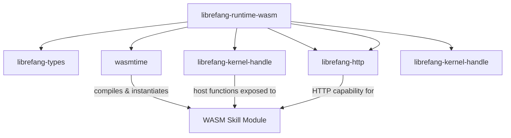

# Other — librefang-runtime-wasm

# librefang-runtime-wasm

WASM skill sandbox for the LibreFang runtime. This module provides a WebAssembly-based execution environment that isolates and runs user-authored "skills" safely within the game runtime.

## Purpose

LibreFang skills are user-defined behaviors that need to execute within the game without compromising the host system. This module uses [wasmtime](https://wasmtime.dev/) to compile and instantiate WASM modules, providing a sandboxed runtime where skills can operate with controlled, explicitly-granted capabilities.

## Architecture

The sandbox bridges the WASM guest and the LibreFang host. Skills running inside wasmtime can call imported host functions to interact with the game kernel and make HTTP requests, but cannot access anything the host does not explicitly expose.

## Key Dependencies and Their Roles

| Dependency | Role |
|---|---|
| `wasmtime` | WASM compilation, instantiation, and execution engine |
| `librefang-types` | Shared type definitions exchanged between host and guest |
| `librefang-kernel-handle` | Exposes kernel operations (state queries, event emission) as host functions callable from WASM |
| `librefang-http` | Provides HTTP client capability to skills that need to make outbound requests |
| `serde` / `serde_json` | Serialization of data passed across the WASM boundary |
| `tokio` | Async runtime backing wasmtime and I/O operations |
| `reqwest` | Underlying HTTP client used by `librefang-http` |
| `tracing` | Structured logging for sandbox lifecycle events |
| `thiserror` / `anyhow` | Error types for sandbox initialization and execution failures |

## WASM Boundary Design

Communication between the host and a WASM skill involves:

1. **Memory sharing** — The host reads from and writes to the WASM module's linear memory.
2. **Host function imports** — Skills declare imports that the host satisfies using `librefang-kernel-handle` and `librefang-http`, giving skills access to kernel operations and HTTP without direct system access.
3. **Serialization** — Complex data structures are serialized with `serde_json` before being written into WASM memory, and deserialized on the other side.

## Integration with LibreFang

This module is consumed by the higher-level runtime orchestration. Other modules load a compiled `.wasm` skill file, pass it to this sandbox for instantiation, and then drive execution by invoking the skill's exported functions in response to game events.

The dependency on `librefang-kernel-handle` rather than the kernel itself ensures the sandbox only has access to the kernel through the controlled handle interface, maintaining the security boundary.

## Error Handling

Errors originating from this module fall into two categories:

- **Initialization errors** — WASM compilation failures, missing imports, or incompatible module formats. These are reported before any skill code runs.
- **Runtime errors** — Traps, out-of-bounds memory access, or host function failures during execution. These are caught at the sandbox boundary and surfaced to the caller.

Both categories use `thiserror` for typed error variants and `anyhow` for internal propagation where specific error handling is not required.