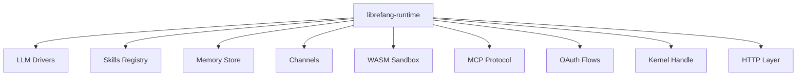

# Other — librefang-runtime

# librefang-runtime

Agent runtime and execution environment for LibreFang. This crate is the central orchestration layer that coordinates LLM inference, tool/skill execution, memory management, communication channels, and sandboxed code execution into a coherent agent lifecycle.

## Architecture

The runtime sits at the top of the dependency tree, composing specialized sub-crates into a unified execution environment:



## Key Responsibilities

- **Agent lifecycle management** — bootstrapping agents, managing their execution context, and coordinating their shutdown
- **LLM orchestration** — dispatching prompts through `librefang-llm-drivers` and `librefang-llm-driver` to various model providers
- **Tool and skill execution** — invoking registered skills via `librefang-skills`, including sandboxed execution of untrusted code
- **Conversation memory** — reading and writing per-session and per-agent memory through `librefang-memory`
- **Channel multiplexing** — routing messages across communication backends via `librefang-channels`
- **MCP integration** — exposing tools and resources through the Model Context Protocol (`librefang-runtime-mcp`)
- **OAuth credential flows** — managing authenticated connections to external services (`librefang-runtime-oauth`)
- **WASM execution** — running user-provided or third-party code in a WebAssembly sandbox (`librefang-runtime-wasm`)

## Sandboxing

The runtime provides two optional Linux sandboxing mechanisms, selectable via Cargo features:

| Feature | Backend | Description |
|---|---|---|
| `landlock-sandbox` | `landlock` | Filesystem access control using Linux Landlock |
| `seccomp-sandbox` | `seccompiler` | System call filtering via seccomp-bpf |

Enable one or both in `Cargo.toml` depending on the target platform and threat model. On non-Linux platforms, these features compile but have no effect. The `wasm-hooks` feature extends the WASM runtime with additional hook callbacks.

## Cryptographic Operations

The runtime includes direct cryptographic dependencies for:

- **Request signing** — `ed25519-dalek` for Ed25519 signature generation and verification
- **HMAC authentication** — `hmac` + `sha2` for keyed-hash message authentication
- **Secure memory handling** — `zeroize` to ensure sensitive material (keys, tokens) is cleared from memory on drop

These are used for verifying agent identities, signing outbound requests, and validating webhook payloads.

## Document Processing

PDF text extraction is supported via `pdf-extract`, enabling agents to ingest and reason over PDF documents as part of their tool execution pipeline.

## Dependency Rationale

| Dependency | Purpose |
|---|---|
| `tokio`, `futures` | Async runtime and combinators |
| `dashmap`, `parking_lot` | High-concurrency maps and mutexes for agent state |
| `rusqlite` | Local SQLite storage for session persistence |
| `tokio-tungstenite` | WebSocket transport for channels and MCP |
| `ureq` | Synchronous HTTP fallback (e.g., for blocking sandboxed operations) |
| `flate2`, `tar` | Archive extraction for artifact downloads |
| `shlex` | Shell-style argument parsing for tool invocation |
| `regex-lite` | Pattern matching in message routing and skill matching |
| `toml`, `dirs` | Configuration file loading from standard OS paths |
| `tempfile` | Ephemeral working directories for isolated execution |

## Connecting to the Rest of the Codebase

`librefang-runtime` is a consumer crate — it depends on nearly every other `librefang-*` crate but is not depended on by any of them. It represents the deployment boundary: the entry point that wires up types, drivers, and infrastructure into a running agent system.

Typical integration pattern:

```
librefang-types        ← shared data structures
librefang-http         ← HTTP client/server primitives
librefang-kernel-handle ← low-level OS abstractions
        │
        ▼
librefang-runtime      ← orchestration and lifecycle
        │
        ▼
application binary / service entrypoint
```

Other runtime sub-crates (`librefang-runtime-mcp`, `librefang-runtime-oauth`, `librefang-runtime-wasm`) encapsulate domain-specific runtime logic, keeping this crate focused on composition and coordination.