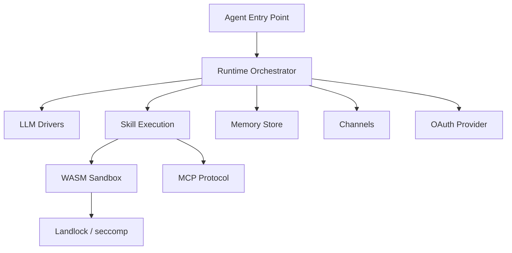

# Other — librefang-runtime

# librefang-runtime

Agent runtime and execution environment for LibreFang. This crate is the orchestration layer that ties together LLM drivers, skill execution, memory, communication channels, and sandboxing into a coherent agent lifecycle.

## Purpose

LibreFang agents need a coordinated environment to: receive instructions, invoke LLMs, execute skills (including untrusted WASM code), persist conversation memory, communicate over channels, and do all of this safely under sandboxing. `librefang-runtime` is that coordination layer.

It does not implement most subsystems itself. Instead it re-exports and orchestrates the following sibling crates:

| Dependency | Role |
|---|---|
| `librefang-runtime-wasm` | WASM-based skill execution engine |
| `librefang-runtime-mcp` | Model Context Protocol client/server |
| `librefang-runtime-oauth` | OAuth flow handling for external services |
| `librefang-llm-driver` | LLM driver trait abstraction |
| `librefang-llm-drivers` | Concrete LLM driver implementations |
| `librefang-skills` | Skill definitions and registry |
| `librefang-memory` | Conversation and agent memory persistence |
| `librefang-channels` | Inter-agent and external communication |
| `librefang-http` | HTTP request/response utilities |
| `librefang-kernel-handle` | Low-level kernel interface |
| `librefang-types` | Shared type definitions |

## Architecture



## Key Subsystems

### LLM Integration

Uses `librefang-llm-driver` for the trait abstraction and `librefang-llm-drivers` for concrete implementations. The runtime manages driver selection, request construction, streaming response handling (`tokio-stream`, `futures`), and retry/error logic.

### Skill Execution

Skills from `librefang-skills` are dispatched through the runtime. Skills that require sandboxed execution are routed to `librefang-runtime-wasm`, which uses **Wasmtime** as the WASM engine.

### Sandboxing

Two Linux-native sandboxing mechanisms are available behind feature flags:

- **`landlock-sandbox`** — Enables [`landlock`](https://docs.rs/landlock) filesystem and capability restrictions. Requires Linux 5.13+.
- **`seccomp-sandbox`** — Enables [`seccompiler`](https://docs.rs/seccompiler) BPF syscall filtering.

Both are optional and compile only when explicitly enabled. The WASM runtime (Wasmtime) provides its own isolation regardless of these flags.

### Memory

Conversation history and agent state are persisted via `librefang-memory`, backed by **SQLite** (`rusqlite`) and cached in-memory with **DashMap** for concurrent access.

### Communication

`librefang-channels` handles message routing between agents and external systems. The runtime also depends on `tokio-tungstenite` and `rustls` for WebSocket-based communication with TLS.

### Cryptography and Identity

Agent identity and request signing use **Ed25519** (`ed25519-dalek`). HMAC-SHA256 (`hmac` + `sha2`) is available for token derivation and integrity checks. Secrets are zeroized on drop via the `zeroize` crate.

### Package Management

The runtime can fetch and extract skill packages over HTTP, with `flate2` and `tar` for decompression and archive handling.

## Feature Flags

| Flag | Default | Description |
|---|---|---|
| `landlock-sandbox` | off | Linux Landlock filesystem sandboxing |
| `seccomp-sandbox` | off | seccomp BPF syscall filtering |
| `wasm-hooks` | off | Enable WASM hook callbacks during skill execution |

## Platform Notes

- On Unix targets, `libc` is linked for low-level system calls (process isolation, signal handling).
- TLS roots are resolved via `webpki-roots` (bundled) and `rustls-native-certs` (system certificate store), ensuring broad compatibility in containerized and bare-metal deployments.
- `landlock-sandbox` and `seccomp-sandbox` are Linux-only. They are no-ops (but still compile) on other platforms.

## Adding the Dependency

```toml
[dependencies]
librefang-runtime = { path = "../librefang-runtime" }

# Optional sandboxing
[features]
default = []
sandboxed = ["librefang-runtime/landlock-sandbox", "librefang-runtime/seccomp-sandbox"]
```