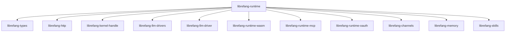

# Other — librefang-runtime

# librefang-runtime

Agent runtime and execution environment for LibreFang. This crate is the top-level orchestrator responsible for managing agent lifecycles, dispatching skill invocations, coordinating LLM interactions, and enforcing sandboxing boundaries during execution.

## Architecture

`librefang-runtime` sits at the center of the LibreFang agent stack. It does not implement low-level primitives itself — instead it wires together the domain-specific subsystems into a cohesive execution loop.

### Subsystem responsibilities

| Dependency | Role in the runtime |
|---|---|
| `librefang-types` | Shared domain types (agent IDs, messages, configs) |
| `librefang-http` | Outbound HTTP communication |
| `librefang-kernel-handle` | Kernel-level resource management |
| `librefang-llm-drivers` / `librefang-llm-driver` | LLM provider abstraction — model invocation, streaming, token accounting |
| `librefang-runtime-wasm` | WASM-based agent/plugin sandboxed execution |
| `librefang-runtime-mcp` | Model Context Protocol client — tool discovery and invocation |
| `librefang-runtime-oauth` | OAuth flows for authenticating agents against external services |
| `librefang-channels` | Message routing between agents, users, and external systems |
| `librefang-memory` | Short-term and long-term agent memory storage and retrieval |
| `librefang-skills` | Skill registry — loading, resolving, and dispatching agent capabilities |

## Key capabilities

### Agent identity and cryptography

The runtime depends on `ed25519-dalek`, `sha2`, `hmac`, and `zeroize` for agent identity management. Agents are identified by Ed25519 key pairs. HMAC-SHA256 is available for message authentication. All secret material uses `zeroize` to clear memory on drop.

### Concurrent state management

`dashmap` and `parking_lot` provide the concurrency primitives for the runtime's internal state: live agent sessions, active channel subscriptions, and in-flight LLM requests. These are chosen over `std::sync` for lower contention under high agent counts.

### Package and document handling

- **Agent packages**: `flate2` and `tar` handle `.tar.gz` archive extraction for agent bundle installation.
- **PDF ingestion**: `pdf-extract` parses PDF documents, making content available to agents for analysis.
- **Shell argument parsing**: `shlex` tokenizes tool command strings.

### WebSocket support

`tokio-tungstenite` provides async WebSocket connectivity, used for real-time channel communication and streaming LLM responses.

### Synchronous HTTP fallback

`ureq` is included alongside `reqwest` for contexts where an async HTTP client is unavailable or undesirable — for example, inside a tightly sandboxed WASM host or during early startup before the Tokio runtime is fully initialized.

## Sandboxing

The runtime offers two optional Linux sandboxing mechanisms, enabled via Cargo features:

| Feature | Dependency | Mechanism |
|---|---|---|
| `landlock-sandbox` | `landlock` 0.4 | Linux Landlock LSM — filesystem access control |
| `seccomp-sandbox` | `seccompiler` 0.5 | seccomp-bpf syscall filtering |

Both are optional and compiled out by default. On Unix systems, `libc` is linked for low-level platform calls (UID/GID management, `chroot`, process signals).

The `wasm-hooks` feature flag enables additional WASM hook points for lifecycle callbacks within the runtime.

## Configuration

`toml` is used for deserializing runtime configuration files. Configuration typically covers:

- Agent identity and key material paths
- LLM provider endpoints and model selection
- Memory backend settings
- Channel connection strings
- Sandbox policy definitions

`dirs` and `tempfile` manage XDG-compliant config/data directories and ephemeral working directories for agent execution.

## Data persistence

`rusqlite` provides embedded SQLite storage for local agent state, session history, and cached data. This is used alongside `librefang-memory` for persistence that doesn't require an external database.

## Integration points

When consuming this crate, you typically:

1. **Construct a runtime instance** with a loaded configuration.
2. **Register skills** via the `librefang-skills` integration.
3. **Attach channel listeners** through `librefang-channels`.
4. **Start the execution loop**, which dispatches incoming messages to agents, invokes LLM drivers, runs MCP tool calls, and optionally executes WASM plugins under sandbox constraints.

The runtime manages the full lifecycle — from message ingestion through LLM reasoning to skill invocation and response delivery — coordinating all subsystems transparently.