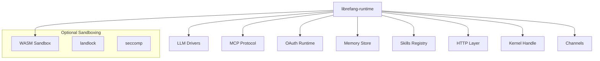

# Other — librefang-runtime

# librefang-runtime

Agent runtime and execution environment for LibreFang. This crate is the orchestration layer that ties together LLM drivers, tool execution, sandboxing, memory, and communication channels into a coherent agent lifecycle.

## Architecture



The runtime acts as the central coordinator. It does not implement low-level functionality itself — instead it consumes specialized sibling crates and wires them into an agent execution loop.

## Key Dependency Groups

### Agent Execution Core

| Crate | Role |
|---|---|
| `librefang-llm-drivers` / `librefang-llm-driver` | Interfaces to LLM providers for inference |
| `librefang-runtime-wasm` | WebAssembly-based sandboxed execution of agent code or tools |
| `librefang-skills` | Registry and dispatch of agent skills/tools |
| `librefang-memory` | Persistent and ephemeral memory stores for conversation and agent state |

### Communication

| Crate | Role |
|---|---|
| `librefang-runtime-mcp` | Model Context Protocol support for tool-calling and context exchange |
| `librefang-runtime-oauth` | OAuth flows for authenticating with external services |
| `librefang-http` | HTTP client/server abstractions |
| `librefang-channels` | Async message-passing channels between runtime components |
| `librefang-kernel-handle` | Low-level kernel interface |

### Sandboxing

Two optional Linux sandboxing strategies are available behind feature flags:

- **`landlock-sandbox`** — Uses the Linux Landlock LSM to restrict filesystem and network access for spawned processes.
- **`seccomp-sandbox`** — Uses seccomp-bpf to filter allowed syscalls.

Both can be enabled simultaneously. On non-Unix platforms, neither feature has effect.

### Document Processing

- **`pdf-extract`** — Extracts text content from PDF files, enabling agents to ingest PDF documents.

### Cryptography & Integrity

- **`ed25519-dalek`** — Ed25519 signing and verification, used for agent identity and message authentication.
- **`sha2`**, **`hmac`** — Hashing and HMAC for integrity checks.
- **`zeroize`** — Secure clearing of sensitive key material from memory.

### Concurrency & State

- **`dashmap`** — Lock-free concurrent hashmap for runtime-wide shared state.
- **`parking_lot`** — Performance-oriented synchronization primitives.
- **`tokio`** — Async runtime foundation.

### Persistence

- **`rusqlite`** — Embedded SQLite for structured local storage (session history, configuration, caches).

### Networking

- **`tokio-tungstenite`** — Async WebSocket client, used for streaming connections to LLM providers or real-time services.
- **`ureq`** — Synchronous HTTP fallback for contexts where async is unavailable.

## Feature Flags

```toml
# Enable Linux Landlock filesystem/network sandboxing
landlock-sandbox = ["dep:landlock"]

# Enable seccomp-bpf syscall filtering
seccomp-sandbox = ["dep:seccompiler"]
```

Both features are off by default. Enable them in `Cargo.toml` when building for production Linux deployments:

```toml
librefang-runtime = { features = ["landlock-sandbox", "seccomp-sandbox"] }
```

## Relationship to Other Crates

This crate sits near the top of the dependency graph. It is a **consumer**, not a library crate consumed by other workspace members. Downstream crates (CLI, server, or integration layers) depend on `librefang-runtime` to bootstrap and manage agents.

The sibling crates it depends on are intentionally kept thin and focused. The runtime's job is to:

1. **Initialize** an agent with its configuration, identity keys, and LLM driver.
2. **Run** the agent loop — sending prompts, receiving completions, dispatching tool calls via MCP or skills.
3. **Isolate** untrusted code execution through WASM or OS-level sandboxing.
4. **Persist** conversation and agent state through the memory and SQLite layers.
5. **Authenticate** to external APIs using the OAuth runtime when required.