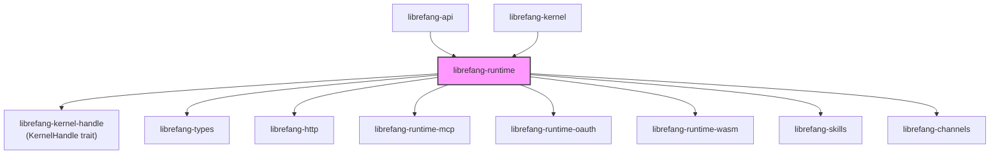

# Other — librefang-runtime

# librefang-runtime

Agent execution engine for LibreFang. Runs the turn-by-turn agent loop, dispatches tools, manages conversation context, and provides sandboxed execution environments.

## Architecture



The kernel invokes the runtime when an agent receives a message. The runtime never depends on the kernel directly — all communication flows through the `KernelHandle` trait (defined in the sibling `librefang-kernel-handle` crate). The kernel implements `KernelHandle`; the runtime consumes it. This breaks what would otherwise be a circular dependency.

## Owned Modules

| Module | Responsibility |
|---|---|
| `agent_loop` | Turn-by-turn agent execution. ~10k LOC. Slated for extraction (#3710). |
| `tool_runner` | Tool execution path. ~9.7k LOC. Also targeted by #3710. |
| `compactor` | Conversation history compaction. |
| `context_budget` | Token budget tracking for context windows. |
| `context_compressor` | Context compression strategies. |
| `context_overflow` | Overflow handling when context exceeds limits. |
| `audit` | Audit trail for agent actions. |
| `auth_cooldown` | Rate-limiting for authentication attempts. |
| `aux_client` | Auxiliary HTTP client for internal calls. |
| `browser` | Browser sandbox execution. |
| `catalog_sync` | Model catalog synchronization. |
| `channel_registry` | Registry of available channels. |
| `checkpoint_manager` | Agent state checkpointing. |
| `dangerous_command` | Detection and handling of dangerous shell commands. |
| `docker_sandbox` | Docker container sandboxing for tool execution. |
| `media` | Media processing (PDF extraction, images). |
| `model_catalog` | `ModelCatalog` type — registry of 130+ models across 28 providers. |
| `mcp` | MCP (Model Context Protocol) client. |
| `prompt_builder` | Prompt assembly from context, tools, and capabilities. |
| `a2a` | Agent-to-Agent peer protocol. |
| `apply_patch` | Tool-level patch application. |

### What is NOT owned here

- Agent registry, scheduler, cron, orchestration → `librefang-kernel`
- HTTP routing → `librefang-api`
- Channel transport adapters → `librefang-channels`
- Skill loading → `librefang-skills`

## KernelHandle

The `KernelHandle` trait lives in `librefang-kernel-handle`, not in this crate. Whenever runtime code needs a kernel callback (persisting state, emitting events, accessing shared services), it goes through `KernelHandle`.

```rust
// Correct: accept KernelHandle as a parameter
pub async fn run_agent<H: KernelHandle>(handle: &H, ...) { ... }
```

Never depend on `librefang-kernel` directly. Never mock `KernelHandle` by hand — use `librefang-testing::MockKernelBuilder`.

## ModelCatalog

`model_catalog::ModelCatalog` is the type definition for the model registry. It tracks 130+ models across 28 providers.

The kernel wraps `ModelCatalog` in `arc_swap::ArcSwap` (#3384) for lock-free reads. All mutations must go through the kernel's `model_catalog_update(|cat| ...)` callback on `KernelHandle`. The runtime does not mutate the catalog directly.

## MCP Client and OAuth

The `mcp` module provides the MCP client. OAuth state for MCP servers is stored in `mcp_auth_states`. The `McpOAuthProvider` trait is implemented on the kernel side; the runtime calls it through `KernelHandle`.

OAuth subsystems (`chatgpt_oauth`, `copilot_oauth`) are re-exported from `librefang-runtime-oauth`.

## Feature Flags

| Feature | Enables |
|---|---|
| `landlock-sandbox` | Linux Landlock-based sandboxing via the `landlock` crate. |
| `seccomp-sandbox` | Seccomp-based sandboxing via `seccompiler`. |
| `ssh-backend` | Remote SSH tool-execution backend via `russh` / `russh-keys` (#3332). |
| `daytona-backend` | Daytona managed-sandbox backend (#3332). No additional deps — uses existing `reqwest`. |

## Cross-Cutting Invariants

### Deterministic prompt ordering (#3298)

Tool definitions, MCP server summaries, and capability lists must be sorted before stringification. Use `BTreeMap` / `BTreeSet`, never `HashMap`. Non-deterministic ordering causes flaky tests and reproducibility failures.

### Identity files

Workspace identity files live at `{workspace}/.identity/`, not the workspace root. `read_identity_file()` falls back to the root for pre-migration workspaces. `migrate_identity_files()` runs on every agent spawn to handle legacy locations.

### USER_AGENT constant

Every outbound HTTP request must include the `USER_AGENT` constant:

```rust
use librefang_runtime::USER_AGENT;
req.header("User-Agent", USER_AGENT)
```

The audit hook flags any request missing this header.

## Async Pitfalls

### ErrorTranslator is !Send

`ErrorTranslator` (from `RequestLanguage`) is `!Send`. Any `.await` that follows construction of an `ErrorTranslator` must happen after `drop(t)`, or you will hit a cryptic axum `Handler<_, _>` trait-bound error:

```rust
// Wrong — compiler error
let t = ErrorTranslator::new(lang);
let result = some_async_call().await;
t.translate(result)

// Right — drop before await
let result = some_async_call().await;
let t = ErrorTranslator::new(lang);
t.translate(result)
```

### No blocking primitives in async context

- Use `tokio::fs`, not `std::fs`.
- Use `arc_swap` or `parking_lot`, not `std::sync::RwLock`.
- Never call `tokio::block_on` from within this crate.

## Testing

This crate historically had zero integration tests (#3696). Any new runtime work **must** include at least one `#[tokio::test]` exercising the new code path.

Run the test suite:

```bash
cargo test -p librefang-runtime
```

For type-checking without a full build:

```bash
cargo check --workspace --lib
```

Do not run `cargo build` locally — real builds run in CI.

## Restrictions

- **No `librefang-kernel` import.** Use `KernelHandle`.
- **No `librefang-api` import.** The API layer consumes runtime; never the reverse.
- **No additions to `agent_loop.rs` or `tool_runner.rs`.** Both are slated to shrink via #3710. Extract new functionality into separate modules.
- **No `unwrap()` / `panic!()` on wire values.** Everything from external input must be handled with proper error propagation.
- **No inline `KernelHandle` mocks.** Use `librefang-testing::MockKernelBuilder`.
- **No `cargo build`.** Use `cargo check --workspace --lib`.