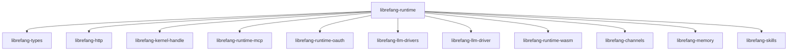

# Other — librefang-runtime

# librefang-runtime

Agent runtime and execution environment for LibreFang. This crate orchestrates the full lifecycle of an agent — from initialization through task execution to shutdown — by composing subsystems for LLM interaction, sandboxed code execution, memory, skills, and external protocol support.

## Architecture

The runtime sits at the center of LibreFang's agent stack. It does not implement low-level primitives itself; instead it wires together sibling crates into a coherent execution environment.



### Subsystem responsibilities

| Dependency | Role in the runtime |
|---|---|
| `librefang-types` | Shared domain types (messages, agent config, error types) |
| `librefang-http` | Outbound HTTP client used by agents for web requests |
| `librefang-kernel-handle` | Host-level system interactions |
| `librefang-runtime-mcp` | Model Context Protocol client — lets agents call external tool servers |
| `librefang-runtime-oauth` | OAuth flows for authenticating agents against third-party services |
| `librefang-llm-drivers` / `librefang-llm-driver` | Pluggable LLM backends (OpenAI, Anthropic, local models, etc.) |
| `librefang-runtime-wasm` | WebAssembly sandbox for running untrusted agent code |
| `librefang-channels` | Async message passing between agent components and external consumers |
| `librefang-memory` | Persistent and ephemeral memory stores for agent context |
| `librefang-skills` | Declarative skill definitions and dispatch |

## Key capabilities

### Sandboxed execution

The runtime provides two orthogonal sandboxing mechanisms, both optional and selected at compile time via Cargo features:

- **`landlock-sandbox`** — Linux Landlock access-control profiles. Constrains filesystem and network access for spawned processes.
- **`seccomp-sandbox`** — seccomp-bpf syscall filters via `seccompiler`. Restricts the set of syscalls available to sandboxed code.
- **WASM sandbox** — `wasmtime`-based execution of untrusted WebAssembly modules through `librefang-runtime-wasm`. Enabled unconditionally; the `wasm-hooks` feature adds additional hook points.

On Unix platforms, `libc` is linked directly for low-level process and signal handling required by sandbox setup.

### LLM integration

LLM calls are routed through the `librefang-llm-driver` trait abstraction, with concrete implementations provided by `librefang-llm-drivers`. The runtime manages:

- Streaming response handling via `tokio-stream` and `futures`
- Request signing where required (Ed25519 via `ed25519-dalek`)
- Retry and error propagation

### Model Context Protocol (MCP)

Through `librefang-runtime-mcp` and the `rmcp` crate, the runtime exposes an MCP client so agents can discover and invoke tools on external MCP-compliant servers over stdio or HTTP transports.

### Cryptographic operations

- **Ed25519** (`ed25519-dalek`) — agent identity signing and verification
- **HMAC-SHA256** (`hmac` + `sha2`) — message authentication and webhook verification
- **Hex/Base64** encoding for wire formats
- **`zeroize`** — secure cleanup of sensitive key material

### Persistence and state

- **SQLite** (`rusqlite`) — local relational storage for agent state, conversation history, and configuration
- **Concurrent maps** (`dashmap`) — in-process, lock-free keyed state
- **`parking_lot`** mutexes and rw-locks for synchronized access patterns

### Networking

- **`reqwest`** — async HTTP client
- **`ureq`** — synchronous HTTP fallback (used in contexts where an async runtime is unavailable, such as WASM host functions)
- **`tokio-tungstenite`** — WebSocket connections, with TLS via `rustls`
- **`rustls`** with `webpki-roots` / `rustls-native-certs` — TLS certificate verification

### Package management

`flate2` and `tar` are included for unpacking skill bundles and WASM modules distributed as `.tar.gz` archives.

## Feature flags

| Feature | Default | Description |
|---|---|---|
| `landlock-sandbox` | off | Enable Linux Landlock filesystem/network sandboxing |
| `seccomp-sandbox` | off | Enable seccomp-bpf syscall filtering |
| `wasm-hooks` | off | Register additional WASM lifecycle hooks |

Both sandbox features target Linux. They compile conditionally and have no effect on other platforms.

## Adding the dependency

```toml
[dependencies]
librefang-runtime = { path = "../librefang-runtime" }

# Optional: enable sandboxing
[features]
default = []
linux-sandbox = ["librefang-runtime/landlock-sandbox", "librefang-runtime/seccomp-sandbox"]
```

## Thread safety and async runtime

The crate is designed for use within a `tokio` multi-threaded runtime. All public async functions expect an active Tokio context. Shared state uses `DashMap` and `parking_lot` primitives rather than `std::sync` to minimize async-aware lock contention.