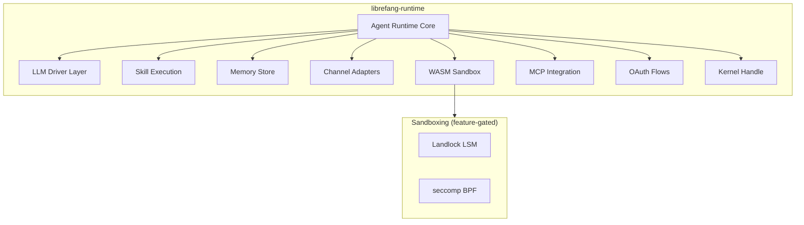

# Other — librefang-runtime

# librefang-runtime

Agent runtime and execution environment for LibreFang. This crate is the central orchestration layer that brings together LLM drivers, tool/skill execution, memory, communication channels, WASM sandboxing, and MCP (Model Context Protocol) integration into a coherent agent lifecycle.

## Architecture

## Purpose

The runtime is responsible for:

- **Agent lifecycle management** — spawning, running, and tearing down agent instances
- **LLM interaction** — routing prompts through the appropriate LLM driver and handling streaming responses
- **Tool and skill dispatch** — invoking registered skills, shell commands, and WASM modules in response to LLM tool calls
- **Memory persistence** — storing and retrieving conversation history and agent state via `librefang-memory` (backed by `rusqlite`)
- **Channel communication** — receiving messages from and sending replies to external channels (e.g., WebSocket, HTTP) through `librefang-channels`
- **MCP integration** — exposing and consuming Model Context Protocol tools via `rmcp` and `librefang-runtime-mcp`
- **Secure execution** — optionally sandboxing untrusted code paths using Landlock or seccomp

## Dependency Breakdown

### Core Infrastructure

| Crate | Role |
|---|---|
| `librefang-types` | Shared type definitions (agent IDs, messages, configs) |
| `librefang-http` | HTTP client/server utilities |
| `librefang-kernel-handle` | Low-level kernel interface for agent isolation |
| `librefang-channels` | Input/output channel abstractions (WebSocket, stdio, etc.) |

### LLM Integration

| Crate | Role |
|---|---|
| `librefang-llm-driver` | Trait definitions for LLM backends |
| `librefang-llm-drivers` | Concrete driver implementations (OpenAI, Anthropic, local models, etc.) |

The runtime uses `librefang-llm-driver` traits for dependency injection and loads specific implementations from `librefang-llm-drivers` based on agent configuration.

### Runtime Subsystems

| Crate | Role |
|---|---|
| `librefang-runtime-wasm` | WASM module loading, compilation via `wasmtime`, and execution |
| `librefang-runtime-mcp` | MCP server/client integration for tool discovery and invocation |
| `librefang-runtime-oauth` | OAuth2 authentication flows for third-party service access |

### Agent Capabilities

| Crate | Role |
|---|---|
| `librefang-memory` | Conversation and state persistence (`rusqlite`-backed) |
| `librefang-skills` | Skill registry, definition, and dispatch |

### Cryptography & Identity

`ed25519-dalek`, `sha2`, `hmac`, `rand`, and `zeroize` provide:

- Agent identity signing and verification (Ed25519)
- HMAC-based message authentication
- Secure key material handling with zeroization

### Networking

- **Async HTTP**: `reqwest` for outbound requests
- **Sync HTTP**: `ureq` for blocking operations (e.g., during startup before tokio runtime is available)
- **TLS**: `rustls` with both `webpki-roots` and `rustls-native-certs` for certificate verification
- **WebSocket**: `tokio-tungstenite` for persistent bidirectional connections

### Packaging & Distribution

`flate2` and `tar` handle `.tar.gz` archive extraction, used for downloading and installing skill packages or WASM modules at runtime.

## Feature Flags

### `landlock-sandbox`

Enables Linux Landlock LSM sandboxing via the `landlock` crate. When active, WASM modules and shell tool executions can be restricted to specific filesystem paths and denied network access.

**Linux kernel 5.13+ required.** No-op on non-Linux platforms.

### `seccomp-sandbox`

Enables seccomp BPF syscall filtering via `seccompiler`. Provides coarse-grained syscall whitelisting for sandboxed execution contexts.

These two features are independent — you can enable either, both, or neither depending on the target platform's security requirements.

### `wasm-hooks`

Enables WASM-based hook points in the agent lifecycle (e.g., pre/post message processing hooks compiled to WASM).

## Configuration

The runtime loads agent configuration from TOML files (via `toml` and `dirs` for standard config path resolution). The `url`, `shlex`, and `regex-lite` crates support URL parsing, shell-style argument tokenization, and pattern matching within configuration and tool definitions.

## Concurrency Model

The runtime is fully async, built on `tokio`. Concurrency primitives:

- `dashmap` for lock-free concurrent hash maps (agent registries, connection pools)
- `parking_lot` for lower-overhead mutexes and read-write locks where `DashMap` isn't suitable
- `tokio-stream` and `futures` for composing async stream pipelines (particularly for LLM response streaming)

## Testing

`tokio-test` is included in dev-dependencies for writing async unit tests that exercise the runtime's agent loops, skill dispatch, and channel handling.