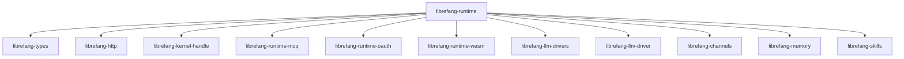

# Other — librefang-runtime

# librefang-runtime

Agent runtime and execution environment for LibreFang. This crate is the top-level orchestration layer that wires together LLM drivers, sandboxing, skill execution, memory, channel I/O, MCP tooling, OAuth flows, and WASM plugin support into a coherent agent lifecycle.

## Role in the System

`librefang-runtime` sits at the center of the LibreFang architecture. It does not implement low-level primitives itself — instead it depends on focused sub-crates and coordinates them to provide a complete environment where agents can be instantiated, run, paused, and torn down.

```
┌──────────────────────────────────────────────────────────────┐
│                    librefang-runtime                         │
│                                                              │
│  ┌─────────────┐  ┌──────────────┐  ┌────────────────────┐  │
│  │ Agent       │  │ Skill        │  │ LLM Driver         │  │
│  │ Lifecycle   │  │ Dispatch     │  │ Integration        │  │
│  └──────┬──────┘  └──────┬───────┘  └────────┬───────────┘  │
│         │                │                    │              │
│  ┌──────┴──────┐  ┌──────┴───────┐  ┌────────┴───────────┐  │
│  │ Sandbox     │  │ Memory       │  │ Channel I/O        │  │
│  │ (WASM/Landlock/seccomp)│  │                    │              │
│  └─────────────┘  └──────────────┘  └────────────────────┘  │
│                                                              │
│  ┌─────────────┐  ┌──────────────┐  ┌────────────────────┐  │
│  │ MCP Runtime │  │ OAuth Runtime│  │ HTTP / WebSocket   │  │
│  └─────────────┘  └──────────────┘  └────────────────────┘  │
└──────────────────────────────────────────────────────────────┘
```

## Architecture



### Subsystem Breakdown

| Dependency | Purpose |
|---|---|
| `librefang-types` | Shared domain types — agent IDs, messages, configuration structs |
| `librefang-http` | HTTP client/server utilities used for outbound API calls and inbound webhooks |
| `librefang-kernel-handle` | Low-level kernel interface for privilege management and process control |
| `librefang-runtime-mcp` | Model Context Protocol runtime — tool registration, invocation, and result routing |
| `librefang-runtime-oauth` | OAuth2 flow handling — token acquisition, refresh, and storage |
| `librefang-runtime-wasm` | WebAssembly runtime powered by Wasmtime — sandboxed execution of user-supplied code |
| `librefang-llm-drivers` / `librefang-llm-driver` | LLM provider abstraction — streaming completions, embeddings, model selection |
| `librefang-channels` | Async channel primitives for inter-agent and agent-to-system messaging |
| `librefang-memory` | Short-term and long-term memory — storage, retrieval, and context window management |
| `librefang-skills` | Skill definitions, registration, and dispatch logic |

## Sandbox Features

The runtime supports three complementary sandboxing mechanisms for isolating untrusted code execution. These are controlled via Cargo feature flags:

### `landlock-sandbox`

Linux Landlock LSM integration. Provides filesystem access control by restricting the set of paths an agent process can read, write, or execute.

```toml
# Cargo.toml
[features]
landlock-sandbox = ["dep:landlock"]
```

Available only on Linux kernels ≥ 5.13.

### `seccomp-sandbox`

Seccomp BPF syscall filtering. Restricts the set of system calls available inside sandboxed execution contexts.

```toml
# Cargo.toml
[features]
seccomp-sandbox = ["dep:seccompiler"]
```

### `wasm-hooks`

Enables hook points within the WASM execution environment, allowing agents to register callbacks at specific lifecycle stages.

```toml
# Cargo.toml
[features]
wasm-hooks = []
```

All three features are optional and disabled by default. Enable them individually or combine them for defense in depth:

```toml
librefang-runtime = { path = "../librefang-runtime", features = ["landlock-sandbox", "seccomp-sandbox"] }
```

## Key External Dependencies

The runtime pulls in several categories of external crates:

**Async runtime and streams:**
- `tokio`, `tokio-stream`, `futures` — async execution and stream composition

**Serialization and data:**
- `serde`, `serde_json`, `toml` — configuration parsing and message serialization

**Cryptography and security:**
- `ed25519-dalek` — Ed25519 signing and verification
- `sha2`, `hmac` — hashing and HMAC computation
- `hex`, `base64` — encoding utilities
- `rand` — secure random number generation
- `zeroize` — secure memory wiping for secrets

**WASM execution:**
- `wasmtime` — WebAssembly runtime engine

**Networking:**
- `reqwest` — HTTP client
- `tokio-tungstenite` — async WebSocket client
- `rustls`, `webpki-roots`, `rustls-native-certs` — TLS without OpenSSL dependency
- `ureq` — synchronous HTTP (used in non-async contexts such as sandbox setup)
- `http` — HTTP type definitions

**Storage:**
- `rusqlite` — SQLite for persistent state
- `dashmap` — concurrent hash maps for in-memory indexes

**System interaction (Unix-only):**
- `libc` — low-level POSIX bindings for process and signal management

**Archiving:**
- `flate2`, `tar` — decompression and archive extraction for bundle/package handling

## Building

```bash
# Default build (no sandbox features)
cargo build -p librefang-runtime

# With full Linux sandboxing
cargo build -p librefang-runtime --features "landlock-sandbox,seccomp-sandbox"

# With WASM hooks enabled
cargo build -p librefang-runtime --features "wasm-hooks"
```

## Testing

```bash
cargo test -p librefang-runtime
```

Dev-dependencies include `tokio-test` for async test utilities.

## Integration Notes

When consuming `librefang-runtime` from a higher-level crate or application:

1. **Feature selection matters.** Sandbox features are compile-time only — choose them based on your target deployment environment and security requirements.

2. **Wasmtime version alignment.** The WASM runtime uses `wasmtime` as a workspace dependency. Ensure any crates that also depend on Wasmtime use the same version to avoid duplicate symbols or ABI mismatches.

3. **TLS configuration.** The runtime uses `rustls` exclusively. If your deployment requires custom CA certificates, configure them via `rustls-native-certs` (system cert store) or provide roots explicitly through `webpki-roots`.

4. **Platform considerations.** The `libc` dependency is gated behind `cfg(unix)`. Windows builds will compile without it, but certain low-level process management features will be unavailable.