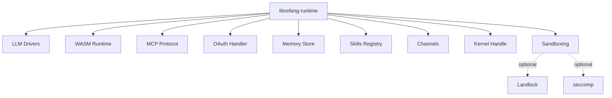

# Other — librefang-runtime

# librefang-runtime

Agent runtime and execution environment for LibreFang. This crate orchestrates the full lifecycle of an agent — from initialization through LLM interaction, tool/skill invocation, memory management, and secure sandboxing of untrusted code.

## Architecture

The runtime sits at the center of the agent stack, pulling in specialized subsystems as dependencies and coordinating them into a coherent execution loop.

## Key Responsibilities

- **Agent lifecycle management** — initializing, running, and tearing down agent sessions
- **LLM orchestration** — selecting and driving LLM backends via `librefang-llm-driver` / `librefang-llm-drivers`
- **Tool and skill dispatch** — routing LLM tool calls to registered skills through `librefang-skills`
- **Sandboxed code execution** — running untrusted WASM modules via `wasmtime` (through `librefang-runtime-wasm`)
- **MCP integration** — exposing/connecting to Model Context Protocol servers via `rmcp` and `librefang-runtime-mcp`
- **Secure storage** — persisting agent state and conversation history using `librefang-memory` (backed by SQLite via `rusqlite`)
- **Channel-based communication** — message passing with the outside world through `librefang-channels`
- **OAuth flows** — authenticating against external services via `librefang-runtime-oauth`

## Optional Features

| Feature | Dependency | Description |
|---|---|---|
| `landlock-sandbox` | `landlock` | Linux Landlock LSM sandboxing for filesystem and IPC access control |
| `seccomp-sandbox` | `seccompiler` | seccomp-bpf syscall filtering to restrict the agent's kernel interface |
| `wasm-hooks` | — | Enables WASM-based hook points in the agent execution cycle |

Both sandboxing features are Linux-only and can be combined for layered isolation.

## Notable Dependencies

### Cryptography and Identity
- `ed25519-dalek` — Ed25519 signing/verification for agent identity and message authentication
- `sha2`, `hmac` — HMAC-SHA256 and general hashing for integrity checks and token derivation
- `zeroize` — secure clearing of sensitive key material from memory

### Networking
- `reqwest` — outbound HTTP with TLS (`rustls`)
- `tokio-tungstenite` — WebSocket client for streaming LLM responses and MCP connections
- `rustls`, `webpki-roots`, `rustls-native-certs` — TLS stack with both bundled and system certificate roots

### Concurrency
- `dashmap` — lock-free concurrent hashmap for shared runtime state
- `tokio-stream`, `futures` — async stream processing for LLM token streams and event pipelines

### Utilities
- `ureq` — synchronous HTTP client (used for non-async contexts such as WASM fetch operations)
- `flate2`, `tar` — archive extraction, likely for skill/package bundles
- `shlex` — shell-style string parsing for command construction
- `base64`, `hex` — encoding utilities

## Relationship to Other Crates

This crate is a **composition root**. It does not define the core abstractions — those live in their respective crates. Instead, it wires them together:

- `librefang-types` provides shared data structures passed between all layers
- `librefang-http` handles low-level HTTP concerns
- `librefang-kernel-handle` abstracts OS-level operations the agent may need
- The `librefang-runtime-*` sub-crates isolate individual subsystems (MCP, OAuth, WASM) so they can be developed and tested independently