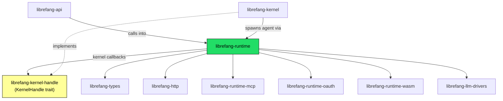

# Other — librefang-runtime

# librefang-runtime

Agent runtime and execution environment for LibreFang. Hosts the turn-by-turn agent loop, tool dispatch, context window management, audit trail, sandboxed execution, the A2A peer protocol, channel registry, and re-exports OAuth subsystems from `librefang-runtime-oauth`.

## Architecture



The runtime never depends on `librefang-kernel` or `librefang-api` directly. All kernel communication flows through the `KernelHandle` trait defined in the sibling `librefang-kernel-handle` crate. Kernel implements the trait; runtime consumes it. This breaks what would otherwise be a circular dependency.

## Key Subsystems

### `agent_loop` — Turn-by-Turn Execution

The core agent execution loop. Approximately 10k lines. Each "turn" receives a user message, builds a prompt incorporating context and tool definitions, calls the LLM, processes the response (which may include tool calls), dispatches tools via `tool_runner`, and loops until the agent produces a final text response or hits a stop condition.

This module is a god module tracked by issue #3710 for extraction into smaller units. **Do not add new files or significant logic here** without coordination.

### `tool_runner` — Tool Dispatch

Approximately 9.7k lines. Executes individual tool calls produced by the agent loop. Validates tool invocations, enforces dangerous command policies via `dangerous_command`, and routes to the appropriate executor (shell, browser, docker, patch, MCP tool, etc.). Also tracked by #3710 for decomposition.

### `model_catalog::ModelCatalog`

Static registry of 130+ models across 28 providers. The kernel wraps this in an `arc_swap::ArcSwap` (see #3384) so the catalog can be hot-reloaded. **All mutations must go through the kernel** via `model_catalog_update(|cat| ...)`. The runtime owns the type definition; the kernel owns the live instance.

### `mcp` — Model Context Protocol Client

Connects to external MCP servers. OAuth state for authenticated MCP servers lives in `mcp_auth_states`. The OAuth provider trait `McpOAuthProvider` is defined on the kernel side; runtime calls through `KernelHandle` to trigger OAuth flows.

### `a2a` — Agent-to-Agent Peer Protocol

Enables agents to communicate with other agents running in the same or remote LibreFang instances. Handles peer discovery, message formatting, and response correlation.

### Context Management

Four cooperating modules control how conversation history fits within model context windows:

| Module | Responsibility |
|---|---|
| `context_budget` | Calculates token budgets for system prompt, tools, history, and response |
| `context_compressor` | Summarizes or compresses older messages to reclaim budget |
| `context_overflow` | Handles cases where context exceeds the window even after compression |
| `compactor` | Orchestrates the overall compaction strategy |

### `prompt_builder`

Assembles the final prompt sent to the LLM. Incorporates system instructions, tool definitions, MCP server summaries, conversation history, and capability lists. Subject to the **deterministic ordering invariant** (see below).

### Sandboxes

Three sandbox types for isolated tool execution:

- **`browser`** — Headless browser automation
- **`docker_sandbox`** — Container-isolated execution (behind feature flags)
- **`process`** — OS-level process isolation using `landlock` (feature `landlock-sandbox`) or `seccomp` (feature `seccomp-sandbox`)

### Other Subsystems

| Module | Purpose |
|---|---|
| `audit` | Records agent actions for compliance and debugging |
| `auth_cooldown` | Rate-limits authentication attempts |
| `aux_client` | Auxiliary HTTP client for outbound calls |
| `catalog_sync` | Synchronizes model catalog updates |
| `channel_registry` | Tracks available output channels |
| `checkpoint_manager` | Saves and restores agent execution state |
| `dangerous_command` | Validates and gates potentially harmful shell commands |
| `media` | Processes media attachments (images, PDFs, etc.) |
| `apply_patch` | Applies diff/patch tool output to files |

## Cross-Cutting Invariants

### Deterministic Prompt Ordering (#3298)

Tool definitions, MCP server summaries, and capability lists **must be sorted** before stringification into prompts. Use `BTreeMap` and `BTreeSet` — never `HashMap`. This ensures identical inputs produce identical prompts, which is critical for caching, reproducibility, and testing.

### Identity Files

Agent identity files live at `{workspace}/.identity/`, not the workspace root. Two functions handle this:

- `read_identity_file()` — reads from `.identity/`, falls back to workspace root for pre-migration workspaces
- `migrate_identity_files()` — runs on every agent spawn to move legacy files

### `USER_AGENT` Constant

Every outbound HTTP request **must** include:

```rust
req.header("User-Agent", librefang_runtime::USER_AGENT);
```

An audit hook flags any request missing this header. Use `aux_client` or the shared HTTP client from `librefang-http` rather than constructing raw `reqwest` clients.

## Async Safety Rules

These are hard requirements, not suggestions:

1. **`ErrorTranslator` is `!Send`.** It comes from `RequestLanguage`. Any `.await` must happen after `drop(translator)`, otherwise axum's `Handler` trait bounds fail with a cryptic error.

2. **No synchronous blocking in async context.** No `std::fs`, no `std::sync::RwLock` inside async handlers. Use `tokio::fs`, `arc_swap::ArcSwap`, or `parking_lot` types (refs #3579).

3. **No `tokio::runtime::Handle::block_on`.** Ever.

## Dependency Graph

```
librefang-runtime
├── librefang-types
├── librefang-http
├── librefang-kernel-handle      ← NOT librefang-kernel
├── librefang-runtime-mcp
├── librefang-runtime-oauth
├── librefang-runtime-wasm
├── librefang-llm-drivers
├── librefang-llm-driver
├── librefang-channels           ← default-features = false
├── librefang-memory
└── librefang-skills
```

The runtime is consumed by `librefang-kernel` (which invokes it to run agents) and `librefang-api` (which calls into runtime subsystems). The dependency arrow points strictly inward.

## Feature Flags

| Flag | Effect |
|---|---|
| `landlock-sandbox` | Enables `landlock`-based process sandboxing (Linux only) |
| `seccomp-sandbox` | Enables `seccomp`-based process sandboxing via `seccompiler` |

Both are off by default.

## Testing

This crate historically had **zero** integration tests (#3696). New runtime work **should** include at least one `#[tokio::test]` exercising the new code path.

Run tests:

```bash
cargo test -p librefang-runtime
```

When mocking kernel behavior in tests, use `librefang-testing::MockKernelBuilder`. Do not fake `KernelHandle` implementations inline.

## Hard Taboos

- **No `librefang-kernel` import.** Use `KernelHandle` from `librefang-kernel-handle`.
- **No `librefang-api` import.** The dependency arrow points the other direction.
- **No new files in `agent_loop` or `tool_runner`.** Both are shrinking (#3710).
- **No `unwrap()` or `panic!()` on values from the network or user input.**
- **No inline `KernelHandle` fakes.** Use `MockKernelBuilder`.
- **No `cargo build` for verification.** Use `cargo check --workspace --lib`. Full builds run in CI.