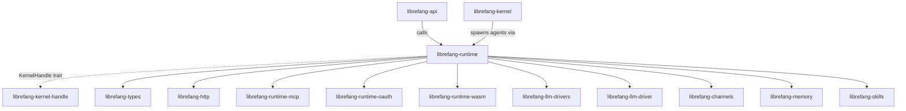

# Other — librefang-runtime

# librefang-runtime

Agent runtime and execution environment for LibreFang. Hosts the turn-by-turn agent loop, tool dispatch, context management, audit trail, A2A peer protocol, channel registry, sandboxed execution backends, and re-exports OAuth subsystems.

## Architecture



The runtime is called by `librefang-kernel` when an agent receives a message. It never depends on `librefang-kernel` directly — all kernel communication goes through the `KernelHandle` trait defined in `librefang-kernel-handle`. This avoids a circular dependency since kernel depends on runtime, not the reverse.

## Module Map

### Core Execution

| Module | Role |
|---|---|
| `agent_loop` | Turn-by-turn agent execution. ~10k LOC. God module — do not grow it without coordination (see #3710). |
| `tool_runner` | Tool execution path. ~9.7k LOC. Also targeted for extraction by #3710. |
| `apply_patch` | Tool-level patch application. |
| `prompt_builder` | Assembles the prompt sent to the LLM. |

### Context Management

| Module | Role |
|---|---|
| `compactor` | Compacts conversation history when context grows. |
| `context_budget` | Allocates and tracks token budget across context windows. |
| `context_compressor` | Compresses context segments. |
| `context_overflow` | Handles overflow when context exceeds limits. |

### Model & Catalog

| Module | Role |
|---|---|
| `model_catalog::ModelCatalog` | Registry of 130+ models across 28 providers. Kernel wraps it in `arc_swap::ArcSwap` (see #3384). Updates go through `kernel.model_catalog_update(\|cat\| ...)`. |
| `catalog_sync` | Synchronizes model catalog state. |

### MCP & A2A

| Module | Role |
|---|---|
| `mcp` | MCP client. OAuth state lives in `mcp_auth_states`. The `McpOAuthProvider` trait is implemented on the kernel side. |
| `a2a` | Agent-to-Agent peer protocol. |

### Sandboxes & Execution Backends

| Module | Role |
|---|---|
| `browser` | Browser sandbox. |
| `docker_sandbox` | Docker container sandbox. |
| `dangerous_command` | Validation and policy for dangerous shell commands. |

Optional backends enabled by Cargo features:

| Feature flag | Backend |
|---|---|
| `ssh-backend` | Remote SSH tool-execution (`russh` / `russh-keys`). #3332. |
| `daytona-backend` | Daytona managed-sandbox execution. Uses existing reqwest stack — no new deps. #3332. |
| `landlock-sandbox` | Linux Landlock-based sandboxing. |
| `seccomp-sandbox` | seccomp-bpf syscall filtering. |

### Other Subsystems

| Module | Role |
|---|---|
| `audit` | Audit trail for agent actions. |
| `auth_cooldown` | Rate-limiting for authentication attempts. |
| `aux_client` | Auxiliary HTTP client for internal service calls. |
| `channel_registry` | Registry of available channel types. |
| `checkpoint_manager` | Agent state checkpointing. |
| `media` | Media handling and processing. |

### Re-exports

OAuth subsystems from `librefang-runtime-oauth` are re-exported:
- `chatgpt_oauth`
- `copilot_oauth`

### Public Constant

`USER_AGENT` — mandatory on every outbound HTTP call. The audit hook flags requests missing this header.

## Dependency Boundary

**Owned by this crate:**
`agent_loop`, `tool_runner`, `compactor`, `context_budget`, `context_compressor`, `context_overflow`, `audit`, `auth_cooldown`, `aux_client`, `browser`, `catalog_sync`, `channel_registry`, `checkpoint_manager`, `dangerous_command`, `docker_sandbox`, `media`, `model_catalog` (the type), `mcp` (client), `prompt_builder`.

**NOT owned — belongs elsewhere:**
- Agent registry, scheduler, cron, orchestration → `librefang-kernel`
- HTTP routing → `librefang-api`
- Channel transport adapters → `librefang-channels`
- Skill loader → `librefang-skills`

**Dependencies:**
- `librefang-types`, `librefang-http`, `librefang-kernel-handle` (NOT `librefang-kernel`)

## KernelHandle

The `KernelHandle` trait lives in `librefang-kernel-handle`, not here. Kernel implements it; runtime and API consume it. Use `KernelHandle` whenever you need a kernel callback from runtime code. Never depend on `librefang-kernel` directly — that creates a circular dependency.

For testing, use `librefang-testing::MockKernelBuilder`. Do not fake `KernelHandle` inline.

## Cross-Cutting Invariants

### Deterministic Prompt Ordering (#3298)

Tool definitions, MCP server summaries, and capability lists must be sorted before stringifying. Use `BTreeMap` / `BTreeSet`, not `HashMap`. This ensures deterministic prompts across runs.

### Identity Files

Identity files live at `{workspace}/.identity/`, not the workspace root. `read_identity_file()` falls back to root for pre-migration workspaces. `migrate_identity_files()` runs on every agent spawn.

### USER_AGENT

Every outbound HTTP request must include:

```rust
req.header("User-Agent", librefang_runtime::USER_AGENT);
```

The audit hook flags missing `User-Agent` headers.

## Async Constraints

### ErrorTranslator is `!Send`

`ErrorTranslator` (from `RequestLanguage`) is `!Send`. Any `.await` must happen **after** `drop(t)`, otherwise you get a cryptic axum `Handler<_, _>` trait-bound error.

```rust
// WRONG — ErrorTranslator alive across await
let t = ErrorTranslator::new(lang);
let result = some_async_call().await; // compile error
drop(t);

// RIGHT — drop before await
let t = ErrorTranslator::new(lang);
let msg = t.translate(error);
drop(t);
let result = some_async_call().await;
```

### No blocking in async context

- No `std::fs` or `std::sync::RwLock` inside async handlers. Use `tokio::fs`, `arc_swap`, or `parking_lot` (#3579).
- No `tokio::task::block_on`. Ever.

## Testing

This crate has historically had **zero** integration tests (#3696). All new runtime work **should** include at least one `#[tokio::test]` exercising the new code path.

Run tests:

```sh
cargo test -p librefang-runtime
```

Do not use raw `cargo build` — use `cargo check --workspace --lib`. Real builds run in CI.

## Taboos

| Prohibited | Reason |
|---|---|
| `use librefang_kernel::*` | Circular dependency. Use `KernelHandle`. |
| `use librefang_api::*` | API consumes runtime, not the reverse. |
| Adding files to `agent_loop.rs` / `tool_runner.rs` | Both are slated to shrink (#3710). |
| `unwrap()` / `panic!()` on wire values | These are untrusted inputs. |
| Inlining a fake `KernelHandle` | Use `librefang-testing::MockKernelBuilder`. |
| `cargo build` | Use `cargo check --workspace --lib`. |