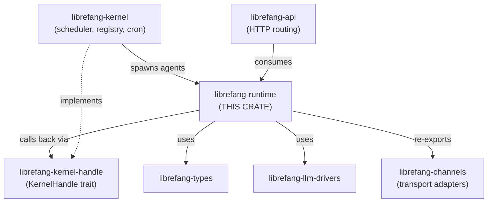

# Other — librefang-runtime

# librefang-runtime

Agent execution engine and runtime environment for LibreFang. This crate owns the turn-by-turn agent loop, tool dispatch, context management, sandbox execution, OAuth flows, audit trail, and the Agent-to-Agent peer protocol. It is the largest and most central crate in the runtime layer.

## Position in the Architecture



The kernel calls into the runtime when an agent receives a message. The runtime never depends on `librefang-kernel` directly—all communication flows through the `KernelHandle` trait defined in `librefang-kernel-handle`, breaking what would otherwise be a circular dependency. The API layer consumes the runtime but the runtime never imports the API.

## Key Dependencies

| Dependency | Relationship |
|---|---|
| `librefang-types` | Shared domain types |
| `librefang-http` | HTTP client utilities |
| `librefang-kernel-handle` | `KernelHandle` trait (runtime's only kernel interface) |
| `librefang-runtime-audit` | Audit trail (re-exported as `audit`) |
| `librefang-runtime-mcp` | MCP client and OAuth (re-exported as `mcp`, `mcp_oauth`) |
| `librefang-runtime-media` | Media processing (feature-gated, re-exported as `media`) |
| `librefang-runtime-sandbox-docker` | Docker sandbox (feature-gated, re-exported as `docker_sandbox`) |
| `librefang-llm-drivers` | LLM provider drivers |
| `librefang-channels` | Channel transport types |
| `librefang-memory` | Memory/context storage |
| `librefang-skills` | Skill loading |

## Module Map

### Core Execution

| Module | Size | Description |
|---|---|---|
| `agent_loop` | ~10k LOC | Turn-by-turn agent execution. This is a god module slated for extraction (#3710). Do not grow it without coordination. |
| `tool_runner` | ~9.7k LOC | Tool execution dispatch. Also targeted by #3710. New tool kinds go in their own sibling file under `tool_runner/`, not into `mod.rs`. |
| `apply_patch` | — | Tool-level patch application. |

### Context and Memory

| Module | Description |
|---|---|
| `compactor` | Context compaction strategies |
| `context_budget` | Token budget allocation for prompts |
| `context_compressor` | Context compression before sending to LLM |
| `context_overflow` | Overflow handling when context exceeds limits |
| `prompt_builder` | Assembles the final prompt sent to the LLM |

### Model Management

| Module | Description |
|---|---|
| `model_catalog` | Contains the `ModelCatalog` type—registry of 130+ models across 28 providers. The kernel wraps this in `arc_swap::ArcSwap` (#3384). All mutations go through the kernel's `model_catalog_update(\|cat\| ...)` callback. |
| `catalog_sync` | Synchronizes model catalog updates. |

### Authentication and OAuth

| Module | Description |
|---|---|
| `chatgpt_oauth` | ChatGPT OAuth flow implementation |
| `copilot_oauth` | Copilot OAuth flow implementation |
| `auth_cooldown` | Rate limiting for authentication attempts |
| `mcp` / `mcp_oauth` | MCP client. OAuth state lives in `mcp_auth_states`. The `McpOAuthProvider` trait is implemented on the kernel side. |

### Sandboxes

| Module | Description |
|---|---|
| `sandbox` | Sandbox trait and in-tree WASM host functions |
| `subprocess_sandbox` | Local subprocess-based sandboxing |
| `docker_sandbox` | Docker-based sandboxing (feature `docker-sandbox`, re-exported from `librefang-runtime-sandbox-docker`) |
| `host_functions` | WASM host functions exposed to sandboxed code |
| `browser` | Browser automation sandbox (feature `browser`) |

### Other Subsystems

| Module | Description |
|---|---|
| `a2a` | Agent-to-Agent peer protocol |
| `audit` | Audit trail (re-exported from `librefang-runtime-audit`) |
| `aux_client` | Auxiliary HTTP client for outbound calls |
| `channel_registry` | Registry of available channel adapters |
| `checkpoint_manager` | Agent state checkpointing |
| `dangerous_command` | Detection and handling of dangerous shell commands |
| `media` / `media_understanding` | Media processing (feature `media`, re-exported from `librefang-runtime-media`) |

## Feature Gates

Default features: `media`, `browser`, `docker-sandbox`.

```toml
# Build everything (default)
cargo check -p librefang-runtime

# Minimal build, no optional subsystems
cargo check -p librefang-runtime --no-default-features

# Selective features
cargo check -p librefang-runtime --no-default-features --features media,browser
```

| Feature | Effect |
|---|---|
| `media` | Pulls in `librefang-runtime-media`. Without it, media modules stub out with no-ops. |
| `browser` | Enables browser automation sandbox. |
| `docker-sandbox` | Pulls in `librefang-runtime-sandbox-docker`. |
| `landlock-sandbox` | Linux Landlock-based sandboxing (optional dep on `landlock`). |
| `seccomp-sandbox` | Seccomp-based sandboxing (optional dep on `seccompiler`). |
| `ssh-backend` | Remote SSH tool-execution backend, pulls in `russh`/`russh-keys` 0.45 (#3332). |
| `daytona-backend` | Daytona managed-sandbox backend. Uses existing reqwest stack, no new deps. |

When a feature is disabled, the corresponding module compiles to a minimal stub that returns "feature disabled" or no-ops, allowing build-time configuration to omit entire subsystems for size or security constraints.

## The KernelHandle Pattern

`KernelHandle` is the runtime's sole interface back to the kernel. The trait lives in `librefang-kernel-handle`—not in this crate. The kernel implements it; the runtime and API consume it.

**Rule:** Any time runtime code needs a kernel callback (persisting state, updating the model catalog, emitting events), use `KernelHandle`. Never depend on `librefang-kernel` directly.

For testing, use `librefang-testing::MockKernelBuilder` rather than hand-rolling a fake.

## Cross-Cutting Invariants

### Deterministic Prompt Ordering (#3298)

Tool definitions, MCP server summaries, and capability lists **must** be sorted before stringifying. Use `BTreeMap` / `BTreeSet`, never `HashMap`. Non-deterministic ordering causes flaky prompt comparisons and test failures.

### Identity Files

Identity files live at `{workspace}/.identity/`, not at the workspace root. Two functions handle this:

- `read_identity_file()` — reads from `.identity/`, falls back to root for pre-migration workspaces.
- `migrate_identity_files()` — runs on every agent spawn to ensure migration.

### USER_AGENT Constant

The `USER_AGENT` constant is mandatory on every outbound HTTP call:

```rust
req.header("User-Agent", librefang_runtime::USER_AGENT)
```

An audit hook flags any request missing this header.

## Async Boundary Rules

### ErrorTranslator is `!Send`

`ErrorTranslator` (from `RequestLanguage`) is `!Send`. If you hold an `ErrorTranslator` across an `.await` point, you get a cryptic axum `Handler<_, _>` trait-bound error at compile time. The fix:

```rust
// WRONG — t alive across .await
let t = ErrorTranslator::new(lang);
let result = some_async_fn().await;
t.translate(result)

// RIGHT — drop before awaiting
let msg = {
    let t = ErrorTranslator::new(lang);
    t.translate(input)
};
let result = some_async_fn(msg).await;
```

### No Blocking Primitives in Async Context

Inside async handlers, never use:

- `std::fs` — use `tokio::fs` instead.
- `std::sync::RwLock` — use `arc_swap`, `parking_lot`, or `tokio::sync` instead.
- `tokio::task::block_on` — this crate runs inside a tokio runtime already.

See #3579 for context.

## Testing

This crate historically had zero integration tests (#3696). New runtime work **should** include at least one `#[tokio::test]` exercising the new code path.

Run tests scoped to this crate:

```bash
cargo test -p librefang-runtime
```

Dev-dependencies available: `serial_test`, `proptest`, `wiremock` (for HTTP mocking), `metrics-util` (with debugging feature), `tracing-subscriber`.

## Hard Rules (Taboos)

1. **No `librefang-kernel` import.** Use `KernelHandle`. This is a circular dependency boundary.
2. **No `librefang-api` import.** The API layer consumes the runtime, never the reverse.
3. **Do not grow `agent_loop/` or `tool_runner/`.** Issue #3710 keeps them at their current size. New tool kinds get their own file under `tool_runner/`.
4. **No `unwrap()` / `panic!()` on wire values.** Anything from HTTP, WebSocket, or user input must be handled with proper error propagation.
5. **No inline `KernelHandle` mocks.** Use `librefang-testing::MockKernelBuilder`.
6. **No raw `cargo build`.** Use `cargo check --workspace --lib`. Full builds run in CI.