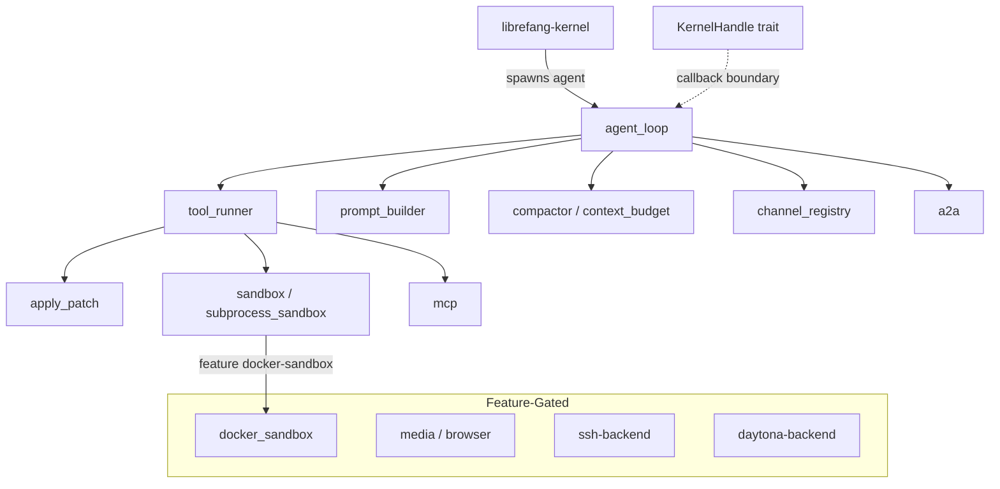

# Other — librefang-runtime

# librefang-runtime

Agent runtime and execution environment. Turns incoming messages into LLM calls, tool invocations, and side effects. Owns the full lifecycle of an agent turn: prompt assembly, context management, tool dispatch, sandboxing, audit, OAuth flows, and the Agent-to-Agent peer protocol.

## Architecture


```mermaid
graph TD
    Kernel["librefang-kernel"] -->|"spawns agent"| AL["agent_loop"]
    KH["KernelHandle trait"] -.->|"callback boundary"| AL
    AL --> TL["tool_runner"]
    AL --> PB["prompt_builder"]
    AL --> CC["compactor / context_budget"]
    TL --> AP["apply_patch"]
    TL --> SB["sandbox / subprocess_sandbox"]
    TL --> MCP["mcp"]
    AL --> CR["channel_registry"]
    AL --> A2A["a2a"]
    subgraph Feature-Gated
        DOCK["docker_sandbox"]
        MED["media / browser"]
        SSH["ssh-backend"]
        DAY["daytona-backend"]
    end
    SB -->|"feature docker-sandbox"| DOCK
```

Kernel calls into `agent_loop` when an agent receives a message. Runtime never depends on kernel directly — all communication flows through the `KernelHandle` trait defined in `librefang-kernel-handle`.

## Dependencies and Boundaries

### Depends on

| Crate | Purpose |
|---|---|
| `librefang-types` | Shared domain types |
| `librefang-http` | HTTP client utilities |
| `librefang-kernel-handle` | `KernelHandle` trait — kernel callbacks without circular deps |
| `librefang-runtime-audit` | Audit trail (re-exported as `audit`) |
| `librefang-runtime-mcp` | MCP client + OAuth (re-exported as `mcp`, `mcp_oauth`) |
| `librefang-runtime-media` | Media understanding (feature `media`, re-exported as `media`, `media_understanding`) |
| `librefang-runtime-sandbox-docker` | Docker sandbox (feature `docker-sandbox`, re-exported as `docker_sandbox`) |
| `librefang-llm-drivers` | LLM provider drivers |
| `librefang-channels` | Channel transport types |
| `librefang-memory` | Memory / conversation storage |
| `librefang-skills` | Skill loading |

### Does NOT own

- Agent registry, scheduler, cron, orchestration → `librefang-kernel`
- HTTP routing → `librefang-api`
- Channel transport adapters → `librefang-channels`
- Skill loader → `librefang-skills`

### Directional rule

`librefang-api` consumes runtime. Runtime never imports `librefang-api`. Runtime never imports `librefang-kernel`. Use `KernelHandle` instead.

## Module Map

### Core execution

- **`agent_loop`** — Turn-by-turn agent execution. ~10k LOC. Slated for extraction (issue #3710). Do not add new logic here; coordinate first.
- **`tool_runner`** — Tool dispatch and execution. ~9.7k LOC, also targeted by #3710. New tool kinds go into their own sibling file under `tool_runner/`, not into `mod.rs`.
- **`prompt_builder`** — Assembles the full prompt sent to the LLM.
- **`apply_patch`** — Tool-level patch application (diff/patch execution).

### Context management

- **`compactor`** — Conversation history compaction.
- **`context_budget`** — Token budget allocation for context window.
- **`context_compressor`** — Context compression strategies.
- **`context_overflow`** — Handling when context exceeds limits.

### Model and catalog

- **`model_catalog::ModelCatalog`** — Registry of 130+ models across 28 providers. Kernel wraps this in `arc_swap::ArcSwap` (issue #3384). All mutations go through kernel's `model_catalog_update(|cat| ...)`.
- **`catalog_sync`** — Synchronizes model catalog with upstream sources.

### Auth and OAuth

- **`chatgpt_oauth`** — ChatGPT OAuth flow (in-tree WASM host function).
- **`copilot_oauth`** — Copilot OAuth flow (in-tree WASM host function).
- **`auth_cooldown`** — Rate limiting for auth attempts.

### Sandboxes and execution isolation

- **`sandbox`** — Sandbox orchestration (WASM host functions).
- **`subprocess_sandbox`** — Process-level sandboxing.
- **`host_functions`** — In-tree WASM host functions.

Feature-gated:

- **`docker_sandbox`** — Docker-based isolation (feature `docker-sandbox`, re-exported from `librefang-runtime-sandbox-docker`).
- Linux-only: `landlock-sandbox`, `seccomp-sandbox` (default features, no-op on non-Linux targets).
- **`ssh-backend`** (feature `ssh-backend`) — Remote SSH tool-execution via `russh 0.61`.
- **`daytona-backend`** (feature `daytona-backend`) — Daytona managed-sandbox execution.

### Protocol and communication

- **`a2a`** — Agent-to-Agent peer protocol. Allows agents to communicate with each other.
- **`channel_registry`** — Registry of channel adapters.
- **`mcp`** — MCP client. OAuth state in `mcp_auth_states`. The `McpOAuthProvider` trait is implemented kernel-side.

### Other subsystems

- **`audit`** — Re-exported from `librefang-runtime-audit`.
- **`aux_client`** — Auxiliary HTTP client.
- **`browser`** — Browser sandbox (feature `browser`).
- **`checkpoint_manager`** — Agent state checkpointing.
- **`dangerous_command`** — Detection and handling of dangerous shell commands.

## Feature Gates

All default-on. Build with `--no-default-features` to selectively exclude subsystems:

```toml
# Cargo.toml example — omit Docker sandboxing and media
[dependencies]
librefang-runtime = { path = "...", default-features = false, features = ["browser"] }
```

| Feature | Default | Effect when off |
|---|---|---|
| `media` | ✓ | `media` / `media_understanding` modules become stubs |
| `browser` | ✓ | Browser sandbox no-ops |
| `docker-sandbox` | ✓ | `docker_sandbox` module stubbed |
| `seccomp-sandbox` | ✓ | Seccomp backend omitted (Linux only) |
| `landlock-sandbox` | ✓ | Landlock backend omitted (Linux only) |
| `ssh-backend` | ✗ | SSH remote execution excluded |
| `daytona-backend` | ✗ | Daytona sandbox excluded |

Disabled features produce stub modules that return `feature disabled` or no-op, keeping downstream call sites compiling without changes.

## KernelHandle Trait

Defined in `librefang-kernel-handle`. The kernel implements it; runtime and API consume it. Whenever runtime needs a kernel callback (persist state, emit events, access shared registries), it goes through `KernelHandle`.

```
librefang-kernel  ──implements──▸  KernelHandle trait
                                      ▲
librefang-runtime  ──consumes─────────┘
librefang-api      ──consumes─────────┘
```

This breaks the circular dependency: kernel → runtime → kernel-handle ← kernel.

## Cross-Cutting Invariants

### Deterministic prompt ordering (#3298)

Tool definitions, MCP server summaries, and capability lists must be sorted before stringifying. Use `BTreeMap` / `BTreeSet` — not `HashMap`. Non-deterministic ordering breaks prompt caching and test reproducibility.

### Identity files

Identity files live at `{workspace}/.identity/`, never the workspace root. `read_identity_file()` falls back to root for pre-migration workspaces. `migrate_identity_files()` runs on every agent spawn to handle legacy layouts.

### USER_AGENT constant

The crate exports `USER_AGENT`. Every outbound HTTP request must include it:

```rust
req.header("User-Agent", librefang_runtime::USER_AGENT)
```

An audit hook flags requests missing this header.

## Async Safety Rules

### ErrorTranslator is `!Send`

`ErrorTranslator` (from `RequestLanguage`) cannot cross `.await` points. Any `.await` must happen after `drop(t)`, or you get a cryptic axum `Handler<_, _>` trait-bound error.

### No blocking primitives in async context

- No `std::fs` — use `tokio::fs`.
- No `std::sync::RwLock` — use `arc_swap` or `parking_lot` (refs #3579).
- No `tokio::task::block_on` — this crate sits inside a tokio runtime already.

## Testing

Historically zero integration tests (issue #3696). New runtime work must include at least one `#[tokio::test]` exercising the new path.

Run:

```sh
cargo test -p librefang-runtime
```

For faster iteration without full compilation:

```sh
cargo check --workspace --lib
```

Do not run `cargo build` locally; real builds run in CI.

When mocking the kernel for tests, use `librefang-testing::MockKernelBuilder`. Never fake `KernelHandle` inline.

## Taboos

| Don't | Do instead |
|---|---|
| Import `librefang-kernel` | Use `KernelHandle` from `librefang-kernel-handle` |
| Import `librefang-api` | Nothing — API consumes runtime, never the reverse |
| Grow `agent_loop/` or `tool_runner/` mod.rs | New tool kinds get their own file in `tool_runner/` |
| `unwrap()` / `panic!()` on wire values | Proper error propagation |
| Inline `KernelHandle` fakes in tests | `librefang-testing::MockKernelBuilder` |
| `cargo build` locally | `cargo check --workspace --lib` |
| `HashMap` for prompt-ordered data | `BTreeMap` / `BTreeSet` |