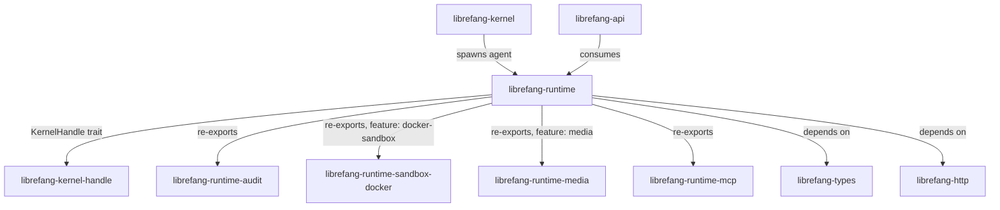

# Other — librefang-runtime

# librefang-runtime

Agent runtime and execution environment. Owns the turn-by-turn agent loop, tool dispatch, context management, sandboxing, OAuth flows, audit trail, A2A peer protocol, and channel registry.

## Architecture


```mermaid
graph TD
    Kernel["librefang-kernel"] -->|spawns agent| Runtime["librefang-runtime"]
    Runtime -->|KernelHandle trait| Handle["librefang-kernel-handle"]
    Runtime -->|re-exports| Audit["librefang-runtime-audit"]
    Runtime -->|re-exports, feature: docker-sandbox| Docker["librefang-runtime-sandbox-docker"]
    Runtime -->|re-exports, feature: media| Media["librefang-runtime-media"]
    Runtime -->|re-exports| MCP["librefang-runtime-mcp"]
    Runtime -->|depends on| Types["librefang-types"]
    Runtime -->|depends on| HTTP["librefang-http"]
    API["librefang-api"] -->|consumes| Runtime
```

Runtime never imports `librefang-kernel` or `librefang-api`. All kernel communication flows through the `KernelHandle` trait defined in `librefang-kernel-handle`. The kernel implements the trait; runtime consumes it. This breaks what would otherwise be a circular dependency.

## Module Map

### Core execution

| Module | Role | Size / Notes |
|---|---|---|
| `agent_loop` | Turn-by-turn agent execution | ~10k LOC. Flagged for extraction (#3710). Do not grow without coordination. |
| `tool_runner` | Tool dispatch and execution | ~9.7k LOC. Also targeted by #3710. New tool kinds go in their own sibling file under `tool_runner/`, not into `mod.rs`. |
| `apply_patch` | Tool-level patch application | — |
| `prompt_builder` | Assembles LLM prompts | — |
| `compactor` | Context compaction | — |
| `context_budget` | Token budget tracking | — |
| `context_compressor` | Context compression | — |
| `context_overflow` | Overflow handling | — |

### Model and catalog

| Module | Role |
|---|---|
| `model_catalog::ModelCatalog` | Registry of 130+ models across 28 providers. Kernel wraps this in `arc_swap::ArcSwap` (#3384). All mutations go through kernel's `model_catalog_update(\|cat\| ...)`. |
| `catalog_sync` | Synchronizes model catalog with upstream sources. |

### Auth and OAuth

| Module | Role |
|---|---|
| `chatgpt_oauth` | ChatGPT OAuth flow. Feature-gated, folded in post-#3710. |
| `copilot_oauth` | Copilot OAuth flow. Feature-gated, folded in post-#3710. |
| `auth_cooldown` | Rate-limiting for auth attempts. |
| `aux_client` | Auxiliary HTTP client for auth-related calls. |

### Sandboxes

| Module | Role |
|---|---|
| `sandbox` | Sandbox trait and dispatch. |
| `subprocess_sandbox` | Local process sandboxing. |
| `docker_sandbox` | Re-export from `librefang-runtime-sandbox-docker` (feature: `docker-sandbox`). |
| `browser` | Browser-based sandbox (feature: `browser`). |

Linux-only sandboxing backends, platform-gated so they are no-ops on macOS/Windows:

| Feature | Crate |
|---|---|
| `landlock-sandbox` | `landlock` 0.4 |
| `seccomp-sandbox` | `seccompiler` 0.5 |

### Protocols and integrations

| Module | Role |
|---|---|
| `a2a` | Agent-to-Agent peer protocol. |
| `mcp` | MCP client. Re-exported from `librefang-runtime-mcp`. OAuth state lives in `mcp_auth_states`. The `McpOAuthProvider` trait is kernel-side. |
| `host_functions` | In-tree WASM host functions. |

### Supporting modules

| Module | Role |
|---|---|
| `audit` | Re-exported from `librefang-runtime-audit`. |
| `channel_registry` | Registry of channel adapters. |
| `checkpoint_manager` | Agent state checkpointing. |
| `dangerous_command` | Detection and gating of dangerous tool commands. |
| `media` / `media_understanding` | Re-exported from `librefang-runtime-media` (feature: `media`). |

## Feature Gates

Default features: `media`, `browser`, `docker-sandbox`, `seccomp-sandbox`, `landlock-sandbox`.

```toml
# Omit all optional subsystems
cargo build -p librefang-runtime --no-default-features

# Selective opt-in
cargo build -p librefang-runtime --no-default-features --features media,docker-sandbox
```

| Feature | Effect when disabled |
|---|---|
| `media` | `media` / `media_understanding` modules become stubs returning feature-disabled errors. Removes `librefang-runtime-media` dep. |
| `browser` | Browser sandbox paths no-op. |
| `docker-sandbox` | `docker_sandbox` module stubs out. Removes `librefang-runtime-sandbox-docker` dep. |
| `ssh-backend` | Adds `russh` / `russh-keys` for remote SSH tool execution. Off by default. |
| `daytona-backend` | Daytona managed-sandbox backend. Uses existing reqwest stack. Off by default. |

Re-exported modules preserve their historical paths so downstream call sites remain unchanged regardless of feature configuration.

## Dependency Boundary

Runtime depends on:
- `librefang-types`
- `librefang-http`
- `librefang-kernel-handle` — the trait only, never `librefang-kernel`
- `librefang-runtime-audit`
- `librefang-runtime-mcp`
- `librefang-llm-drivers`, `librefang-llm-driver`
- `librefang-channels` (default-features disabled)
- `librefang-memory`
- `librefang-skills`
- `librefang-subprocess`

Runtime does **not** depend on:
- `librefang-kernel` (would be circular)
- `librefang-api` (API consumes runtime, not the reverse)

When you need a kernel callback from runtime code, use `KernelHandle`. For testing, use `librefang-testing::MockKernelBuilder` — never hand-roll a fake.

## Cross-Cutting Invariants

### Deterministic prompt ordering (#3298)

Tool definitions, MCP server summaries, and capability lists must be sorted before stringifying. Use `BTreeMap` / `BTreeSet`, not `HashMap`. This ensures reproducible prompts across runs.

### Identity files

Identity files live at `{workspace}/.identity/`, not the workspace root. `read_identity_file()` falls back to the root for pre-migration workspaces. `migrate_identity_files()` runs on every agent spawn.

### User-Agent header

The `USER_AGENT` constant is mandatory on every outbound HTTP call:

```rust
req.header("User-Agent", librefang_runtime::USER_AGENT)
```

An audit hook flags any request missing this header.

### Full regex for PII filter

The crate pulls in both `regex-lite` and the full `regex` crate. The full `regex` is used by `pii_filter` because it supports `RegexBuilder::size_limit` / `.dfa_size_limit` to bound operator-supplied patterns. `regex-lite` has no equivalent guard.

## Async Boundaries

**`ErrorTranslator` is `!Send`.** It comes from `RequestLanguage`. Any `.await` must happen after `drop(t)` or you will get a cryptic axum `Handler<_, _>` trait-bound error.

```rust
// WRONG — compiler error
let t = ErrorTranslator::new(lang);
some_async_call().await;
t.translate(error)

// RIGHT
let t = ErrorTranslator::new(lang);
let msg = t.translate(error);
drop(t);
some_async_call().await;
```

Other rules:
- No synchronous `std::fs` or `std::sync::RwLock` inside async handlers. Use `tokio::fs`, `arc_swap`, or `parking_lot` (#3579).
- No `tokio::block_on` anywhere in this crate.

## Testing

This crate historically had zero integration tests (#3696). New runtime work **should** include at least one `#[tokio::test]` exercising the new path.

Run tests scoped to this crate:

```bash
cargo test -p librefang-runtime
```

Dev-dependencies available: `serial_test`, `proptest`, `metrics-util` (with `debugging` feature), `wiremock` (for HTTP mock tests), `tracing-subscriber`.

## Taboos

- **No `librefang-kernel` import.** Use `KernelHandle`.
- **No `librefang-api` import.** The dependency goes one direction only.
- **Do not grow `agent_loop/` or `tool_runner/`.** New tool kinds get their own sibling file in `tool_runner/`, not a chunk in `mod.rs`.
- **No `unwrap()` or `panic!()`** on values that come off the wire.
- **No inline kernel mocks.** Use `librefang-testing::MockKernelBuilder`.
- **No raw `cargo build`.** Use `cargo check --workspace --lib`. Full builds run in CI.