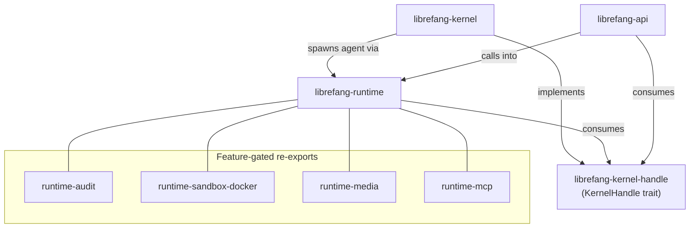

# Other — librefang-runtime

# librefang-runtime

Agent execution engine for LibreFang. Owns the turn-by-turn agent loop, tool dispatch, context window management, OAuth flows, sandboxes, and the Agent-to-Agent peer protocol.

## Architecture


```mermaid
graph TD
    KH["librefang-kernel"]
    KHA["librefang-kernel-handle<br/>(KernelHandle trait)"]
    API["librefang-api"]
    RT["librefang-runtime"]

    KH -->|implements| KHA
    RT -->|consumes| KHA
    API -->|consumes| KHA

    KH -->|spawns agent via| RT
    API -->|calls into| RT

    subgraph "Feature-gated re-exports"
        AUD["runtime-audit"]
        MDA["runtime-sandbox-docker"]
        MED["runtime-media"]
        MCP["runtime-mcp"]
    end

    RT --- AUD
    RT --- MDA
    RT --- MED
    RT --- MCP
```

The kernel calls into the runtime when an agent receives a message. The runtime never depends on `librefang-kernel` or `librefang-api` directly — all kernel callbacks go through the `KernelHandle` trait defined in `librefang-kernel-handle`. This breaks what would otherwise be a circular dependency: kernel → runtime → kernel.

## Owned modules

| Module | Role |
|---|---|
| `agent_loop` | Turn-by-turn agent execution. ~10k LOC. Targeted for future extraction (#3710). Do not grow this module. |
| `tool_runner` | Tool dispatch and execution. ~9.7k LOC. Same extraction target. New tool kinds go in their own file under `tool_runner/`, never in `mod.rs`. |
| `model_catalog::ModelCatalog` | Registry of 130+ models across 28 providers. Kernel wraps it in `arc_swap::ArcSwap` (#3384). Mutations go through `model_catalog_update(\|cat\| ...)`. |
| `mcp` | MCP client. OAuth state in `mcp_auth_states`; the `McpOAuthProvider` trait is implemented on the kernel side. |
| `a2a` | Agent-to-Agent peer protocol. |
| `apply_patch` | Tool-level patch application. |
| `compactor` / `context_budget` / `context_compressor` / `context_overflow` | Context window management — compaction, budgeting, compression, overflow handling. |
| `prompt_builder` | Assembles the prompt sent to the LLM. |
| `chatgpt_oauth` / `copilot_oauth` | OAuth flows for ChatGPT and Copilot. |
| `host_functions` / `sandbox` / `subprocess_sandbox` | In-tree WASM host functions and sandboxing. |
| `browser` | Browser sandbox (feature `browser`). |
| `auth_cooldown` / `aux_client` / `catalog_sync` / `channel_registry` / `checkpoint_manager` / `dangerous_command` | Supporting subsystems. |

## Re-exported leaf crates

Historical module paths are preserved so downstream call sites remain unchanged:

| Re-export path | Source crate | Feature gate |
|---|---|---|
| `audit` | `librefang-runtime-audit` | always |
| `docker_sandbox` | `librefang-runtime-sandbox-docker` | `docker-sandbox` |
| `media`, `media_understanding` | `librefang-runtime-media` | `media` |
| `mcp`, `mcp_oauth` | `librefang-runtime-mcp` | always |

## Feature gates

Default features: `media`, `browser`, `docker-sandbox`, `seccomp-sandbox`, `landlock-sandbox`.

```
cargo build -p librefang-runtime --no-default-features
```

Strips every gated module down to a stub that returns "feature disabled" or no-ops. Use this for minimal builds where subsystems must be omitted for size or security reasons.

Additional features:

- **`ssh-backend`** — Remote SSH tool-execution backend (#3332). Pulls in `russh 0.61`.
- **`daytona-backend`** — Daytona managed-sandbox backend (#3332). Uses existing reqwest; no new deps.
- **`landlock-sandbox`** — Linux Landlock LSM sandboxing. No-op on non-Linux targets.
- **`seccomp-sandbox`** — Linux seccomp sandboxing via `seccompiler`. No-op on non-Linux targets.

## KernelHandle

The `KernelHandle` trait lives in the sibling `librefang-kernel-handle` crate. The kernel implements it; runtime and API consume it. Any time runtime code needs a kernel callback (persisting state, emitting events, updating model catalog), use `KernelHandle`. Never import `librefang-kernel`.

## Cross-cutting invariants

### Deterministic prompt ordering (#3298)

Tool definitions, MCP server summaries, and capability lists must be sorted before stringification. Use `BTreeMap` / `BTreeSet`, never `HashMap`. This ensures consistent prompts across runs.

### Identity files

Identity files live at `{workspace}/.identity/`, not the workspace root. `read_identity_file()` falls back to root for pre-migration workspaces. `migrate_identity_files()` runs on every spawn.

### USER_AGENT

The `USER_AGENT` constant is mandatory on every outbound HTTP call:

```rust
req.header("User-Agent", librefang_runtime::USER_AGENT)
```

The audit hook flags any request missing this header.

## Async rules

**`ErrorTranslator` is `!Send`.** Any `.await` must happen after `drop(t)`, or you hit a cryptic axum `Handler<_, _>` trait-bound error.

**No blocking I/O in async context.** No `std::fs`, no `std::sync::RwLock` inside async handlers. Use `tokio::fs`, `arc_swap`, or `parking_lot` (#3579).

**No `tokio::block_on`.** Ever.

## Dependencies

Direct dependencies this crate owns:

- `librefang-types`, `librefang-http`, `librefang-kernel-handle` — core types and kernel interface
- `librefang-runtime-audit`, `librefang-runtime-mcp` — always-on leaf crates
- `librefang-runtime-media` — feature `media`
- `librefang-runtime-sandbox-docker` — feature `docker-sandbox`
- `librefang-llm-drivers`, `librefang-llm-driver` — LLM driver layer
- `librefang-channels` — channel types (default-features disabled)
- `librefang-memory`, `librefang-skills` — memory and skill loading

Not imported (by design): `librefang-kernel`, `librefang-api`.

## Testing

This crate historically had zero integration tests (#3696). New runtime work **must** include at least one `#[tokio::test]` exercising the new path.

Run tests scoped to this crate:

```
cargo test -p librefang-runtime
```

For kernel mocking, use `librefang-testing::MockKernelBuilder`. Never fake `KernelHandle` inline.

## Taboos

- **No `librefang-kernel` import.** Use `KernelHandle`.
- **No `librefang-api` import.** API consumes runtime, not the reverse.
- **Don't grow `agent_loop/` or `tool_runner/`.** New tool kinds get their own sibling file under `tool_runner/`.
- **No `unwrap()` / `panic!()`** on values that come off the wire.
- **No inline kernel mocks.** Use `MockKernelBuilder`.
- **No raw `cargo build`.** Use `cargo check --workspace --lib`. Real builds run in CI.