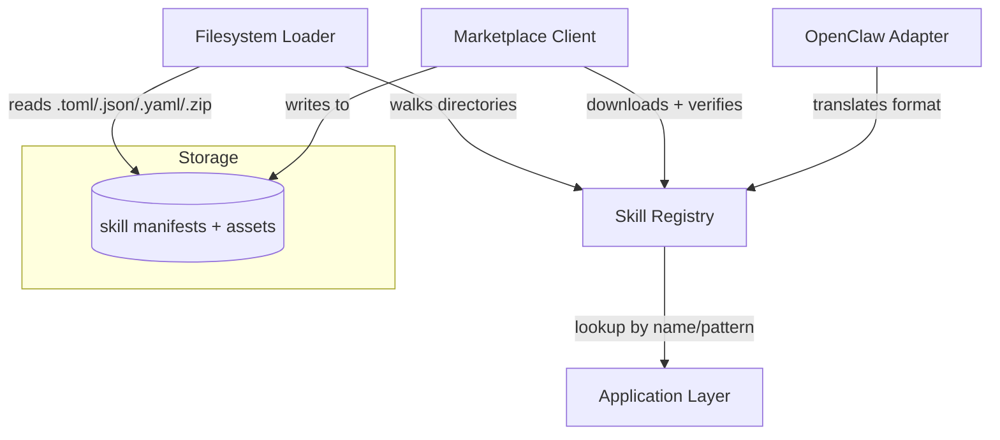

# Other — librefang-skills

# librefang-skills

Skill system for LibreFang — provides the registry, filesystem loader, marketplace client, and OpenClaw compatibility layer for discovering, loading, and managing skills.

## Purpose

A **skill** in LibreFang is a self-contained unit of functionality that can be discovered at runtime, loaded on demand, and optionally fetched from a remote marketplace. This crate provides all infrastructure for that lifecycle:

- **Defining** what a skill looks like (its metadata, version, dependencies).
- **Discovering** skills on the local filesystem via directory traversal.
- **Loading** skill definitions from TOML, JSON, or YAML manifests, and extracting packaged archives (`.zip`).
- **Registering** loaded skills in a central registry for lookup by name or pattern.
- **Fetching** skills from a remote marketplace over HTTPS, with integrity verification.
- **Compatibility** with the OpenClaw skill format, allowing LibreFang to consume skills originally authored for that ecosystem.

## Architecture

## Key Subsystems

### Skill Registry

The registry is the central in-memory index of all available skills. It supports:

- **Name-based lookup** — retrieve a skill by its unique identifier.
- **Pattern-based search** — efficient multi-pattern matching over skill names or tags (backed by `aho-corasick`).
- **Version tracking** — skills are versioned using semantic versioning (`semver` crate), enabling version constraints and conflict detection.

### Filesystem Loader

Uses `walkdir` to recursively scan configured skill directories for manifests. Supported manifest formats:

| Format | Extension |
|--------|-----------|
| TOML   | `.toml`   |
| JSON   | `.json`   |
| YAML   | `.yaml` / `.yml` |

Packaged skills distributed as `.zip` archives are extracted and their manifests read during the walk.

File locking (`fs2`) prevents corruption when multiple processes load or install skills concurrently against the same directory.

### Marketplace Client

An async HTTP client (`reqwest` with `rustls`) that:

1. Connects to a configured marketplace endpoint over HTTPS.
2. Downloads skill packages.
3. Verifies package integrity using SHA-256 digests (`sha2` + `hex`).
4. Writes verified packages to the local skill directory.

TLS certificate validation uses both the `webpki-roots` Mozilla bundle and `rustls-native-certs` for system-installed certificates, ensuring compatibility across platforms.

### OpenClaw Compatibility

An adapter layer that translates OpenClaw-format skill definitions into LibreFang's native types (from `librefang-types`). This allows the ecosystem to reuse existing OpenClaw skills without modification.

## Dependencies and Their Roles

| Dependency | Role in this crate |
|------------|-------------------|
| `librefang-types` | Shared type definitions (skill metadata structs, error types) |
| `serde` / `serde_json` / `toml` / `serde_yaml` | De/serialization of skill manifests in multiple formats |
| `thiserror` | Derived error types for loader, registry, and marketplace operations |
| `tracing` | Structured logging throughout the skill lifecycle |
| `tokio` | Async runtime for marketplace HTTP calls and concurrent I/O |
| `walkdir` | Recursive directory traversal for skill discovery |
| `chrono` | Timestamp handling for skill installation and cache metadata |
| `reqwest` | HTTP client for marketplace communication |
| `rustls` + `webpki-roots` + `rustls-native-certs` | TLS backend for secure marketplace connections |
| `sha2` + `hex` | SHA-256 integrity verification of downloaded packages |
| `zip` | Extraction of packaged skill archives |
| `aho-corasick` | Fast multi-pattern matching for skill name/tag lookups |
| `semver` | Parsing and comparing semantic version strings in skill metadata |
| `fs2` | Filesystem locking for safe concurrent access to skill storage |

## Relationship to Other Crates

This crate sits above `librefang-types`, consuming the skill-related types defined there (metadata structs, version types, error enums). It is consumed by the application layer, which uses the registry to resolve and dispatch skills at runtime.

No other crates in the workspace call into `librefang-skills` directly — the call graph shows it as a leaf dependency that exposes a self-contained API surface to its consumers.

## Testing

Tests use `tempfile` to create isolated filesystem trees for loader and registry tests, avoiding side effects on the host system. The `serial_test` crate serializes tests that share filesystem state, preventing race conditions during parallel test execution.