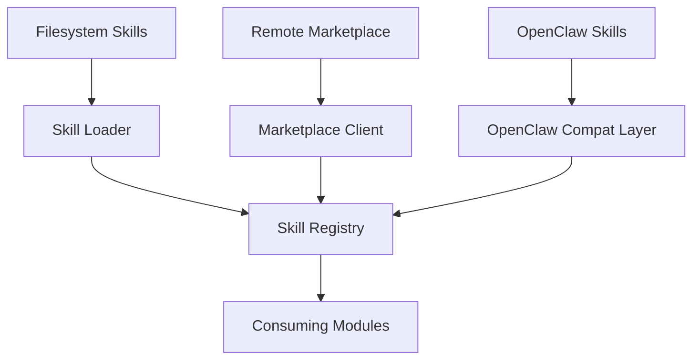

# Other — librefang-skills

# librefang-skills

Skill system for LibreFang — provides the registry, filesystem loader, marketplace client, and OpenClaw compatibility layer. Other modules consume this crate to discover, load, and manage skills at runtime.

## Architecture

The crate is organized around four concerns:

| Concern | Purpose |
|---|---|
| **Registry** | In-memory index of loaded skills, supporting lookup by name, version, and tags |
| **Loader** | Walks local directories, parses skill manifests (TOML, YAML, JSON), and registers valid skills |
| **Marketplace** | Communicates with a remote skill repository over HTTPS, downloads and verifies skill packages |
| **OpenClaw Compatibility** | Translates OpenClaw-format skill definitions into LibreFang's internal representation |

## Key Dependencies and Why They Matter

| Dependency | Role in this crate |
|---|---|
| `librefang-types` | Shared domain types (skill metadata, identifiers, error categories) used across all LibreFang crates |
| `serde`, `serde_json`, `toml`, `serde_yaml` | Deserialization of skill manifests in multiple formats |
| `walkdir` | Recursive directory traversal when scanning for locally installed skills |
| `reqwest`, `rustls`, `webpki-roots`, `rustls-native-certs` | TLS-secured HTTP requests to the marketplace; supports both system CA certs and bundled Mozilla roots |
| `sha2`, `hex` | SHA-256 digest computation for verifying skill package integrity after download |
| `zip` | Extraction of downloaded skill archives |
| `aho-corasick` | Fast multi-pattern matching, used for efficient skill-name resolution across large registries |
| `semver` | Parsing and comparing semantic version requirements in skill dependency declarations |
| `fs2` | File locking to prevent concurrent writes during skill installation or updates |
| `chrono` | Timestamps for cache entries and marketplace metadata |

## Skill Lifecycle

1. **Discovery.** The loader scans configured directories using `walkdir`. Each skill is expected to have a manifest file at its root (e.g., `skill.toml` or `skill.yaml`).

2. **Parsing and validation.** The manifest is deserialized via `serde`. The loader validates required fields—name, version (`semver`), description—and checks that the declared version satisfies any constraints.

3. **Registration.** Valid skills are inserted into the registry. The registry indexes skills for fast lookup by exact name and by tag sets, using `aho-corasick` for efficient multi-pattern queries.

4. **Marketplace sync.** The marketplace client fetches a remote index over HTTPS (`reqwest` with `rustls`), compares available versions against locally installed ones, and downloads updated archives. Each downloaded archive is verified against its expected SHA-256 digest before extraction.

5. **OpenClaw import.** OpenClaw-format skills go through the compatibility layer, which maps OpenClaw metadata fields to LibreFang equivalents before registration.

## Thread Safety and Concurrency

Skill installation and updates touch the filesystem. The crate uses `fs2` file locks to serialize writes, allowing multiple reader processes while preventing corruption from concurrent installs. The in-memory registry is designed for concurrent read access after initial loading.

## Error Handling

Errors are consolidated through `thiserror`-based error enums covering:

- Manifest parse failures (invalid TOML/YAML/JSON, missing required fields)
- Version constraint violations (`semver` errors)
- Filesystem errors during loading or extraction
- Network and TLS errors during marketplace communication
- Integrity check failures (SHA-256 mismatch)

All errors propagate `tracing` diagnostic spans so callers can correlate failures with specific skill names, file paths, or remote URLs.

## Integration Points

This crate depends on `librefang-types` for shared domain types and is itself consumed by higher-level modules that need skill data. The typical integration pattern is:

1. Call the loader to populate the registry at startup.
2. Query the registry by skill name or tag throughout the application's lifetime.
3. Optionally invoke the marketplace client for user-initiated installs or updates.

## Testing

The dev-dependencies include `tempfile` for isolated filesystem tests and `serial_test` to serialize tests that involve file locking, ensuring deterministic behavior when testing concurrent install scenarios.