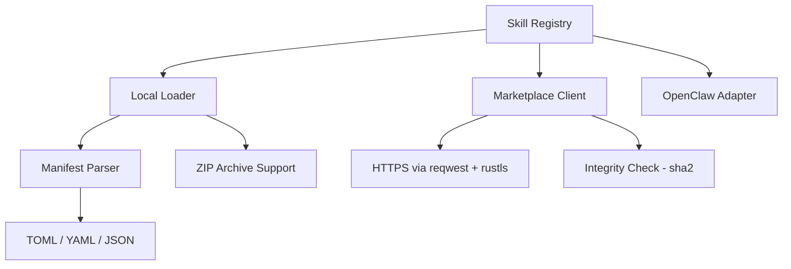

# Other — librefang-skills

# librefang-skills

Skill system for LibreFang providing a local registry, filesystem loader, remote marketplace client, and OpenClaw compatibility layer.

## Overview

Skills are the primary extensibility mechanism in LibreFang. This crate is responsible for every stage of a skill's lifecycle: discovery on disk or from a remote marketplace, loading and parsing of skill manifests, version resolution, integrity verification, and registration into a queryable in-memory registry.

The crate is intentionally self-contained. It depends on `librefang-types` for shared data structures but does not call into any other LibreFang crate, nor does any other crate call into it at the code level. Downstream consumers instantiate and drive the APIs from their own runtime context.

## Architecture

## Key Components

### Skill Registry

An in-memory store of loaded skill definitions. Skills are keyed by a unique identifier and version. The registry supports:

- Looking up a skill by name and optional version constraint
- Listing all available skills
- Resolving semantic version constraints to a single best match using the `semver` crate

### Local Loader

Scans configured skill directories using `walkdir`, parses each skill's manifest, and registers valid skills. The loader handles three manifest formats via `serde`:

- **TOML** — the native LibreFang format
- **YAML** — via `serde_yaml`
- **JSON** — via `serde_json`

Skills packaged as `.zip` archives are extracted in-memory using the `zip` crate before manifest parsing.

The `dirs` crate resolves platform-appropriate default directories when no explicit paths are configured.

### Marketplace Client

Downloads skills from a remote marketplace over HTTPS. Key details:

- Uses `reqwest` with `rustls` for TLS — no native OpenSSL dependency
- Loads system root certificates via `rustls-native-certs` and bundles Mozilla roots via `webpki-roots` as a fallback
- Verifies downloaded artifacts against their published SHA-256 digests using `sha2` and `hex`
- File locking via `fs2` prevents concurrent write corruption when multiple processes install skills simultaneously

All network operations are async and rely on the `tokio` runtime.

### OpenClaw Adapter

Provides compatibility with OpenClaw-formatted skill packages. The adapter translates OpenClaw manifest fields and directory structures into LibreFang's native representation so that existing OpenClaw skills can be loaded without modification.

### Version Management

All skill versions follow semantic versioning. The `semver` crate is used to parse version strings, compare versions, and evaluate version requirement expressions (e.g., `^1.2.0`, `>=2.0.0-beta`).

## Dependency Rationale

| Dependency | Role in this crate |
|---|---|
| `aho-corasick` | Fast multi-pattern matching for skill name and command lookups |
| `chrono` | Timestamps on cached marketplace responses and skill installation metadata |
| `fs2` | File locking during skill installation to avoid race conditions |
| `semver` | Parsing and comparing skill version numbers |
| `sha2` / `hex` | SHA-256 integrity verification of downloaded artifacts |
| `uuid` | Unique identifiers for marketplace transactions and cache entries |
| `zip` | Reading skills distributed as ZIP archives |
| `walkdir` | Recursive directory traversal during skill discovery |
| `serde_json` / `toml` / `serde_yaml` | Deserialization of skill manifests in three formats |

## Error Handling

Errors are expressed through thiserror-derived types. The main error categories are:

- **IO errors** — permission denied, missing directories, corrupt ZIP archives
- **Parse errors** — malformed manifests, invalid TOML/YAML/JSON
- **Network errors** — marketplace unreachable, TLS handshake failure, HTTP error responses
- **Integrity errors** — SHA-256 digest mismatch after download
- **Version errors** — unresolvable version constraints

All errors carry enough context for the caller to report actionable messages.

## Logging

The crate emits structured log entries via `tracing` spans at standard levels:

- `DEBUG` — individual files scanned, manifests parsed, cache hits/misses
- `INFO` — skills loaded, marketplace queries, installations completed
- `WARN` — skipped invalid manifests, version conflicts
- `ERROR` — download failures, integrity check failures

## Testing

Tests use `tempfile` to create isolated directory trees for the local loader and registry, avoiding side effects on the developer's actual skill directory. `tokio-test` provides the async runtime for marketplace client tests.