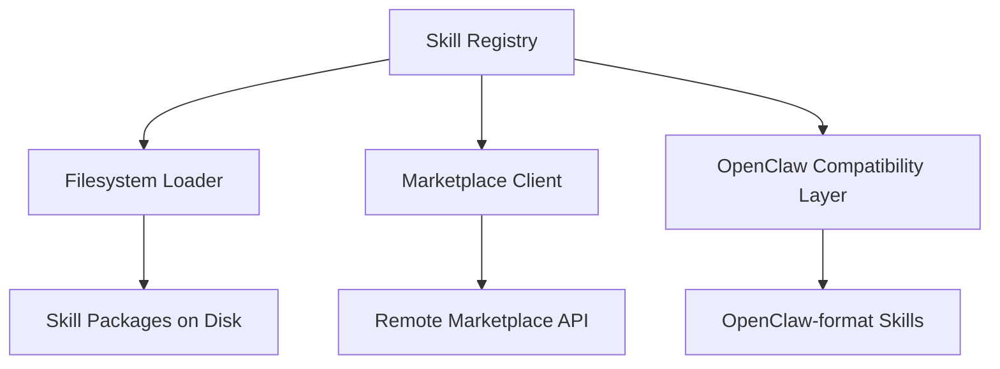

# Other — librefang-skills

# librefang-skills

Skill system for LibreFang — provides skill registry, filesystem loader, marketplace integration, and OpenClaw compatibility.

## Overview

This module manages the full lifecycle of skills in LibreFang: discovery on disk, loading and parsing, registration at runtime, version management, and retrieval from a marketplace. It also provides backward compatibility with the OpenClaw skill format.

A **skill** in LibreFang is a self-contained unit of behavior that can be discovered, loaded, and invoked at runtime. Skills are packaged as archives (`.zip`) and described by metadata in TOML, JSON, or YAML formats.

## Architecture

## Key Subsystems

### Skill Registry

The central in-memory store for all loaded skills. Skills are identified by a unique `uuid` and tracked with semantic versioning via `semver`. The registry supports lookup, enumeration, and removal of skills.

### Filesystem Loader

Uses `walkdir` to recursively discover skill packages under configured directories. The loader:

1. Scans standard directories (via the `dirs` crate) and user-configured paths
2. Extracts metadata from `serde`-deserializable manifests (TOML, JSON, or YAML)
3. Verifies package integrity using SHA-256 hashes (`sha2`, `hex`)
4. Extracts `.zip` archives using the `zip` crate
5. Registers loaded skills with the registry

File locking (`fs2`) prevents concurrent access corruption when multiple processes load or update skills simultaneously.

### Marketplace Client

An async HTTP client (`reqwest` with `rustls` for TLS) that connects to a remote skill marketplace. Responsible for:

- Searching and browsing available skills
- Downloading skill packages
- Verifying downloaded content integrity
- Tracking download timestamps with `chrono`

TLS root certificates are sourced from both `webpki-roots` (Mozilla bundle) and `rustls-native-certs` (system certificate store) for broad compatibility.

### OpenClaw Compatibility Layer

Translates skills authored in the OpenClaw format into LibreFang's internal representation. This layer uses `serde_yaml` and `serde_json` to parse OpenClaw metadata schemas and map them to the LibreFang skill model defined in `librefang-types`.

## Dependencies and Their Roles

| Dependency | Purpose |
|---|---|
| `librefang-types` | Shared type definitions (`Skill`, `SkillManifest`, etc.) |
| `serde` / `serde_json` / `toml` / `serde_yaml` | Multi-format metadata deserialization |
| `walkdir` | Recursive directory traversal for skill discovery |
| `zip` | Skill package extraction |
| `sha2` / `hex` | SHA-256 integrity hashing |
| `semver` | Semantic version parsing and comparison |
| `uuid` | Unique skill identification |
| `reqwest` / `rustls` | Marketplace HTTP client with TLS |
| `fs2` | File-based locking for concurrent safety |
| `aho-corasick` | Efficient multi-pattern matching for skill triggers |
| `dirs` | Platform-standard directory paths |
| `chrono` | Timestamps for marketplace operations |

## Relationship to Other Modules

This module depends on **`librefang-types`** for all shared data structures — it does not define its own skill types. Other modules in LibreFang consume this crate to resolve and invoke skills by name or ID.

There are no direct outgoing calls to other LibreFang crates beyond `librefang-types`, keeping this module self-contained and testable in isolation.

## Testing

Tests use `tempfile` for isolated filesystem operations and `tokio-test` for async runtime in marketplace tests. Skill loading, integrity verification, and OpenClaw format conversion are the primary test surfaces.