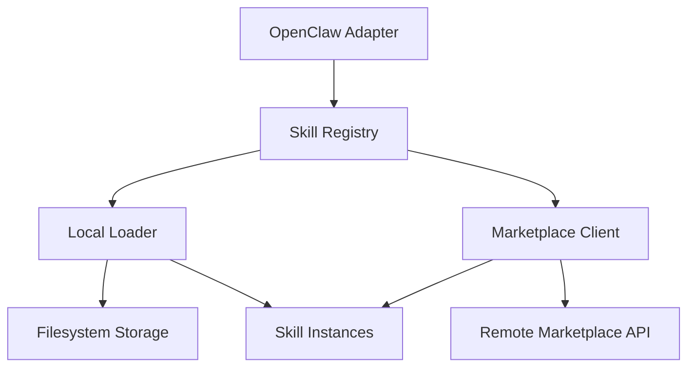

# Other — librefang-skills

# librefang-skills

Skill system for LibreFang — provides the registry, filesystem loader, marketplace client, and OpenClaw compatibility layer.

## Purpose

This module manages the full lifecycle of **skills** in LibreFang: discovery on disk, loading into memory, version resolution, marketplace publishing/downloading, and compatibility with the OpenClaw skill format. It acts as the bridge between skill authors (who package `.zip` archives with manifests) and the runtime that executes them.

## Architecture

The four subsystems interact as follows:

| Subsystem | Responsibility |
|---|---|
| **Registry** | Central index of all known skills, their versions, and metadata. Handles queries, deduplication, and conflict resolution. |
| **Local Loader** | Scans configured directories, parses manifests (`toml`/`yaml`/`json`), extracts `.zip` packages, and validates integrity via SHA-256 hashes. |
| **Marketplace Client** | Connects to a remote skill marketplace over HTTPS, handles search, download, and publishing. Manages TLS via `rustls` with both `webpki-roots` and `rustls-native-certs` for broad certificate trust. |
| **OpenClaw Adapter** | Translates OpenClaw-format skill packages into LibreFang's internal representation, enabling use of the existing OpenClaw skill ecosystem. |

## Key Dependencies and Their Roles

### Filesystem and Discovery

- **`walkdir`** — Recursively walks skill directories to discover installed packages.
- **`dirs`** — Resolves platform-standard paths (`~/.local/share/librefang/skills`, etc.) for default skill storage locations.
- **`zip`** — Extracts `.zip`-packaged skills into the local store.
- **`fs2`** — File locking on the skill store directory to prevent corruption during concurrent installs or updates.

### Parsing and Serialization

- **`serde`**, **`serde_json`**, **`toml`**, **`serde_yaml`** — Skill manifests can be authored in TOML, YAML, or JSON. All three formats are parsed into a common `serde`-derived structure (defined in `librefang-types`).

### Networking and Security

- **`reqwest`** + **`rustls`** + **`webpki-roots`** + **`rustls-native-certs`** — HTTPS client for marketplace operations. Uses `rustls` (not native TLS) for a consistent, auditable TLS stack. Supports both bundled Mozilla roots and the system's native certificate store.
- **`sha2`** + **`hex`** — SHA-256 digest computation for skill package integrity verification on download and install.

### Versioning and Identity

- **`semver`** — Semantic version parsing and comparison for skill version constraints and dependency resolution.
- **`uuid`** — Unique skill identifiers, assigned on first registration or sourced from manifests.
- **`chrono`** — Timestamps for install dates, last-updated checks, and marketplace metadata.

### Lookup

- **`aho-corasick`** — Fast multi-pattern string matching used for skill name/tag lookups against the registry index, allowing efficient batch queries.

### Error Handling and Observability

- **`thiserror`** — Derives structured error types for loader failures, registry conflicts, marketplace errors, and format-mismatch issues.
- **`tracing`** — Instrumentation throughout all subsystems for diagnostic logging.

## Integration with LibreFang

This module depends on **`librefang-types`** for shared data structures — primarily the `Skill` type, `SkillManifest`, and related enums. Other LibreFang modules consume this crate's public API to:

1. **Query available skills** before launching a session.
2. **Install or update skills** from the marketplace.
3. **Load skill definitions** at runtime for execution or validation.

## Testing

The crate uses `tempfile` and `tokio-test` in its dev-dependencies, indicating that tests create temporary directory trees to exercise the loader and registry in isolation, and use `tokio-test` for async runtime support in marketplace client tests.