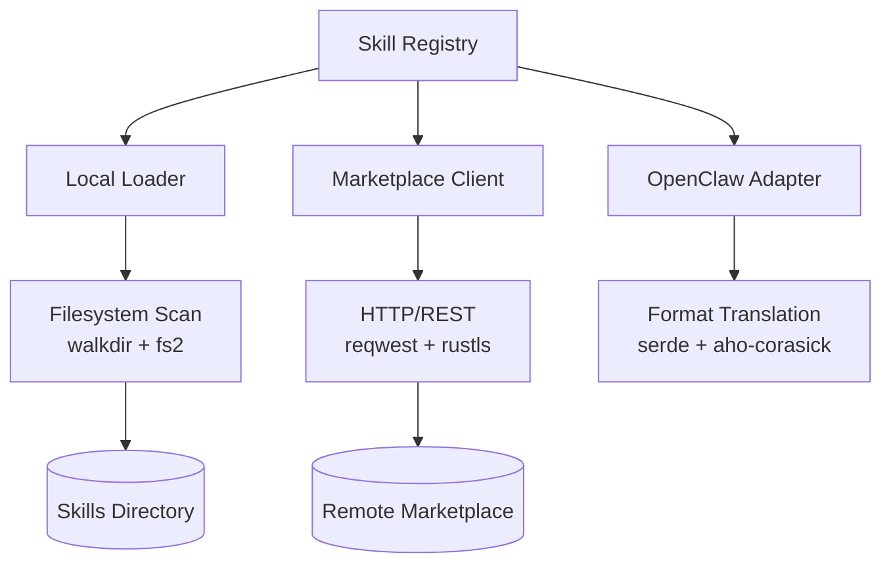

# Other — librefang-skills

# librefang-skills

Skill system for LibreFang — provides skill registration, loading from disk, marketplace interaction, and OpenClaw compatibility.

## Overview

This crate manages the full lifecycle of skills in LibreFang:

- **Discovery and loading** of skill definitions from the local filesystem
- **Registry** of available skills with metadata and versioning
- **Marketplace** integration for downloading and publishing skills
- **OpenClaw compatibility** to load skills authored for the OpenClaw ecosystem

Skills are self-contained units of functionality (behaviors, actions, or response patterns) that can be loaded dynamically at runtime.

## Architecture

## Key Dependencies

| Dependency | Role |
|---|---|
| `librefang-types` | Shared type definitions used across LibreFang crates |
| `serde` / `serde_json` / `serde_yaml` / `toml` | Deserialization of skill manifests and configuration in multiple formats |
| `walkdir` | Recursive directory traversal to discover installed skills |
| `zip` | Extraction of skill packages (`.zip` archives) downloaded from the marketplace |
| `sha2` / `hex` | Integrity hashing of skill packages before installation |
| `semver` | Semantic version parsing and comparison for skill versions and dependency constraints |
| `reqwest` / `rustls` / `webpki-roots` | HTTPS client for marketplace communication with TLS verification |
| `aho-corasick` | Efficient multi-pattern string matching — used for fast keyword or pattern detection within skill definitions |
| `fs2` | File locking to prevent concurrent writes to the skill directory |
| `thiserror` | Typed error definitions |
| `tracing` | Structured logging throughout skill operations |

## Core Responsibilities

### Skill Loading

Skills are stored on disk as directories or archive files containing a manifest (TOML, YAML, or JSON) plus any required assets. The loader:

1. Scans configured skill directories using `walkdir`
2. Parses each skill manifest using the appropriate serde format
3. Validates version constraints via `semver`
4. Computes integrity hashes with `sha2` for tamper detection
5. Acquires a file lock via `fs2` during writes to prevent corruption from concurrent processes

### Skill Registry

The registry holds all loaded skills and provides lookup by name and version. It supports:

- Multiple versions of the same skill coexisting
- Semantic version queries (e.g., "find latest compatible with `^1.2.0`")
- Skill metadata: name, version, author, description, dependencies, compatibility tags

### Marketplace Integration

The marketplace client communicates with a remote skill repository over HTTPS:

- **Search and browse** available skills
- **Download** skill packages as `.zip` archives
- **Verify** package integrity via SHA-256 hashes before extraction
- **Publish** local skills to the marketplace

TLS uses `rustls` with `webpki-roots` for trusted CA certificates and `rustls-native-certs` for platform-native certificate stores.

### OpenClaw Compatibility

The OpenClaw adapter translates skill definitions authored for the OpenClaw format into LibreFang's internal representation. This involves:

- Parsing OpenClaw-specific manifest schemas
- Mapping OpenClaw skill properties to LibreFang equivalents
- Using `aho-corasick` for batch pattern/keyword replacement during format translation

## Error Handling

All fallible operations return typed errors via `thiserror`. Error variants cover:

- Manifest parsing failures (invalid TOML/YAML/JSON)
- Version constraint violations
- Filesystem I/O errors during skill installation or loading
- Network errors from marketplace requests
- Integrity check failures (hash mismatch)
- Lock contention errors

## Logging

Operations are instrumented with `tracing` spans. Key events logged include:

- Skill discovery and loading progress
- Marketplace request/response cycles
- Version resolution decisions
- Compatibility translation steps

## Testing

The crate uses `tempfile` for isolated filesystem-based tests and `serial_test` to serialize tests that involve file locking, preventing race conditions in concurrent test runs.