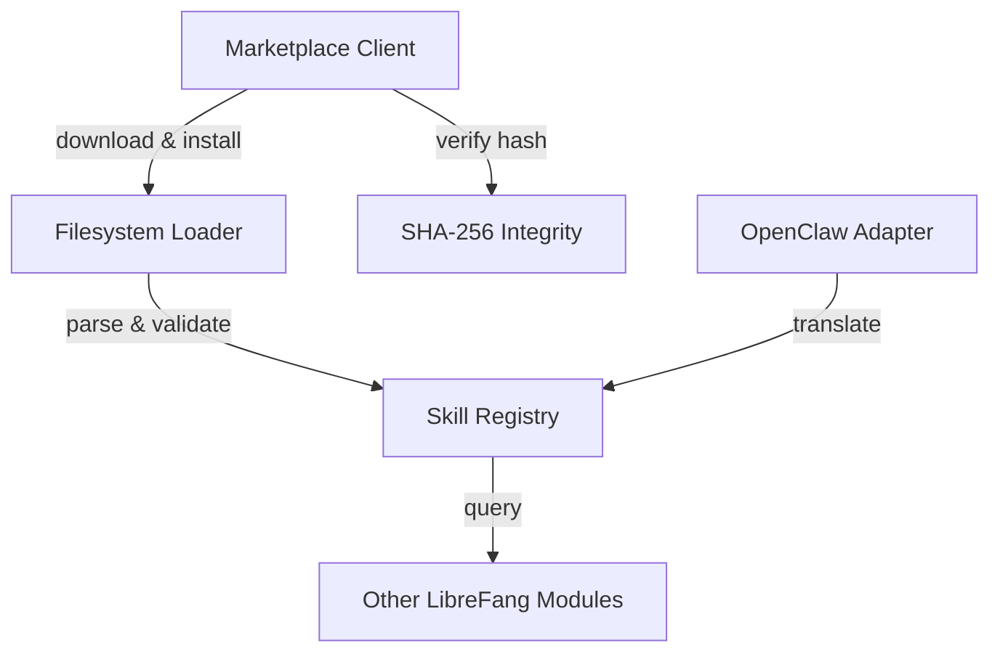

# Other — librefang-skills

# librefang-skills

Skill system for LibreFang — provides the registry, filesystem loader, marketplace client, and OpenClaw compatibility layer.

## Purpose

LibreFang's skill system defines how game abilities, actions, and behaviors are packaged, discovered, loaded, and distributed. This module owns that entire lifecycle:

- **Registry** — canonical in-memory index of all known skills, keyed by unique identifier
- **Loader** — filesystem walker that discovers skill definitions (TOML, JSON, YAML) and validates them before registration
- **Marketplace** — HTTP client for browsing, downloading, and installing skills from a remote marketplace; includes integrity verification and file locking for concurrent safety
- **OpenClaw compatibility** — adapter layer that translates OpenClaw-format skill packs into LibreFang's native representation

## Architecture



The registry sits at the center. All skill data, regardless of origin, flows through validation and into the registry, where other modules query it at runtime.

## Key Responsibilities

### Skill Registry

Maintains the authoritative collection of loaded skills. Each skill carries metadata including a unique identifier, semantic version, and human-readable description. The registry supports lookup by ID and enumeration of available skills.

### Filesystem Loader

Scans configured skill directories using `walkdir`, parsing skill manifests in TOML, JSON, or YAML format via `serde`. Parsed skills are validated against `librefang-types` definitions before insertion into the registry. File locking (`fs2`) prevents corruption when multiple processes load or install skills concurrently.

### Marketplace Client

Uses `reqwest` with `rustls` TLS to communicate with a remote skill marketplace. The client handles:

- Searching and browsing available skills
- Downloading skill archives (`.zip` packages extracted via the `zip` crate)
- Verifying downloads with SHA-256 digests (`sha2` + `hex`) against published checksums
- Installing skills into the local filesystem for the loader to discover

User-level directories are resolved via the `dirs` crate to pick the correct platform-specific data path.

### OpenClaw Compatibility

Translates skill definitions authored for OpenClaw into LibreFang's native format. This adapter reads OpenClaw skill packs, maps their fields onto `librefang-types` structures, and registers them as if they were native skills.

### Version Resolution

Skill versions are parsed and compared using `semver`, enabling version constraints in dependency declarations and marketplace queries.

### Fast Pattern Matching

The `aho-corasick` crate is used for efficient multi-pattern string matching during skill name lookups and command alias resolution.

## Dependencies

| Dependency | Role |
|---|---|
| `librefang-types` | Shared type definitions for skill structs, metadata, and validation |
| `serde`, `serde_json`, `toml`, `serde_yaml` | De/serialization of skill manifests in multiple formats |
| `walkdir` | Recursive directory traversal for skill discovery |
| `reqwest` + `rustls` + `webpki-roots` + `rustls-native-certs` | HTTPS client for marketplace communication with native TLS roots |
| `sha2` + `hex` | SHA-256 integrity verification of downloaded archives |
| `zip` | Extraction of skill distribution packages |
| `semver` | Semantic version parsing and comparison |
| `aho-corasick` | Fast multi-pattern matching for skill aliases and names |
| `fs2` | File locking for concurrent-safe skill installation |
| `uuid` | Unique skill identifiers |
| `chrono` | Timestamps for installation and cache metadata |
| `dirs` | Platform-standard paths for skill storage directories |

## Integration Points

This module depends on `librefang-types` for all shared data structures — skill definitions, metadata schemas, and error types flow through that crate. Downstream modules consume the registry to resolve which skills are available and look up skill data at runtime.

Because no incoming or outgoing internal calls were detected in the call graph, this module operates as a self-contained library: other crates call into it directly rather than it calling into the broader system. Integration is pull-based — consumers query the registry when they need skill data.

## Testing

Tests use `tempfile` for isolated filesystem fixtures and `tokio-test` for async marketplace client tests. Run with:

```sh
cargo test -p librefang-skills
```