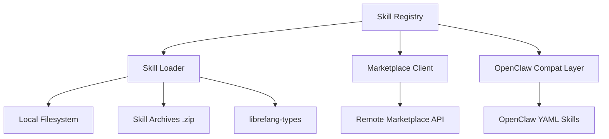

# Other — librefang-skills

# librefang-skills

Skill system for LibreFang — provides the registry, loader, marketplace client, and OpenClaw compatibility layer.

## Purpose

This crate manages the full lifecycle of **skills** in LibreFang: discovering them on disk, loading their definitions, resolving dependencies and versions, downloading from a marketplace, and maintaining compatibility with the OpenClaw skill format. It acts as the single source of truth for what skills are available and how they're configured.

## Architecture



The module is organized around four concerns:

- **Registry** — Maintains the known set of skills, supports lookup by name and version constraint, and handles concurrent access.
- **Loader** — Reads skill definitions from the filesystem and from zip archives, deserializing them from TOML, JSON, or YAML formats.
- **Marketplace Client** — Downloads skills from a remote marketplace over HTTPS, verifies integrity via SHA-256 checksums, and stores them locally.
- **OpenClaw Compatibility** — Translates OpenClaw-format skill definitions (YAML-based) into LibreFang's internal representation.

## Key Dependencies & What They Enable

| Dependency | Role in this crate |
|---|---|
| `librefang-types` | Shared types representing skills, metadata, and configuration structures used across all LibreFang crates |
| `serde`, `serde_json`, `toml`, `serde_yaml` | Multi-format deserialization of skill definitions |
| `walkdir` | Recursive filesystem traversal to discover installed skills |
| `zip` | Extraction of packaged skill archives |
| `reqwest`, `rustls`, `webpki-roots`, `rustls-native-certs` | HTTPS client for marketplace communication with platform-native or bundled TLS roots |
| `sha2`, `hex` | SHA-256 integrity verification of downloaded skills |
| `semver` | Semantic version parsing and constraint resolution for skill versions |
| `fs2` | File-based locking to prevent concurrent corruption of the skill store |
| `aho-corasick` | Efficient multi-pattern matching for skill name lookups and search |
| `dirs` | Resolving platform-standard directories for local skill storage |
| `uuid`, `chrono` | Unique identifiers and timestamps for skill records |
| `tracing` | Structured logging throughout skill operations |
| `thiserror` | Ergonomic error type definitions |

## Skill Loading Flow

1. **Discovery** — The registry scans configured skill directories using `walkdir`, identifying skill definition files.
2. **Deserialization** — Each definition is parsed from its native format (TOML, JSON, or YAML) into the shared types from `librefang-types`.
3. **Validation** — Version constraints are checked with `semver`, and metadata integrity is confirmed.
4. **Registration** — Validated skills are entered into the in-memory registry, protected by file locks (`fs2`) when persisting changes.

For OpenClaw-format skills, the compat layer intercepts YAML definitions and translates them before registration.

## Marketplace Operations

The marketplace client handles:

- **Searching** remote skill listings.
- **Downloading** skill packages over TLS-secured connections.
- **Verifying** SHA-256 checksums of downloaded content against published hashes.
- **Installing** verified packages to the local skill directory, extracting archives as needed.

TLS certificate verification uses either the platform's native certificate store (`rustls-native-certs`) or the bundled Mozilla roots (`webpki-roots`), depending on the build configuration.

## Error Handling

All fallible operations return typed errors derived via `thiserror`. Error variants cover:

- Filesystem I/O failures during discovery or installation
- Deserialization errors for malformed skill definitions
- Network errors from marketplace requests
- Integrity check failures (hash mismatches)
- Version constraint resolution failures
- Lock contention errors from concurrent access

## Integration with the Codebase

This crate depends on `librefang-types` for shared data structures and produces skill information consumed by higher-level game logic. Other LibreFang modules query the skill registry to determine available abilities, their parameters, and version compatibility — this crate does not depend on those consumers in return.

## Development

Run tests with:

```bash
cargo test -p librefang-skills
```

Tests use `tempfile` and `tokio-test` to create isolated filesystem environments and validate async operations without touching the real skill store.