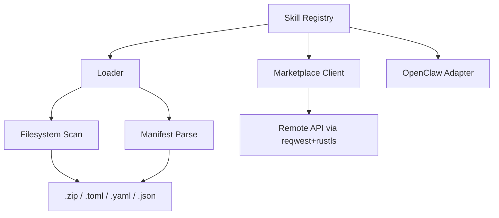

# Other — librefang-skills

# librefang-skills

Skill system for LibreFang — provides the registry, filesystem loader, marketplace client, and OpenClaw compatibility layer.

## Overview

This crate manages the full lifecycle of **skills** (also called "plugins" or "addons" in other systems): discovery from disk, deserialization of manifests, registration in an in-memory index, downloading from a remote marketplace, and interoperability with the OpenClaw skill format.

It is a pure library crate with no binary target. Other LibreFang components depend on it to resolve and instantiate skills at runtime.

## Architecture



## Key Concepts

### Skill Manifest

Every skill is described by a manifest file containing metadata such as name, version, description, and entry-point path. Manifests may be authored in TOML, YAML, or JSON — the loader detects the format by file extension and deserializes through the appropriate `serde` frontend.

Versions follow **semantic versioning** (`semver` crate) and are compared/enforced throughout the registry.

### Skill Package

Skills are distributed as **ZIP archives** containing the manifest and all runtime assets. The loader unpacks these into a local directory and indexes them.

Integrity is verified via **SHA-256** digests (`sha2` + `hex`) computed over the archive bytes.

## Components

### Registry

The central in-memory store of all known skills. It supports:

- **Insertion and lookup** by skill ID and version range.
- **Efficient name-based search** using the Aho-Corasick algorithm (`aho-corasick` crate), allowing fast fuzzy or prefix matching across the full catalogue.
- **Thread-safe access** designed for use within a Tokio runtime.

### Loader

Reads skills from the local filesystem:

1. **Walks** a configured skill directory recursively (`walkdir`).
2. Detects manifest files by extension (`.toml`, `.yaml`, `.json`).
3. **Parses** the manifest into a typed skill descriptor (`serde` deserialization).
4. For `.zip` packages, **extracts** the archive (`zip` crate) and locates the manifest inside.
5. **Registers** the loaded skill into the registry.

File-level locking (`fs2`) prevents concurrent write corruption when multiple processes load or update skills in a shared directory.

### Marketplace Client

Downloads skills from a remote marketplace over HTTPS:

- Uses **reqwest** with a **rustls** TLS backend (`rustls` + `webpki-roots` + `rustls-native-certs`) — no native TLS library dependency required.
- Supports querying the marketplace catalogue and fetching individual skill packages.
- Timestamps downloads using `chrono` for cache/validation purposes.

### OpenClaw Compatibility

An adapter layer that translates **OpenClaw-format** skill packages into LibreFang's internal representation. This allows users to migrate or share skills between the two ecosystems without manual conversion.

## Error Handling

All fallible operations return `Result<T, SkillError>` where `SkillError` is an enum derived via `thiserror`. Variants cover I/O failures, manifest parse errors, ZIP extraction issues, network errors from the marketplace, integrity check failures, and version constraint violations.

## Logging

Significant operations (skill discovery, load failures, marketplace requests, integrity mismatches) are instrumented with `tracing` spans and events. Downstream consumers should initialize a `tracing` subscriber to capture this output.

## Dependencies on Other Crates

| Crate | Role in this module |
|---|---|
| `librefang-types` | Shared domain types (skill descriptors, IDs, etc.) |
| `serde` / `serde_json` / `toml` / `serde_yaml` | Multi-format manifest deserialization |
| `zip` | Skill package extraction |
| `walkdir` | Recursive directory scanning |
| `reqwest` + `rustls` | Marketplace HTTPS client |
| `sha2` + `hex` | Package integrity verification |
| `semver` | Version parsing and comparison |
| `aho-corasick` | Fast skill name search |
| `fs2` | File locking for concurrent safety |
| `tokio` | Async runtime primitives |

## Testing

Tests use `tempfile` to create isolated directory trees for loader tests and `serial_test` to serialize tests that share filesystem state. Run with:

```bash
cargo test -p librefang-skills
```