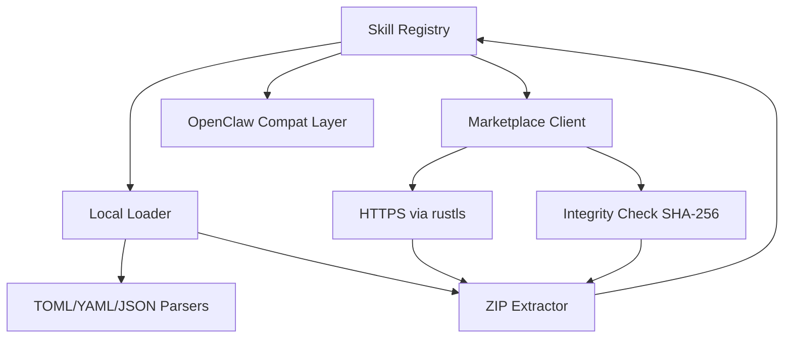

# Other — librefang-skills

# librefang-skills

Skill system for LibreFang — provides skill registration, loading from disk, marketplace integration, and OpenClaw compatibility.

## Overview

This crate manages the full lifecycle of LibreFang skills: discovery on the local filesystem, loading and validation, versioning, remote fetching from a marketplace, and runtime registration. It serves as the bridge between skill authors (who package skills as distributable archives) and the game engine (which instantiates and invokes skills during play).

## Architecture

### Skill Registry

Central in-memory store of loaded skills. Skills are keyed by identifier and version. The registry supports lookup by name, iteration over registered skills, and conflict detection when duplicate identifiers are loaded.

### Local Loader

Scans configured directories for skill definitions using `walkdir`. Each skill is expected to be a directory (or a `.zip` archive) containing a manifest file in TOML, YAML, or JSON format. The loader:

1. Walks the skill directory tree
2. Locates and parses the manifest
3. Validates required fields and semantic version compliance via `semver`
4. Extracts packaged assets if the skill is a ZIP archive
5. Registers the validated skill with the registry

File locking (`fs2`) prevents concurrent processes from corrupting skill directories during installation or updates.

### Marketplace Client

Connects to a remote skill marketplace over HTTPS using `reqwest` with `rustls` for TLS. Responsibilities include:

- Searching and browsing available skills
- Downloading skill packages
- Verifying package integrity via SHA-256 hashes (`sha2` + `hex`)
- Installing downloaded packages into the local skill directory

Certificate verification uses both `webpki-roots` and `rustls-native-certs` for broad compatibility across platforms.

### OpenClaw Compatibility

Provides a compatibility layer for loading skills authored for OpenClaw, translating OpenClaw skill metadata and structure into LibreFang's internal representation. This allows reuse of existing skill libraries without manual migration.

## Key Dependencies

| Dependency | Purpose |
|---|---|
| `librefang-types` | Shared type definitions for skill descriptors, identifiers, and registry entries |
| `serde` / `serde_json` / `toml` / `serde_yaml` | Multi-format manifest deserialization |
| `walkdir` | Recursive directory traversal during skill discovery |
| `zip` | Extraction of packaged skill archives |
| `reqwest` + `rustls` | Authenticated marketplace communication |
| `sha2` + `hex` | SHA-256 integrity verification of downloaded packages |
| `aho-corasick` | Efficient multi-pattern matching for skill trigger/keyword lookup |
| `semver` | Parsing and comparing skill version requirements |
| `fs2` | Filesystem locking for safe concurrent access |
| `tracing` | Structured logging throughout loading and registration |

## Integration Points

This crate depends on `librefang-types` for shared data structures and is expected to be consumed by the game engine or server at startup to discover and load available skills. No other LibreFang crates depend on it directly — it is a leaf dependency that exposes its registry to the application layer.