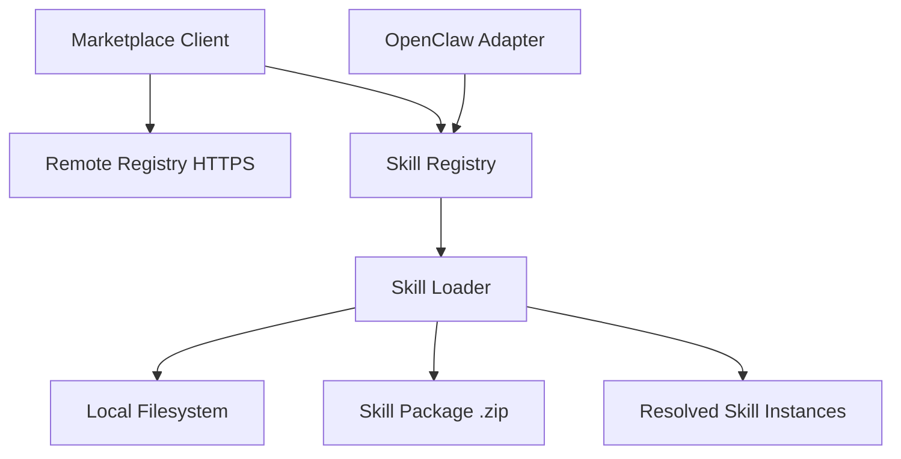

# Other — librefang-skills

# librefang-skills

Skill system for LibreFang — provides registry, loader, marketplace integration, and OpenClaw compatibility.

## Overview

This module manages the full lifecycle of **skills** in LibreFang: discovering them on disk, loading and validating their definitions, resolving dependencies, downloading from a marketplace, and maintaining compatibility with the OpenClaw skill format.

## Architecture

The four main concerns map to the dependency profile:

| Concern | Purpose | Key Dependencies |
|---|---|---|
| **Registry** | In-memory index of known skills with version tracking | `serde`, `semver` |
| **Loader** | Reads skill definitions from disk, validates, and instantiates | `walkdir`, `serde_json`, `toml`, `serde_yaml`, `sha2`, `hex`, `zip` |
| **Marketplace** | Fetches and installs skills from remote sources | `reqwest`, `rustls`, `chrono` |
| **OpenClaw compatibility** | Translates OpenClaw-format skills into LibreFang skill objects | `aho-corasick` |

## Skill Package Format

Skills are distributed as `.zip` archives containing:

- A manifest file (TOML, JSON, or YAML) describing metadata, version, and entry points
- Skill logic files
- An optional checksum for integrity verification (SHA-256, handled via `sha2` + `hex`)

The loader supports all three manifest formats, detected by file extension.

## Registry

The registry maintains a collection of available skills keyed by identifier and version (`semver`). It supports:

- Registering skills loaded from disk or downloaded from the marketplace
- Querying by name, version range, or capability
- Concurrent access with file locking (`fs2`) to prevent corruption when multiple processes share a skill directory

## Loader

The loader scans configured skill directories using `walkdir`, reads manifests, verifies checksums, and produces resolved skill instances. File locking via `fs2` ensures safe concurrent reads during load.

Key behaviors:

- Recursively walks the skill directory tree
- Parses manifests in TOML, JSON, or YAML format
- Validates semantic versions (`semver`)
- Verifies package integrity via SHA-256 checksums

## Marketplace Client

Provides HTTPS-based access to a remote skill marketplace:

- Uses `reqwest` with `rustls` for TLS (accepts both `webpki-roots` and `rustls-native-certs` for certificate validation)
- Downloads skill packages and registers them in the local registry
- Tracks download timestamps with `chrono`

## OpenClaw Compatibility

The OpenClaw adapter layer translates skills authored for the OpenClaw system into LibreFang's internal representation. It uses `aho-corasick` for efficient multi-pattern matching during format conversion — likely to identify and rewrite OpenClaw-specific syntax patterns in skill definitions.

## Error Handling

All fallible operations return errors defined through `thiserror`, providing structured error types for:

- Manifest parsing failures
- Checksum/integrity violations
- Network and TLS errors from marketplace requests
- File I/O and lock contention

## Logging

Structured logging throughout uses the `tracing` crate, covering skill discovery, load progress, marketplace operations, and compatibility translation steps.

## Relationship to Other Crates

- **`librefang-types`** — provides the shared `Skill` type and related data structures that this crate populates and returns
- This crate has no downstream dependents in the workspace; it is consumed by higher-level application crates that need skill resolution

## Testing

Tests use `tempfile` for isolated filesystem operations and `serial_test` to serialize tests that share on-disk state (due to file locking with `fs2`).