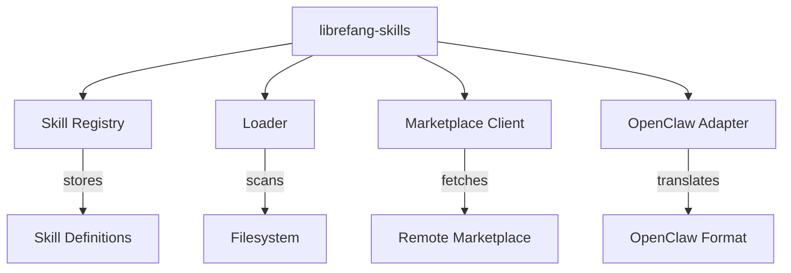

# Other — librefang-skills

# librefang-skills

Skill system for LibreFang — provides the registry, filesystem loader, marketplace client, and OpenClaw compatibility layer.

## Purpose

This crate manages the full lifecycle of **skills** in LibreFang: discovery on disk, loading and parsing, version resolution, marketplace downloads, and cross-compatibility with the OpenClaw skill format. It serves as the single source of truth for what skills are available, their metadata, and their installed state.

## Architecture

The crate breaks down into four cooperating subsystems:

| Subsystem | Role |
|-----------|------|
| **Registry** | In-memory index of all known skills, their versions, dependencies, and load status |
| **Loader** | Walks configured skill directories, parses TOML/YAML manifests, validates integrity via SHA-256 hashes |
| **Marketplace Client** | Async HTTPS client that queries a remote skill marketplace, downloads packages, and verifies them |
| **OpenClaw Adapter** | Translates OpenClaw-format skill definitions into LibreFang's native representation |

## Key Dependencies and Why They Matter

| Dependency | Purpose in this crate |
|------------|----------------------|
| `librefang-types` | Shared domain types (`SkillId`, `SkillManifest`, `SkillVersion`, etc.) |
| `serde` / `serde_json` / `toml` / `serde_yaml` | Deserialization of skill manifests, which may be authored in TOML or YAML |
| `walkdir` | Recursive directory traversal to discover skill packages on disk |
| `reqwest` + `rustls` + `webpki-roots` / `rustls-native-certs` | Async HTTPS for marketplace communication, using Rustls as the TLS backend with both bundled and system certificate stores |
| `sha2` / `hex` | SHA-256 integrity verification of downloaded or installed skill packages |
| `zip` | Extraction of `.zip`-packaged skill archives |
| `semver` | Semantic version parsing and constraint resolution for skill dependencies |
| `aho-corasick` | Fast multi-pattern matching — used for bulk lookups across skill names, tags, and keywords |
| `fs2` | File locking to prevent concurrent write corruption when installing or updating skills |
| `chrono` | Timestamps for install date, last-updated, and cache TTL |

## Skill Manifest Format

Skills are expected to ship with a manifest file (`skill.toml` or `skill.yaml`) at their root. The manifest is deserialized into types provided by `librefang-types`. A typical manifest includes:

- **Skill ID** — unique identifier
- **Version** — semver-compliant version string
- **Dependencies** — other skill IDs with optional version constraints
- **Entry point** — path to the skill's main logic
- **Hash** — expected SHA-256 of the package archive (for integrity checks)

The loader supports both TOML and YAML so skill authors can choose their preferred format.

## Loading Flow

1. **Directory scan** — `walkdir` recursively walks each configured skill directory.
2. **Manifest discovery** — For each subdirectory, the loader looks for `skill.toml` or `skill.yaml`.
3. **Parsing** — The manifest is deserialized and validated (required fields, semver compliance).
4. **Integrity check** — If a hash is recorded, the package contents are hashed with SHA-256 and compared.
5. **Registration** — The parsed skill is inserted into the registry, keyed by skill ID and version.

## Marketplace Flow

1. **Query** — An async request via `reqwest` fetches available skill listings from the marketplace API.
2. **Download** — Selected skill packages (`.zip` archives) are streamed to a temporary staging area.
3. **Verify** — The downloaded archive's SHA-256 hash is compared to the advertised hash.
4. **Extract** — `zip` extracts the archive into the target skill directory.
5. **Register** — The newly extracted skill is passed through the standard loading flow.
6. **Lock** — `fs2` file locks prevent concurrent installs from corrupting the skill store.

All network calls are TLS-secured via Rustls, which respects both the bundled Mozilla certificate store (`webpki-roots`) and the host system's native certificate store (`rustls-native-certs`).

## OpenClaw Compatibility

The OpenClaw adapter translates OpenClaw-format skill definitions into LibreFang's native `SkillManifest` type. This allows LibreFang to consume skills originally authored for the OpenClaw ecosystem without modification. The adapter handles:

- Format conversion (OpenClaw metadata fields → LibreFang fields)
- Dependency name remapping where conventions differ
- Version normalization if OpenClaw uses a non-semver scheme

## Error Handling

All fallible operations return `Result<T, SkillError>` where `SkillError` is derived via `thiserror`. Common error variants include:

- Manifest not found or unreadable
- Manifest parse failure (invalid TOML/YAML, missing required fields)
- Semver constraint violation
- SHA-256 hash mismatch (tampered or corrupted package)
- Network or TLS failure during marketplace operations
- Filesystem errors during extraction (disk full, permissions)

## Integration with the Rest of LibreFang

This crate depends on `librefang-types` for all shared domain types but does not itself call into other LibreFang crates. It is consumed by higher-level crates that need to:

- Enumerate available skills before starting a session
- Resolve skill dependencies at load time
- Install or update skills from the marketplace
- Load OpenClaw-format skill packs for backward compatibility

## Development

When running tests, the `tempfile` dev-dependency provides isolated temporary directories for testing the loader and extraction logic without touching the real skill store.