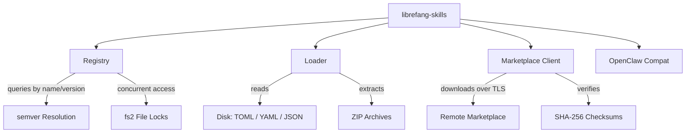

# Other — librefang-skills

# librefang-skills

Skill system for LibreFang — provides the registry, loader, marketplace client, and OpenClaw compatibility layer.

## Purpose

This crate manages the full lifecycle of **skills** in LibreFang: discovery from disk, deserialization from multiple formats, version resolution via semantic versioning, integrity verification, marketplace interaction, and compatibility with the OpenClaw skill format.

It sits between `librefang-types` (which defines the core data structures) and the higher-level game or server crates that consume installed skills.

## Architecture

```mermaid
graph TD
    A[librefang-skills] --> B[Registry]
    A --> C[Loader]
    A --> D[Marketplace Client]
    A --> E[OpenClaw Compat]

    C -->|reads| F[Disk: TOML / YAML / JSON]
    C -->|extracts| G[ZIP Archives]
    D -->|downloads over TLS| H[Remote Marketplace]
    D -->|verifies| I[SHA-256 Checksums]
    B -->|queries by name/version| J[semver Resolution]
    B -->|concurrent access| K[fs2 File Locks]
```

## Key Subsystems

### Registry

Maintains the set of installed skills and answers queries by name, version range, or capability. Uses `semver` for version constraint resolution (e.g., "find skill X at `^1.2.0`"). File locking via `fs2` prevents corruption when multiple processes access the skill store concurrently.

### Loader

Reads skill definitions from the local filesystem. Supports three configuration formats:

| Format | Dependency |
|--------|-----------|
| TOML   | `toml`    |
| YAML   | `serde_yaml` |
| JSON   | `serde_json` |

Directory traversal uses `walkdir` to recursively discover skill manifests. For packaged skills, the `zip` crate extracts archives before loading.

### Marketplace Client

HTTP client built on `reqwest` with `rustls` for TLS. Downloads skill packages from a remote marketplace, verifies integrity via SHA-256 hashes (`sha2` + `hex`), and installs them into the local skill store. Timestamps from `chrono` track install and publication times.

### OpenClaw Compatibility

Translates skills authored for the OpenClaw format into LibreFang's internal representation. The `aho-corasick` crate provides efficient multi-pattern matching when rewriting command names, aliases, or metadata keys during conversion.

## Dependencies and Rationale

| Dependency | Role in this crate |
|------------|-------------------|
| `librefang-types` | Shared type definitions (skill descriptors, metadata structs) |
| `serde` / `serde_json` / `toml` / `serde_yaml` | De/serialization across multiple config formats |
| `thiserror` | Typed error definitions for load, registry, and marketplace failures |
| `base64` | Encoding for embedded payloads or signature data |
| `tracing` | Structured logging throughout skill operations |
| `tokio` | Async runtime for marketplace I/O and concurrent skill loading |
| `walkdir` | Recursive filesystem traversal for skill discovery |
| `chrono` | Timestamps for marketplace entries and local install tracking |
| `reqwest` | HTTP client for marketplace communication |
| `rustls` / `webpki-roots` / `rustls-native-certs` | TLS backend — trusts both system CA store and bundled Mozilla roots |
| `sha2` / `hex` | SHA-256 integrity verification of downloaded packages |
| `zip` | Extraction of packaged skill archives |
| `aho-corasick` | Fast multi-pattern string replacement during OpenClaw format translation |
| `semver` | Semantic version parsing and constraint matching for skill versions |
| `fs2` | File-level locking to serialize writes to the skill store |

## Integration with LibreFang

This crate depends on `librefang-types` for its data structures and is consumed by the game/server layers that need to resolve and execute skills. It has no incoming or outgoing call-graph edges with other LibreFang crates at the module level — it is a self-contained library that exposes a clean API boundary.

Typical usage from a consumer:

1. **Bootstrap** — Create a registry backed by a local directory.
2. **Load** — Call the loader to discover and deserialize all installed skills.
3. **Query** — Ask the registry for skills matching a name or version range.
4. **Install** — Optionally fetch new skills from the marketplace and verify their checksums.

## Error Handling

All fallible operations return errors defined via `thiserror`. The error types cover:

- Filesystem I/O failures during load or extraction
- Parse errors from malformed TOML, YAML, or JSON manifests
- Network and TLS errors from marketplace requests
- Checksum mismatches on downloaded packages
- Semver constraint violations during version resolution