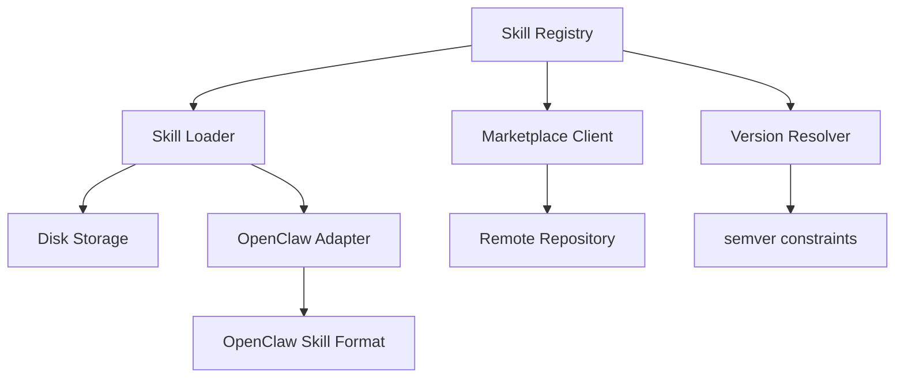

# Other — librefang-skills

# librefang-skills

Skill system for LibreFang — provides the registry, loader, marketplace client, and OpenClaw compatibility layer.

## Overview

This crate implements the complete lifecycle for LibreFang skills: discovery on disk, loading into memory, version management, integrity verification, marketplace interaction, and compatibility with the OpenClaw skill format. It is a library crate consumed by higher-level LibreFang components (server, CLI tools) rather than an executable target.

## Architecture

```mermaid
graph TD
    A[Skill Registry] --> B[Skill Loader]
    B --> C[Disk Storage]
    A --> D[Marketplace Client]
    D --> E[Remote Repository]
    B --> F[OpenClaw Adapter]
    F --> G[OpenClaw Skill Format]
    A --> H[Version Resolver]
    H --> I[semver constraints]
```

## Key Components

### Skill Registry

Maintains the catalog of known skills and their metadata. Likely backed by on-disk TOML or JSON manifests discovered via `walkdir` traversal of skill directories. The registry tracks:

- Skill identifiers and versions
- Dependencies between skills
- Installation status and filesystem locations

### Skill Loader

Reades skill definitions from the filesystem and deserializes them into types from `librefang-types`. Supports:

- **Directories**: Skills stored as unpacked directory trees
- **Archives**: `.zip`-packed skills extracted on load via the `zip` crate
- **Multiple formats**: TOML, JSON, and YAML manifests (`serde_json`, `toml`, `serde_yaml`)

### Marketplace Client

HTTP client built on `reqwest` with `rustls` for TLS. Responsible for:

- Fetching skill listings from remote repositories
- Downloading skill packages
- Verifying download integrity using SHA-256 (`sha2` + `hex`)

TLS certificate validation uses both `webpki-roots` (Mozilla's CA bundle) and `rustls-native-certs` (system certificate store) to maximize compatibility across platforms.

### OpenClaw Compatibility

The `aho-corasick` dependency indicates fast multi-pattern matching, used here to parse or translate skills authored in the OpenClaw format. This adapter layer converts OpenClaw skill definitions into LibreFang's internal representation.

### Version Resolution

Uses `semver` for semantic version parsing and constraint solving. Skills declare compatible version ranges, and the resolver ensures a consistent, installable set.

### Concurrency Safety

`fs2` provides file locking for concurrent access to the skill store — preventing corruption when multiple processes or async tasks attempt to install, update, or remove skills simultaneously.

## Dependencies on Other LibreFang Crates

| Crate | Usage |
|---|---|
| `librefang-types` | Shared type definitions for skill structures, metadata, and errors |

## External Dependency Rationale

| Dependency | Purpose |
|---|---|
| `walkdir` | Recursive directory traversal for skill discovery |
| `zip` | Reading `.zip`-archived skill packages |
| `serde` + formats | Serialization of skill manifests (TOML, JSON, YAML) |
| `reqwest` + `rustls` | Secure HTTP for marketplace communication |
| `sha2` + `hex` | SHA-256 integrity hashes for downloaded skills |
| `aho-corasick` | Efficient multi-pattern matching for OpenClaw parsing |
| `semver` | Semantic version parsing and comparison |
| `fs2` | Filesystem-level locking for concurrent safety |
| `thiserror` | Derived error types |
| `tracing` | Structured logging throughout skill operations |

## Testing

The dev-dependencies include `tempfile` (for isolated filesystem tests) and `serial_test` (to serialize tests that share filesystem state), indicating that the test suite exercises real disk I/O for loading and registry operations.

Tests requiring file locks or shared temporary directories are annotated with `#[serial]` to avoid races.