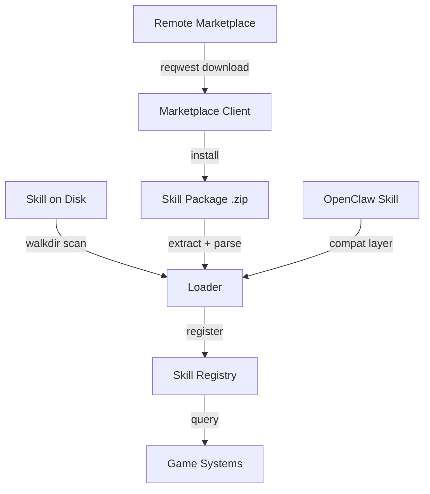

# Other — librefang-skills

# librefang-skills

Skill system for LibreFang — provides the registry, filesystem loader, marketplace client, and OpenClaw compatibility layer for discovering, loading, and managing skills.

## Purpose

This crate is the central skill management layer in LibreFang. A *skill* is a self-contained unit of functionality that can be loaded at runtime, traded on a marketplace, and executed within the game. This module handles everything between a skill sitting on disk (or a remote server) and it being available for use:

- **Discovery** — scanning filesystem directories for installed skills.
- **Loading** — reading and validating skill manifests, verifying integrity, and deserializing skill definitions.
- **Registry** — maintaining an in-memory index of loaded skills and querying by name, keyword, or capability.
- **Marketplace** — downloading skills from a remote marketplace, verifying hashes, and installing them locally.
- **OpenClaw compatibility** — reading skills authored for the OpenClaw format so existing content works without modification.

## Architecture

```mermaid
graph TD
    A[Skill on Disk] -->|walkdir scan| B[Loader]
    C[Skill Package .zip] -->|extract + parse| B
    D[Remote Marketplace] -->|reqwest download| E[Marketplace Client]
    E -->|install| C
    B -->|register| F[Skill Registry]
    F -->|query| G[Game Systems]
    H[OpenClaw Skill] -->|compat layer| B
```

### Subsystem Breakdown

#### Loader

The loader is responsible for reading skill data from the filesystem. It uses `walkdir` to recursively scan skill directories, locates manifest files (TOML, JSON, or YAML), parses them with the corresponding `serde` frontend, and validates the resulting structures against expected schemas.

Key responsibilities:

- Traversing one or more skill root directories.
- Parsing manifests (`serde` + `toml` / `serde_json` / `serde_yaml`).
- Computing SHA-256 digests (`sha2` + `hex`) of skill payloads for integrity verification.
- Extracting `.zip` packages (`zip` crate) when a skill is distributed as a compressed archive.

File locking (`fs2`) is used during extraction and installation to prevent corruption when multiple processes access the same skill directory concurrently.

#### Registry

The registry is the in-memory store of loaded skills. It supports:

- Insertion and removal of skills at runtime.
- Lookup by skill name (exact match).
- Keyword-based search using an Aho-Corasick automaton (`aho-corasick` crate) for efficient multi-pattern matching across skill metadata.
- Semantic version queries (`semver`) — filtering or matching skills by version constraints.

#### Marketplace Client

An async HTTP client (`reqwest` with `rustls` for TLS) that communicates with a LibreFang skill marketplace. It handles:

- Listing available skills and their metadata.
- Downloading skill packages.
- Verifying downloaded content against published hashes before writing to disk.

Certificate roots are provided by both `webpki-roots` (bundled Mozilla roots) and `rustls-native-certs` (system certificate store) for maximum compatibility across platforms.

#### OpenClaw Compatibility

A translation layer that reads skill definitions authored for the OpenClaw format and converts them into LibreFang's native representation (`librefang-types`). This allows existing OpenClaw content to work without manual conversion.

## Dependencies

| Dependency | Role in this crate |
|---|---|
| `librefang-types` | Shared type definitions — skill structs, enums, error types |
| `serde` / `serde_json` / `serde_yaml` / `toml` | Deserialization of skill manifests in multiple formats |
| `thiserror` | Derived error types for loader, registry, and marketplace errors |
| `tracing` | Structured logging throughout all subsystems |
| `tokio` | Async runtime for marketplace HTTP calls and concurrent file operations |
| `walkdir` | Recursive directory traversal for skill discovery |
| `chrono` | Timestamp handling (install dates, manifest timestamps) |
| `reqwest` + `rustls` | HTTPS client for marketplace communication |
| `sha2` + `hex` | SHA-256 digest computation for integrity checks |
| `zip` | Extraction of `.zip`-packaged skills |
| `aho-corasick` | Fast multi-pattern keyword search across skill metadata |
| `semver` | Parsing and comparing semantic version strings in skill manifests |
| `fs2` | Filesystem locking to prevent concurrent write conflicts |

## Error Handling

Errors are defined using `thiserror` and typically fall into these categories:

- **IO errors** — file not found, permission denied, corrupt archive.
- **Parse errors** — malformed manifest, unknown format, schema validation failure.
- **Integrity errors** — hash mismatch after download or extraction.
- **Network errors** — marketplace unreachable, TLS failure, HTTP error responses.
- **Registry errors** — duplicate skill registration, skill not found.

All errors implement `std::error::Error` and integrate with `tracing` for structured diagnostic output.

## Testing

Tests use `tempfile` for isolated filesystem operations and `serial_test` to serialize tests that touch shared state on disk. When adding tests that involve file I/O or the registry, wrap them with `#[serial_test::serial]` to avoid races.