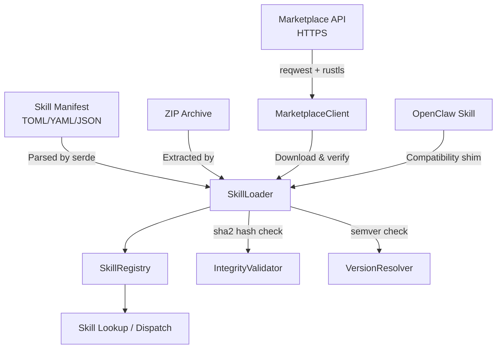

# Other — librefang-skills

# librefang-skills

Skill system for LibreFang — provides the registry, filesystem loader, remote marketplace client, and OpenClaw compatibility layer for discovering, loading, and managing skills at runtime.

## Overview

A **skill** in LibreFang is a self-contained unit of functionality that can be discovered, loaded, and executed on demand. This crate handles the full lifecycle:

1. **Defining** skill metadata and structure (backed by `librefang-types`)
2. **Loading** skills from the local filesystem (TOML, YAML, JSON manifests; ZIP archives)
3. **Registering** skills in an in-memory registry for fast lookup
4. **Fetching** skills from a remote marketplace over HTTPS
5. **Validating** skill integrity via SHA-256 hashes and semver version constraints
6. **Providing OpenClaw compatibility** so legacy skill packages work unchanged

## Architecture

```mermaid
graph TD
    A[Skill Manifest<br/>TOML/YAML/JSON] -->|Parsed by serde| B[SkillLoader]
    B --> C[SkillRegistry]
    C --> D[Skill Lookup / Dispatch]
    E[ZIP Archive] -->|Extracted by| B
    F[Marketplace API<br/>HTTPS] -->|reqwest + rustls| G[MarketplaceClient]
    G -->|Download & verify| B
    H[OpenClaw Skill] -->|Compatibility shim| B
    B -->|sha2 hash check| I[IntegrityValidator]
    B -->|semver check| J[VersionResolver]
```

## Key Components

### SkillRegistry

The central in-memory store for all loaded skills. Provides O(1) lookup by skill ID and supports querying by category, tag, or version range.

### SkillLoader

Reads skill definitions from the filesystem. Uses `walkdir` to recursively discover skill manifests under a configured root directory. Supports three manifest formats:

- **TOML** (preferred for hand-authored skills)
- **YAML** (common in shared community skills)
- **ZIP archives** containing a manifest plus optional assets, extracted at load time

File locking via `fs2` prevents concurrent write corruption during skill installation or updates.

### MarketplaceClient

Async HTTP client (`reqwest` + `rustls`) for interacting with a LibreFang skill marketplace. Responsibilities:

- Searching published skills by name, tag, or keyword
- Downloading skill packages with progress tracking
- Verifying downloaded content against published SHA-256 digests (`sha2` + `hex`)
- TLS certificate validation using both `webpki-roots` and `rustls-native-certs` for broad compatibility

### OpenClaw Compatibility Layer

Translates OpenClaw-format skill packages into LibreFang's internal representation. This lets operators migrate existing skill libraries without modification. The layer handles differences in manifest schema, directory layout, and metadata naming conventions.

### IntegrityValidator

Computes and compares SHA-256 hashes of skill packages and their manifests to ensure nothing was tampered with during download or on disk.

### VersionResolver

Uses the `semver` crate to evaluate version constraints, enabling skills to declare dependency ranges and the registry to resolve compatible versions.

## Dependencies

| Dependency | Role |
|---|---|
| `librefang-types` | Shared type definitions for skill metadata |
| `serde` / `serde_json` / `serde_yaml` / `toml` | De/serialization of skill manifests |
| `thiserror` | Ergonomic error types |
| `base64` | Encoding for embedded skill payloads |
| `tracing` | Structured logging and diagnostics |
| `tokio` | Async runtime for marketplace I/O |
| `walkdir` | Recursive filesystem traversal |
| `chrono` | Timestamp handling in manifests |
| `reqwest` + `rustls` | HTTPS marketplace communication |
| `sha2` / `hex` | Content-addressable integrity checks |
| `zip` | Skill archive extraction |
| `aho-corasick` | Fast multi-pattern matching for skill command routing |
| `semver` | Semantic version parsing and comparison |
| `fs2` | File locking for concurrent-safe skill installation |

## Error Handling

All fallible operations return `Result<T, SkillError>` where `SkillError` is an enum derived via `thiserror`. Variants cover:

- Manifest parse failures (malformed TOML/YAML/JSON)
- Missing or unreadable files
- Hash mismatches (integrity failures)
- Network errors from marketplace requests
- Semver constraint violations
- OpenClaw format incompatibilities

## Testing

Tests use `tempfile` to create isolated directory trees for loading and registry operations, and `serial_test` to serialize tests that touch shared filesystem state.