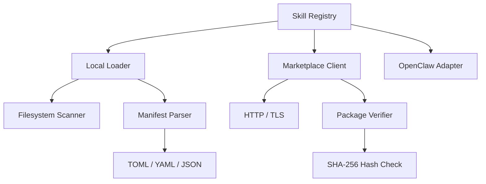

# Other — librefang-skills

# librefang-skills

Skill system for LibreFang — provides the registry, filesystem loader, marketplace client, and OpenClaw compatibility layer for discovering, loading, and managing skills.

## Overview

A **skill** in LibreFang is a self-contained unit of functionality that can be discovered, loaded, and executed at runtime. This crate provides the infrastructure for the full skill lifecycle:

- **Discovery** — scanning directories and remote sources for available skills
- **Loading** — reading skill manifests, validating metadata, and preparing skills for use
- **Registry** — an in-memory index of loaded skills with lookup by name, tag, or category
- **Marketplace** — a client for downloading and installing skills from a remote marketplace
- **OpenClaw Compatibility** — support for loading skills authored for the OpenClaw format

## Architecture

```mermaid
graph TD
    A[Skill Registry] --> B[Local Loader]
    A --> C[Marketplace Client]
    B --> D[Filesystem Scanner]
    B --> E[Manifest Parser]
    C --> F[HTTP / TLS]
    C --> G[Package Verifier]
    E --> H[TOML / YAML / JSON]
    G --> I[SHA-256 Hash Check]
    A --> J[OpenClaw Adapter]
```

## Key Concepts

### Skill Manifests

Every skill is described by a manifest file containing metadata such as:

- Unique identifier and display name
- Semantic version (`semver`)
- Author information
- Tags and categories for discovery
- Compatibility requirements
- Entry point definition

Manifests may be authored in **TOML**, **YAML**, or **JSON** — all three formats are supported by the loader.

### Versioning

Skill versions follow [Semantic Versioning](https://semver.org/) and are validated using the `semver` crate. This enables:

- Version constraint resolution when skills declare dependencies on one another
- Compatibility checks during loading
- Upgrade detection in the marketplace client

### Integrity Verification

Downloaded skill packages are verified using **SHA-256** hashes (`sha2` + `hex`). This ensures that marketplace-sourced skills have not been tampered with during transit.

### File Locking

The `fs2` dependency provides file-level locking for the local skill store. This prevents corruption when multiple processes or concurrent tasks attempt to install, update, or remove skills simultaneously.

## Components

### Local Loader

Scans a configured directory tree using `walkdir`, parses each discovered manifest, and registers valid skills. Invalid or malformed manifests are logged via `tracing` and skipped rather than causing a panic.

The loader is designed to be called at startup and optionally on-demand when the skill directory changes.

### Skill Registry

An in-memory collection of loaded skills supporting:

- Lookup by exact name or ID
- Filtering by tags or categories
- Iteration over all registered skills

The `aho-corasick` crate powers fast multi-pattern matching across skill names and tags, enabling efficient batch lookups.

### Marketplace Client

An async HTTP client built on `reqwest` with TLS via `rustls`. It supports:

- Browsing available skills from a remote marketplace
- Downloading skill packages (ZIP archives, unpacked via the `zip` crate)
- Verifying package integrity against published hashes
- Tracking download timestamps using `chrono`

Certificate roots are sourced from both `webpki-roots` (Mozilla's bundled roots) and `rustls-native-certs` (the system certificate store), ensuring compatibility across platforms.

### OpenClaw Adapter

Provides a compatibility layer that translates OpenClaw-format skill manifests and packages into the native LibreFang skill representation. This allows the ecosystem to leverage existing OpenClaw skills without modification.

## Error Handling

All fallible operations return `Result<T, SkillError>` where `SkillError` is derived via `thiserror`. Error variants cover:

- Manifest parsing failures (invalid TOML/YAML/JSON, missing required fields)
- Version constraint violations
- Filesystem I/O errors during scanning or installation
- Network errors from marketplace operations
- Hash verification failures
- File locking conflicts

Errors are instrumented with `tracing` spans to provide context in logs.

## Async Runtime

All I/O-bound operations (directory scanning, HTTP requests, file extraction) are `async` and require a `tokio` runtime. The crate does not create its own runtime — callers must ensure one is available, typically by running within a `#[tokio::main]` function or a Tokio task.

## Integration with libreFang

This crate depends on `librefang-types` for shared data structures — primarily the `Skill` type and related metadata structs. Other crates in the workspace consume `librefang-skills` to:

- Query the registry for available skills at runtime
- Trigger skill installation from the marketplace
- Reload skills after directory changes

## Testing

Tests use `tempfile` for isolated filesystem operations and `serial_test` to serialize tests that share filesystem state. This avoids flaky tests caused by concurrent access to temporary directories.