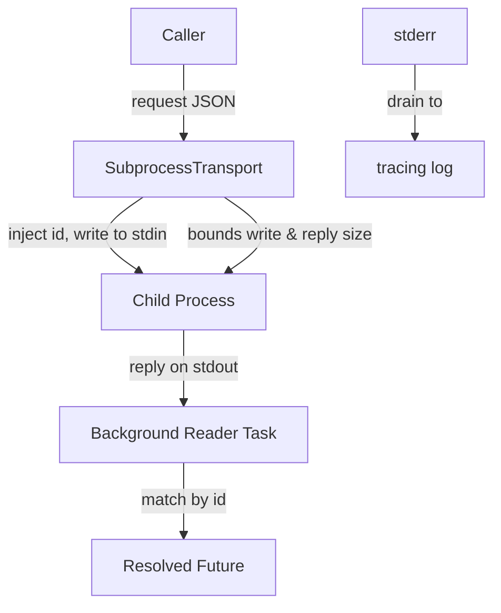

# Other — librefang-subprocess

# librefang-subprocess

Persistent JSON-over-stdio subprocess transport shared by LibreFang's sidecar bridges.

## Purpose

Every sidecar bridge in LibreFang was re-implementing the same plumbing: spawn a child process, write JSON to its stdin, read JSON from its stdout, match replies to callers, drain stderr to the log, and clean up when the child exits. This crate extracts that shared logic into one reusable transport layer.

The caller supplies a JSON request body. The transport injects a unique `id` field, writes `{"id": N, …}\n` to the child's stdin, and resolves the pending call when a matching reply arrives on stdout. Replies follow the shape `{"id": N, "ok": …}` or `{"id": N, "error": …}`.

## Architecture



## Two Layers

### `SubprocessTransport`

The raw, id-matched transport. It manages exactly one child process. Once that child exits — whether cleanly or by crashing — the transport is dead. Callers who want to send another request must create a new transport instance.

Key responsibilities:

- **Process lifecycle** — spawns the child on creation, reaps it on drop.
- **Request multiplexing** — each outbound request gets a unique `id`; a background tokio task reads reply lines and dispatches them to the correct waiting future.
- **Size bounds** — both the outbound JSON line and the inbound reply line are bounded to prevent unbounded memory growth from a misbehaving child.
- **stderr draining** — the child's stderr is continuously read and forwarded to `tracing` so sidecar logs are visible in the daemon's log output.

Use this when you want explicit control over the child's lifetime or when the child is expected to run for a single bounded session.

### `SupervisedTransport`

Wraps `SubprocessTransport` for callers that want resilience. Instead of dying permanently when the child exits, it:

1. **Spawns lazily** — the child is not started until the first call is made.
2. **Re-spawns on failure** — if the child crashes mid-session, the next call triggers a fresh spawn (rate-limited by a configurable respawn cooldown).
3. **Degrades gracefully** — a transient sidecar failure fails the single in-flight call rather than poisoning the daemon's entire lifetime.

Use this for long-running bridges where the sidecar may crash or be restarted independently.

## Wire Protocol

All communication is newline-delimited JSON over the child's stdin/stdout.

**Request** (written by the transport on behalf of the caller):

```json
{"id": 42, …caller fields…}
```

The transport injects the `id` field. The caller must not include their own `id`.

**Success reply** (read from the child's stdout):

```json
{"id": 42, "ok": …}
```

**Error reply** (read from the child's stdout):

```json
{"id": 42, "error": …}
```

Both the request line and reply line are size-bounded. Lines exceeding the configured limit are rejected rather than buffered indefinitely.

## Dependencies

| Crate | Purpose |
|-------|---------|
| `serde_json` | Serialize/deserialize JSON lines |
| `tokio` | Async I/O, task spawning, process management |
| `tracing` | Structured logging (stderr drain, transport events) |
| `thiserror` | Error type derivation |
| `metrics` | Transport-level metrics (in-flight count, error rates, etc.) |

No `librefang-*` crates appear as dependencies. This crate sits at the bottom of the LibreFang dependency graph — below `librefang-channels` and `librefang-runtime`.

## Position in the Codebase

```
librefang-subprocess          ← this crate (no librefang deps)
    ↑
librefang-channels
librefang-runtime
    ↑
context engine / proactive-memory extractor    ← in-tree consumers
```

The primary in-tree consumers are:

- **Context engine** (`docs/architecture/sidecar-context-engine.md`) — communicates with a sidecar to build conversation context.
- **Proactive-memory extractor** — offloads memory extraction to a sidecar process.

Both use `SupervisedTransport` to tolerate sidecar restarts without bringing down the host daemon.

## Error Handling

Errors are represented via `thiserror`-derived types and cover:

- Child process spawn failures.
- I/O errors on stdin/stdout/stderr.
- Line-too-large violations (write or reply exceeded the configured bound).
- Child exited before a reply arrived (pending calls are failed).
- Respawn-cooldown violations (in `SupervisedTransport`).

All errors are logged through `tracing` and counted through `metrics`, so operators can monitor transport health without inspecting individual call results.

## Testing

Dev-dependencies include `tempfile`, used in integration tests that spawn real child processes to exercise the full stdin/stdout round-trip, size-bound enforcement, and respawn logic end-to-end.